# SHELL & DEBT

**Russian roulette with the frog mob, in hand-drawn pixel art.** You are 'Lucky' Verde.
You owe the Bullfrog everything, and the only way to clear the marker is at the table:
a revolver, a mix of **LIVE** and **blank** shells, and whoever's sitting across from you.
Eight antes. Three blinds each. Kill the mark, **loot the corpse before the badges
arrive** — the last chair belongs to the Bullfrog himself.


## Play it

No build, no dependencies, no assets, no network — plain HTML/CSS/JS:

```
# either just open index.html in a browser, or:
python3 -m http.server 8080   # then visit http://localhost:8080
```

Every frog wears a real outfit, built from a wardrobe of **15 named costumes** — 3-piece
pinstripe, double-breasted, dinner jacket, white tie and tails, belted trench,
shirtsleeves with braces, croupier livery, warden's tunic, evening gown, zoot suit — with
shirt collars, waistcoats, lapels in notch/peak/shawl, watch chains and pocket squares.
Arms sit *under* the coat and end in four-fingered frog hands resting on the felt.

The whole game plays **fullscreen over a Balatro-style paint swirl** — the table, the
lamp and the mark sit right on the casino floor, and the UI is felt and gold trim. Every
sprite is drawn by the game at boot from one parameterized frog rig: eye bulbs that are
part of the skull rather than stuck on top of it, and a mouth nearly as wide as the head.

**These frogs do not emote.** They are professionals sitting across a table from a man
with a gun and they have done it before, so every expression is one or two pixels off
deadpan — what moves is the lid and the pupil, not the whole face. A grin is the line
going up two pixels at the ends. Anger is a jaw held shut. What tells you he is alive is
that he **blinks**, shifts his weight in the chair, and every so often puts his tongue
through a fly.

**No teeth anywhere.** Frogs don't have any, so an open mouth shows gum, the pale
maxillary ridge along the top jaw, and tongue — and the GOLD TOOTH tell is a stud set in
his lip. Every frog is also freckled: a mottle scatter seeded off his own def, so the
same frog is speckled the same way every time you meet him, with a wet slick over the
crown and each eye bulb. Suits with lapels, cuffs and frog hands, and every tell drawn
right on the frog. Works on phones — the buttons grow to thumb size. Sounds are
synthesized with WebAudio. Runs are seeded. Unlocks persist in localStorage.

The table is dressed to match: baize with a visible nap, grain running round the wooden
rail, and behind him **the house** — two more tables with somebody still sitting at them,
cigarette haze crossing the room, and dust turning over in the lamp cone.

That tongue is a **nine-point verlet chain anchored in his mouth**, not an animation
curve. Flies work the room; when one drifts inside range he snaps at it and the whole
length whips out after the tip with momentum and sag, then comes back slack with the fly
stuck to the end of it.

**Every button is an arcade button** — a socket bolted into the panel with a moulded
cap sitting in it, a glint on the crown, and a press that drops the cap into the socket
and takes the label down with it. None of that is CSS: `js/btn.js` paints each button's
face as pixel art on its own canvas at whatever size it ends up, so the same button reads
identically at 360px and 1920.

The irons are built out of parts rather than drawn as flat art, which means the duel can
**cock the hammer and index the cylinder** frame by frame. Thumb it back, watch the
flutes scroll a chamber round, and the hammer drops: a directional flame cone off the
crown, powder smoke out of the muzzle *and* the cylinder gap, the iron kicking straight
back down the bore line with your fist still wrapped round it, and the case spinning out
onto the felt.

Every screen change goes behind a **rack of card backs** that sweeps shut, changes the
world behind it, and keeps going off the other side. Sit down and the room is dark: you
can see the mark's eyes across the felt before the lamp above the table stutters, catches,
and the camera settles in on the green. A boss doesn't get a menu — **bars close over the
top and bottom of the frame** and he crosses the room while his name lands like a stamp.
Clear an ante and the night's take **rains past the lens**. Die and the lights iris shut.
Tap through any of it.

## The run

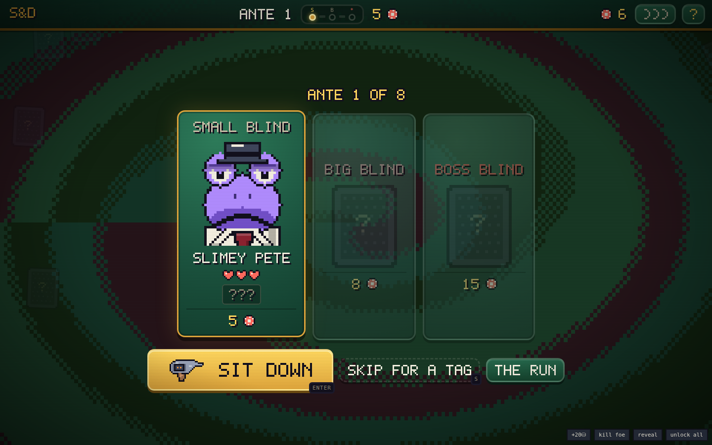

Eight antes, three chairs each — **SMALL**, **BIG**, then the **BOSS**. Before every one
you get the select screen: who's sitting there, how many hearts he has, what his purse
is worth, and which of his tells you can already read. Then either sit down, or
**skip for a tag** — walk past the chair and take a favour instead of a corpse (a fat
envelope, an inside man at the precinct, a care package, dutch courage, a gunrunner).
No purse, no pockets, no cards: that's the trade. Bosses can never be skipped.

`TAB` opens **the run** at any time — every trinket and item spelled out, your iron,
tags taken, and what the night has cost so far.

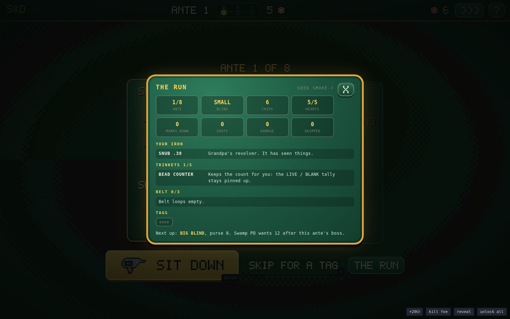

## The duel — first person


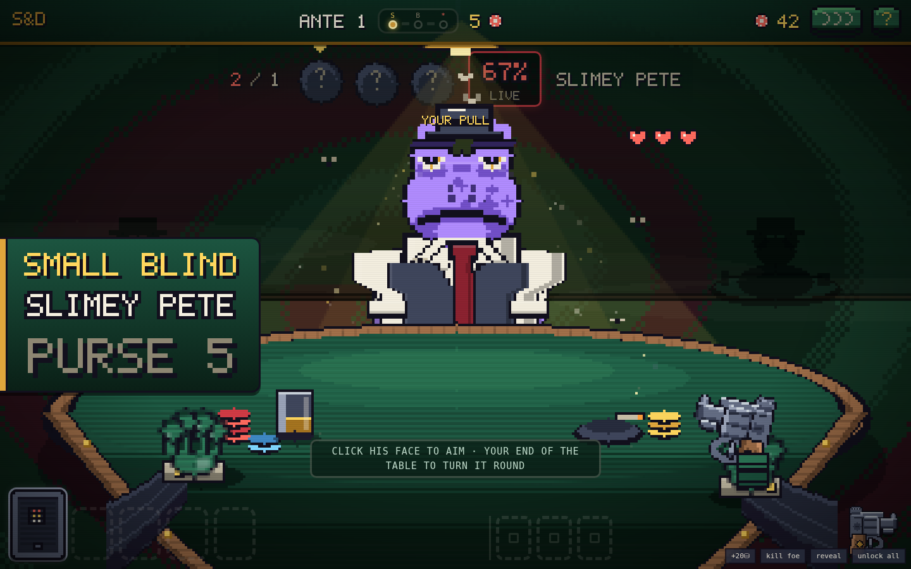

You're not a sprite on the far side of the table; **you are the camera**. What you see of
yourself is your own two frog hands on your end of the felt, your pinstripe forearms
coming up out of the bottom of the frame, and the iron in your right fist. The table is
built to match: the far half is an ellipse under the lamp, the near half dips off the
bottom of the shot the way your own edge of a card table actually does, going dark as it
comes toward you — and your glass, your ashtray with the cigar still going and your
hearts all sit on it. Aim at the mark and the barrel swings out across the felt. Aim at
yourself and it turns back at the lens: a bore, staring.

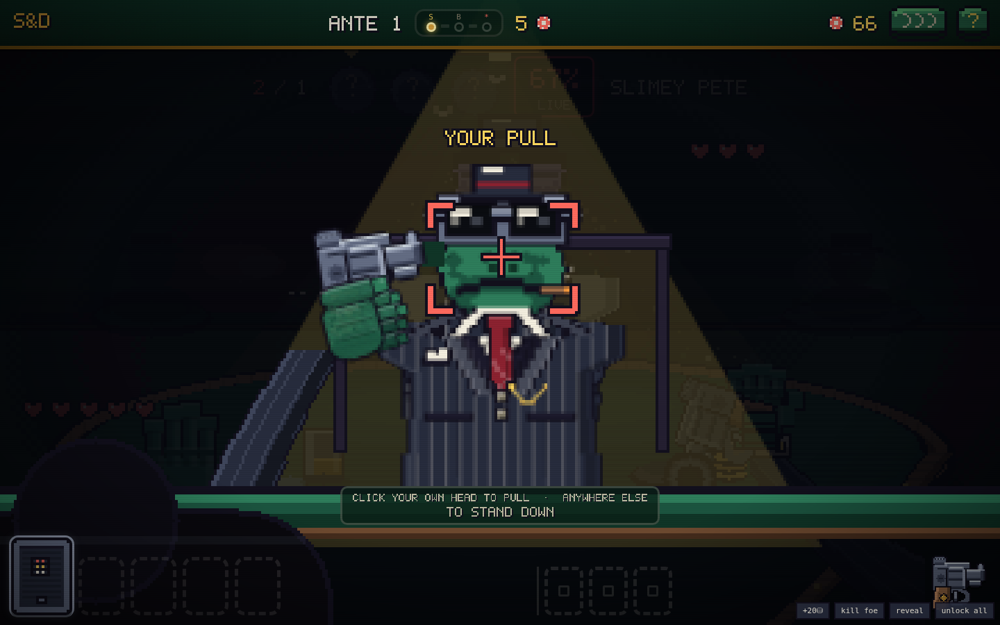

The drum loads with a posted mix — say **2 LIVE, 3 blank** — in an order nobody knows.
Take turns with the mark across the felt:

- **Aim at him** — live hurts him (blood on the felt is yours to keep), blank wastes
  the pull. Turn passes.
- **Aim at yourself** — a blank **keeps your turn** (that's the whole game), a live
  costs a heart.
- Empty drum reloads with a fresh mix. Zero hearts ends somebody. Lose, and the swamp
  keeps your marker.

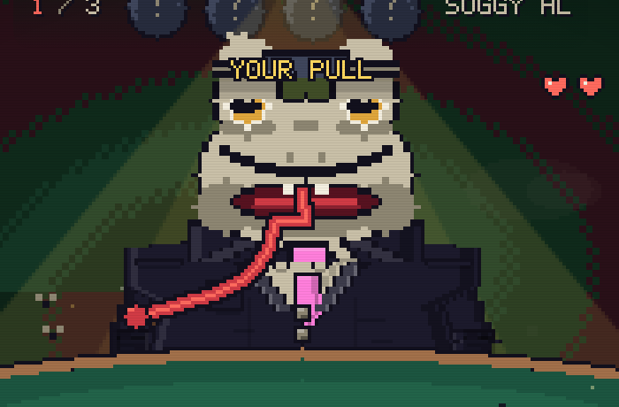


## Tells & the little black book

Every mook and capo is **procedurally generated** — face, build, suit, and 0–3 **tells**
you can read across the table:

| Tell | What it means |
|---|---|
| 🎩 **TOP HAT** | big hat, deep pockets: +6 corpse chips |
| 👒 **BOWLER** | a careful frog — slower to shoot you |
| 🧢 **FLAT CAP** | hungry and mean — quicker to shoot you, lighter pockets |
| ✨ **GOLD TOOTH** | pliers pay +5 at the loot |
| 💍 **RINGS** | the HAND pocket always pays |
| ⚔ **SCAR** | he's done this before: +1 heart |
| 🏴 **EYE PATCH** | no depth perception, no fear |
| 💧 **THE SWEATS** | panics — points it at himself more |
| 🚬 **CIGAR** | cool head, thick skin: +1 heart |
| 🦺 **FANCY VEST** | the VEST pocket always pays |

You don't start knowing any of this. **Loot a frog that carries a tell and you can
read it forever** — hover the mark's name and every learned tell is spelled out;
the ones you haven't earned yet stay `???`.

## The loot, and the law


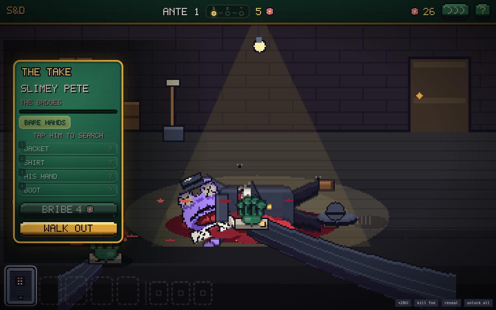

There is no shop. Kill the mark — he sprawls across the felt, legs, splayed hand, wounds
where your lead landed, a pool that keeps spreading — and then **you go through him
yourself**. His pockets aren't a list of buttons next to a corpse: they're places *on*
him. Hat, coat, vest, his hand, his boot, his mouth. Point at one and it lights up; tap
it and your arm goes out across the felt, shrinking with the distance, digs — cloth
shifting, dust off the lining, his weight rocking under your hand — and comes back with
whatever was in there. Nothing detonates. You're going through a dead frog's coat.

Every pocket you go into brings **the badges** closer; three and they're at the door.
**Bribe** them to keep digging (the price climbs) or walk with what you've got. Trinket
cards and guns come out of corpses — **boss holsters carry your next iron**.

### What you brought with you

| Tool | At the corpse |
|---|---|
| 🔧 **PLIERS** | yank the gold tooth free — the badges don't count it |
| 🔪 **THE SHIV** | arm it, then go back into a pocket you already emptied and slit the lining |
| 🔍 **JEWELLER'S LOUPE** | every bulge on him shows at once, and you get one more pocket for free |
| 📁 **FILE FOLDER** | hand them somebody else's paperwork: the heat here clears, free |

The badges are not an abstraction: a cop **walks in through the back door**, stands over the
body tapping his nightstick in his palm, and waits. Bribe him and the chips arc across
the felt into his glove one at a time — he pockets them, tips his cap and leaves. Refuse
and he folds his arms and stays.

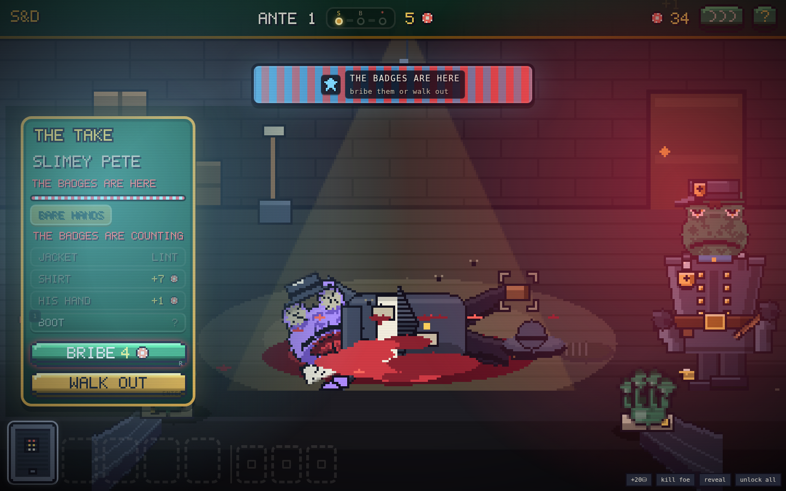

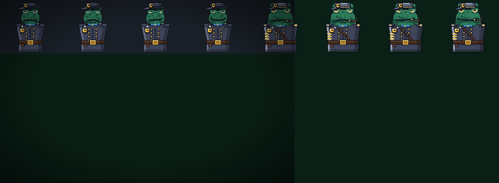

After every boss, **Swamp PD wants protection money**, scaling with the ante. Two or
three of them march in flanking the table under a red-and-blue light wash. Pay and they
salute and go. Can't pay, and the cuffs come out, the paddy wagon rolls past, and the
screen tips over. That's the debt now.

## The belt

Trinkets are permanent; **items are one-shot** and come out of the same pockets. Three
belt loops, keys **6–8**:

| Item | What it does |
|---|---|
| 🥃 **WHISKEY** | heal 2 hearts |
| 🔧 **PLIERS** | look at the LAST shell — or pull a gold tooth at the corpse |
| 🪙 **COIN FLIP** | heal 1 or take 1, but always +6 chips |
| ⚪ **SPARE BLANK** | slip an extra blank into the drum (the count changes) |
| 🔴 **SPARE LIVE** | slip an extra live in — for a mark about to take the gun |
| 👊 **BRASS KNUCKLE** | 1 damage right now, no shell spent |
| 📁 **FILE FOLDER** | make the current heat level go away, free |
| 💥 **HOLLOW POINT** | your next live hit deals +2 |
| 💨 **SMOKE BOMB** | the mark's next shot at you misses entirely |
| 🍀 **LUCKY PENNY** | force the shell under the hammer to be a blank |
| 🔪 **THE SHIV** | slit the lining of a pocket you already emptied — no heat |
| 🔍 **LOUPE** | every bulge on the corpse shows, and one more free pocket |

## The mob


Eight bosses, one per ante, each with a house rule and signature tells:

| # | Boss | The rule |
|---|---|---|
| 1 | **CROAKER** | blanks you fire at him *heal* him |
| 2 | **BLIND NEWT** | the load counts stay hidden |
| 3 | **TAXTOAD TONY** | every pull you take costs 1 chip |
| 4 | **DIZZY SAL** | the drum re-shuffles after every shot |
| 5 | **SLICK LILY** | your gun tricks are locked |
| 6 | **WARDEN WART** | trinket actives are locked |
| 7 | **DON BUFO** | nine hearts of blubber, no trick |
| 8 | **THE BULLFROG** | gets back up once — then hits for 2 |

Pay the badges after a boss and the ante closes out on its own screen:

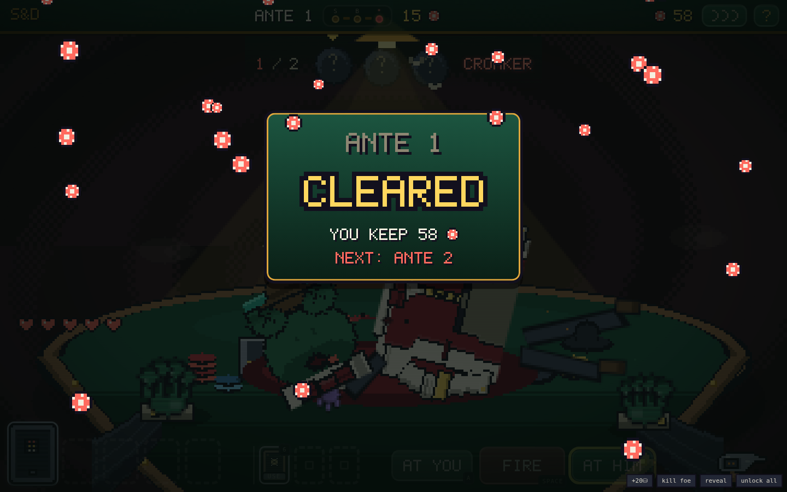

## The irons

Five guns, none of them flat art. Each is assembled from parts — frame, top strap,
cylinder, ejector shroud, rib, front sight, hammer, guard, checkered walnut — so the
scene can pose one, cock it, and turn the cylinder without needing a sprite sheet.
Left to right below: hammer down, hammer back, one chamber round, two.

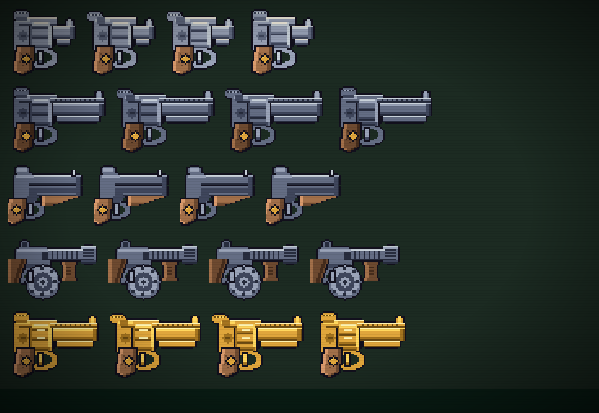

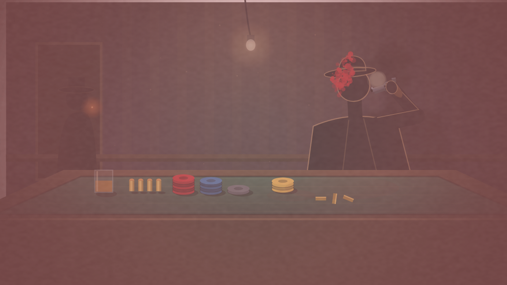

## Trinkets & the iron

**32 trinket cards** (5 slots, four rarities) loot out of pockets — passives like BAD
BLOOD (+1 on full-health marks) and actives on keys **1–5** like the MONOCLE (peek the
chamber) and the MIRROR SHARD (flip the shell under the hammer). Nine start locked
behind account-wide feats; the collection screen tracks everything.

The gun ladder stacks as you take it off boss corpses:
**SNUB .38 → LONG COLT** (first live hit +1) **→ SAWN-OFF** (Q: next shot ×2)
**→ TOMMY GUN** (E: double tap) **→ THE GOLDEN GUN** (corpses ×1.5, +1 heart).


## Keys

`A` aim at yourself · `D` aim at the mark · `SPACE` fire · `1–5` trinkets · `6–8` belt
items · `Q`/`E` gun tricks · `R` bribe · `S` skip a blind · `TAB` the run · `ENTER` sit down /
walk out · `M` mute · `H` house rules

Or just **tap**: tap the mark to aim at him, tap again to fire. Tap during any animation
to fast-forward it. The whole game is playable with one thumb, portrait or landscape.


## Project layout

```
index.html        entry point
style.css         pixel skin: chunky panels, CRT overlay
js/util.js        seeded RNG (mulberry32), helpers, procedural WebAudio SFX
js/pixfont.js     hand-drawn 5×7 typeface (every numeral in the game)
js/pix.js         pixel engine: palette, sprite compiler, draw helpers
js/data.js        content: traits, trinkets, guns, the mob, blinds, loot tuning
js/meta.js        persistence: stats, unlocks, learned tells (localStorage)
js/sprites.js     ALL the art: frog rig v2, the iron rig (hammer + cylinder), cards
js/bg.js          the swirling paint background
js/engine.js      pure rules: the duel, the mark's brain, the loot, the heat (no DOM)
js/ui.js          screens: title, duel frame, collection, help, keys
js/btn.js         the arcade buttons: sockets, moulded caps, pixel-art faces
js/fx.js          the effects engine: smoke, gore, chip arcs, slow-mo, ambient dust
js/duel.js        the drawn table scene: expressions, blood, the fall, the corpse
js/cine.js        the wipe, the sit-down, the boss cut-in, the ante interstitial
js/cops.js        Swamp PD: the walk-in, the bribe handoff, the shakedown, the bust
js/loot.js        the take: pockets, the badges bar, bribes, protection money
js/main.js        boot (+ ?debug harness)
dev/sim.js        headless balance & fuzz harness (node dev/sim.js)
dev/smoke.js      full browser smoke test (playwright-core)
```

### Tuning knobs (for modders)

- Corpse money, heat, bribes — `BLIND_PURSE` / `HEAT_COST` / `LOOT_TUNING` in `js/data.js`
- New tell: one `TRAITS` row + a visual flag in the rig (`js/sprites.js` `buildFrog`)
- New expression: one case in the eye/mouth switches in `buildFrog`
- The mark's brain — `E.oppDecide()` (aggression per boss in `BOSSES`)
- New trinket: one entry in `TRINKETS` (glyph included) + one hook in `E.pull()`

### Dev checks

```
node dev/sim.js      # 500 bot runs + 200 random-action fuzz runs against the real engine
node dev/smoke.js    # drives the full UI in headless Chromium, fails on any console error
```

Current curve (counting bot that plays its belt and sometimes skips): ~85% clear ante 1,
~39% reach the Bullfrog, ~10% walk out clean, ~4.4 items burned and ~1 blind skipped
per run. Humans who can't read a
top hat do worse. That's the point.

---

*A blank in your own head is a free turn. Loot fast — the badges are coming.* 🐸🔫
