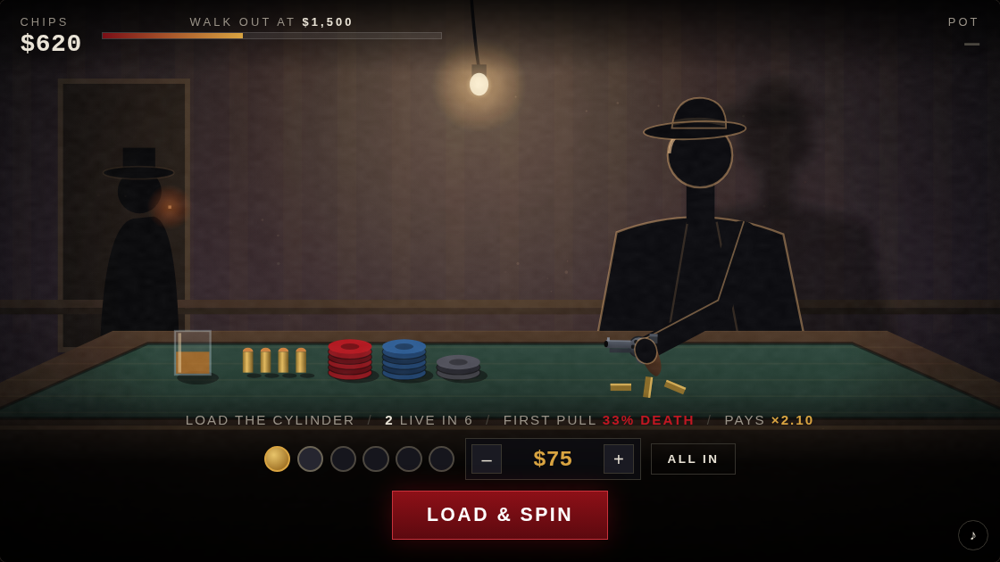
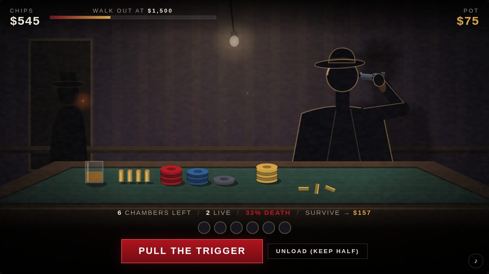

# SIX CHAMBERS

**Bet. Pull. Breathe.** A back room, one bulb, one revolver. You load the live rounds
yourself, spin the cylinder, and put the barrel against your own temple. Every **blank**
multiplies the pot — and empties a chamber, so the next pull is always worse odds than the
last. Cash out whenever your nerve goes. Reach **$1,500** and you walk out of here.



## Play it

No build, no dependencies, no assets, no network — one HTML file, one stylesheet, one script:

```
# open index.html in a browser, or:
python3 -m http.server 8080   # then visit http://localhost:8080
```

`space` pulls · `c` cashes out · `←/→` sets live rounds · `↑/↓` sets the stake · `m` mutes.

## The rules, all of them

1. **Load.** Choose your stake and how many of the six chambers get a live round. More live
   rounds means a bigger payout and a worse first pull.
2. **Pull.** The first pull is mandatory — that is what the stake buys. Survive it and the
   pot grows.
3. **Keep pulling, or don't.** The cylinder does not re-spin. Each blank you survive removes
   a safe chamber, so a 1-in-6 gun becomes 1-in-5, then 1-in-4, then a coin flip. The payout
   climbs with the risk.
4. **Die and the run is over.** The pot, the chips, all of it stays on the table.

The pot grows by `1 + 2.2 × (odds of dying on this pull)`, so a 1-in-6 chamber pays ×1.44
and a coin-flip chamber pays ×3.20. Clearing five blanks out of a one-live cylinder turns a
stake into roughly ×26.



## Is it winnable?

`dev/sim.js` replays the odds from the game a few hundred thousand times so the tuning is a
measurement rather than a hunch:

```
$ node dev/sim.js
SIX CHAMBERS — 200,000 runs, start 300, goal 1500, risk-pay 2.2

strategy                                walk out    died    broke   avg pulls
timid    (1 live, quit at 25% risk)      12.5%   87.5%    0.0%     3.5
steady   (2 live, quit at 40% risk)      16.3%   83.7%    0.0%     1.5
greedy   (2 live, all-in, quit at 50%)   19.8%   80.2%    0.0%     1.3
reckless (3 live, all-in, quit at 60%)   19.3%   80.7%    0.0%     0.7
suicidal (5 live, all-in, never quits)   16.7%   83.3%    0.0%     0.2
```

Roughly one run in five walks out, and every style of play is live — grinding small bets is
viable but slow, and slow means more pulls. Pass `START=250 GOAL=1000 K=2.6 node dev/sim.js`
to try other tunings before changing the constants in `js/game.js`.


## How it is built

Everything on screen is drawn at runtime into a single `<canvas>` — the room, the bulb and
its swaying pool of light, the wall shadow, the table in perspective, the chips (the stacks
track your actual bankroll), the seated figure, and the revolver, which is assembled from
gradients rather than an image. The figure is drawn in two layers, body before the table and
arm after it, so the table cuts him off at the waist while his hand rests on the felt. The
arm is a two-bone IK chain: the elbow drops to the table at rest and chicken-wings out when
the gun comes up.

The HUD and controls are plain DOM on top, sized entirely in `cqw` so they scale exactly
with the stage at any window size. Sound is synthesized with WebAudio — the cylinder ticking
to a stop, the dry clack of a blank, the heartbeat while you hold it there, and the one you
don't want to hear.

```
index.html      markup: canvas, HUD, control panel, overlays
style.css       noir shell, container-query scaling
js/game.js      the whole game: odds, state machine, scene, audio
dev/sim.js      Monte Carlo check on the payout curve
```
