# SHELL & DEBT

**A murder-mystery in Paris, in hand-drawn pixel art. No build, no assets,
no network — every pixel is drawn by the game at boot.**

You were the good cop. You picked the Bullfrog out of a line-up and his
lawyers had him out by noon. At seven that evening the door came in. It rained
at the funeral and he sent flowers. You kept the badge, and the gun.

Six years later there is a board in the back of the Brigade with five holes
in it, and nobody's name on the case but yours. Fill the board and the man
goes down in a courtroom. Turn up at his door without it and the only thing
you can do to him is the thing he did to you.

Every day of it is the same shape: **the captain gives you a lead at nine in
the morning, the city hides the evidence, and he wants you off the street at
seven.** Drive out across Paris, put your hand in the drains and the wine
crates and the pawnbroker's case, find out where each of the frogs on that
wall says he was and break the one story that is a lie, name him in the
line-up downstairs, and then sit down across a table from him with one
revolver between you.

That is the whole game, and it is the two endings.

## It opens on a Tuesday, and nothing happens

Before any of the rest of it, you get one ordinary morning. It is the only
bright set in the game and it has to earn that, because it is the room the
whole of SHELL & DEBT is about losing — so it gets more detail than anything
else in here and all of it is domestic. Butter paper with a sprig on it,
honey wood, scrubbed boards, sun over the sink, a kettle going, a checked
towel on the range rail, three coats on three hooks and **one of them is
small**, two pairs of shoes and **one pair is small**, and a crayon drawing of
four frogs holding hands under a smiling sun, stuck to the larder with a red
magnet.

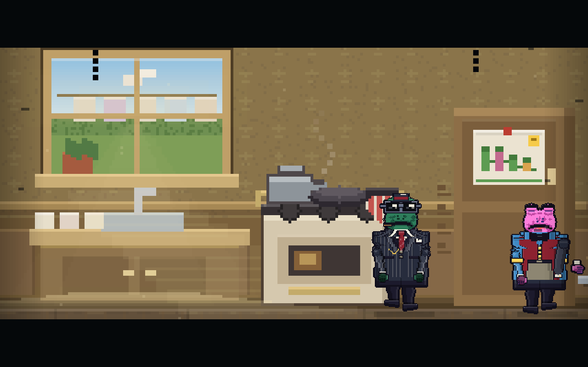

**And it is the tutorial.** Every game has to teach four things — how to
move, how to use a thing, how to talk to somebody, how to look closely — and
most teach them with a box of text in the corner of a grey room. This one
teaches them by *needing* them:

- **Tap the floor to walk.** He is standing in the wrong place and the room
  is yours. That is the whole lesson.
- **Use a thing.** The stove has a bracket round it and a word on it, same as
  every door, drawer and body in the game. Using it cooks breakfast: three
  eggs on the same sweeping needle every trade in this game runs on, and the
  plate on the counter fills up as they land. The first thing you ever do
  with your hands is make an egg for your son, and it is the identical action
  you will spend six years doing to locks, prints, taps and a pistol.
- **Talk to somebody.** The boy at the table cannot find his school reader.
  He has looked everywhere. Twice.

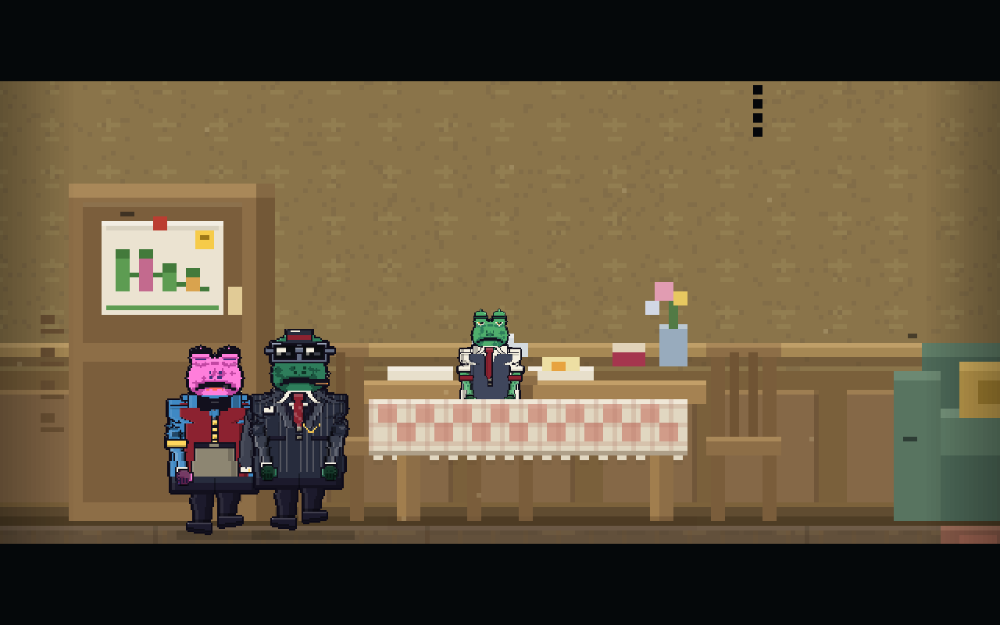

- **Look closely.** The reader is under the left sofa cushion, and the only
  way to find it is the eyeglass — the room five times closer in a brass
  ring, with the lines under it. Which means the first case you ever work is
  a missing library book in your own front room, and the game never once
  calls it a case.

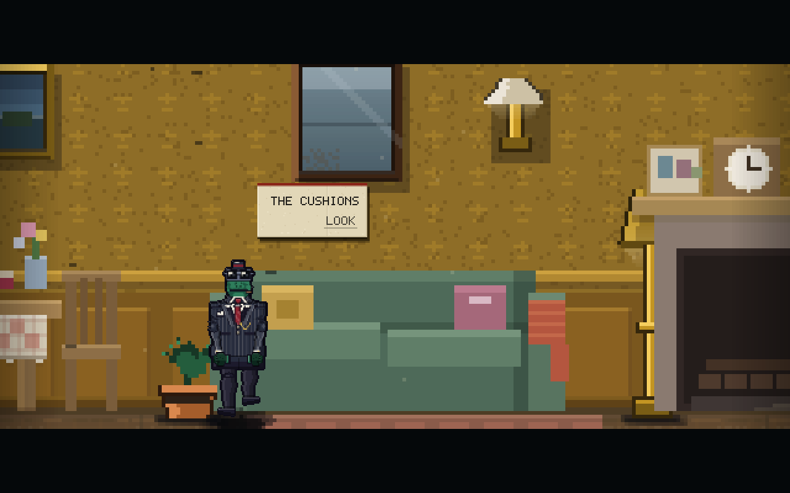

Then the bag off the hook, the shoes, the door, and the car. *Be back by six.
It is your turn to cook properly.*

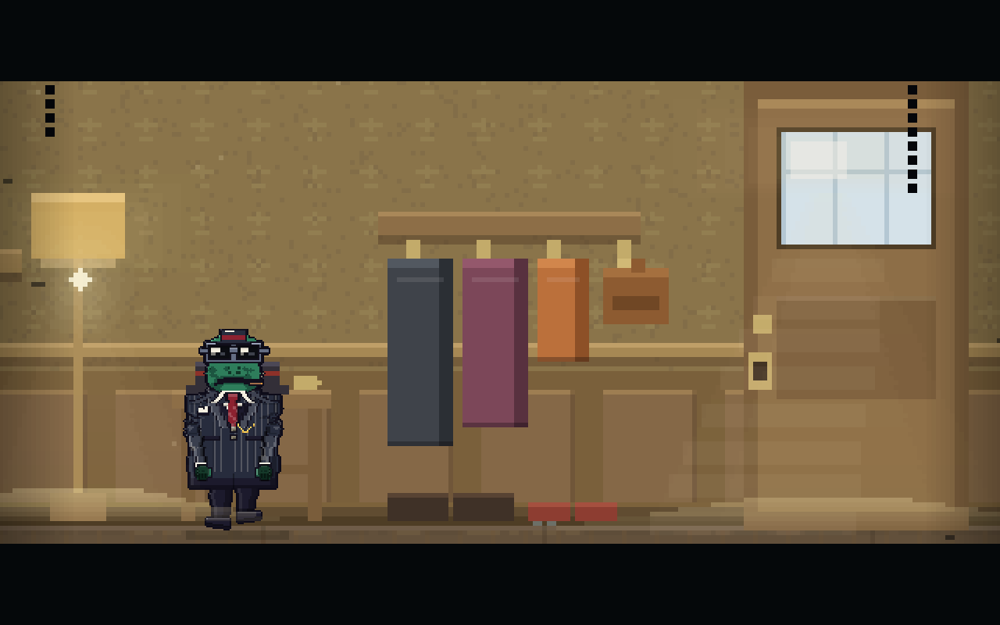

**The school gate.** Nine seconds, and one job: be the last completely
ordinary thing that ever happens to him. Railings, a horse chestnut, a bell
on a bracket, hopscotch chalked on the pavement, a bicycle against the fence.
He waves from the gate. You do not go in.

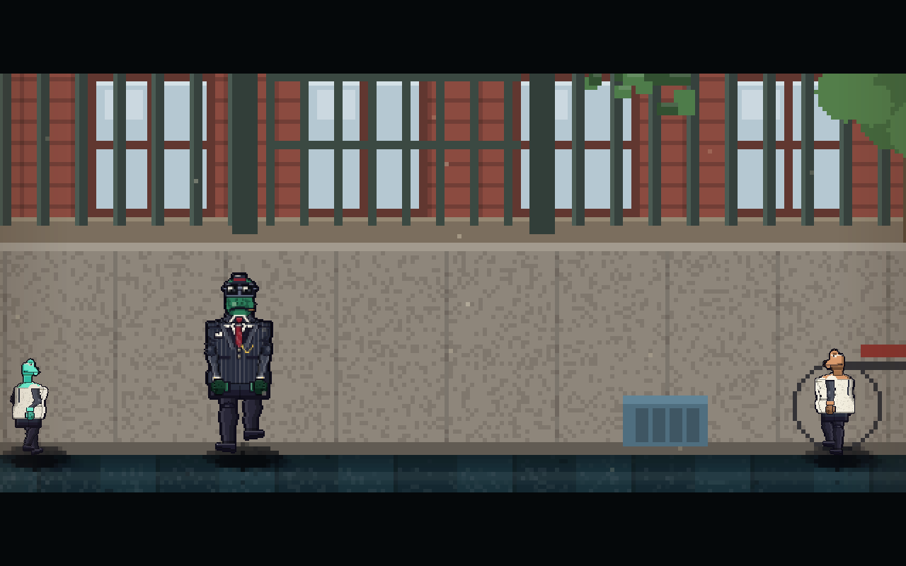

### And then the post comes up from the desk

An envelope with his name on it and **no stamp**, which is the first thing
wrong with it. Somebody walked it in.

*WE HAVE YOUR WIFE AND WE HAVE YOUR BOY. THEY ARE ALIVE THIS MORNING. DO NOT
GO HOME. DO NOT TELL YOUR CAPTAIN. THERE IS NOTHING YOU CAN PAY US. THIS IS
FOR SOMETHING YOU DID.*

And there is something in the fold of it.

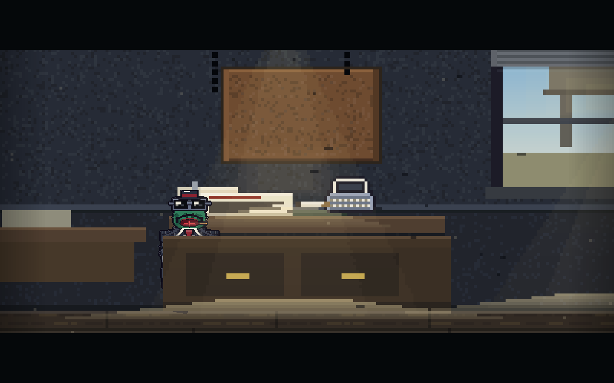

**The zoom right in** is not a camera move. It is the eyeglass — the same
instrument the cushions taught you twenty minutes ago, held up to one
cigarette end smoked down to the print and put out carefully. *GAULOISE.
CAPORAL. And under that, in four point: PARIS.*

Then the tabac on Sixth, who has been behind that counter for thirty years
and has a wall of every brand sold within a hundred miles, with one gap in
it. *I have not sold one of those in my life. Nor has anybody between here
and the coast. Whoever put that out bought it in Paris.*

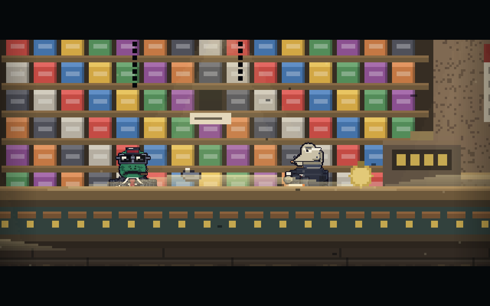

## And then he goes home anyway

He was told not to. He went.

The game used to open on a slideshow. Eight painted panels, two hundred and
twenty pixels by a hundred and twenty-four, each held up while a caption
typed itself underneath. They were decent drawings and they were still
slides, and the game they introduced does not look anything like that: it
looks like a lit room with a frog walking across it, seen from the side, with
a camera that follows him.

**So the cutscenes are rooms.** Same `SCENE` runtime, same rig with its
elbows and knees, same lamps, same floorboards, same dialogue plates. What a
cutscene adds is that nobody is driving: a shot list walks him in, pans the
camera across the wreckage, cuts in close on the thing that matters, and puts
the lines over the top of it. Everything in the opening you will see again
while you are playing, because it is the same machinery.

**The house, that night.** Black, then a hall out of the dark, then the front
door with the lock plate split off the jamb and the screws out of the wood.
He walks in. The camera goes with him, past the coat still on its hook and
the telephone that is not on its table — *she got as far as picking it up* —
and through the archway into the front room in one move.

Every warm thing in the prologue has its cold twin in here: the same paper,
the same chair, the same boards.

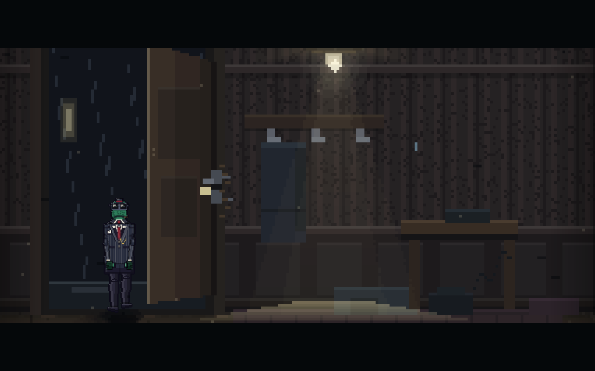

**The room.** Her chair on its side on the rug. The window sash pushed right
up in November, throwing a shaft of street light across the boards. The
wireless still on the sideboard, untouched, which is its own kind of wrong —
nobody came here for the silver. And no blood anywhere: **nobody is dead in
this house.**

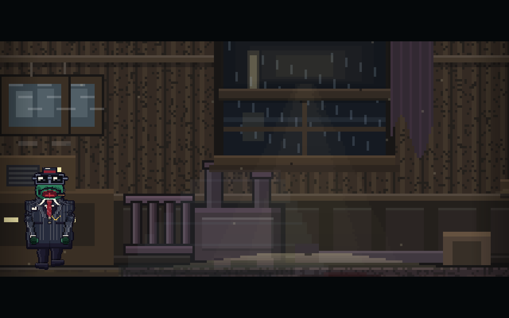

**Three places, and you have to look.** Not a card with brackets painted on
it: the room's own hotspots, the room's own markers, the room's own
walk-over-and-use. This beat is not a cutscene at all any more. It is the
game, six years early.

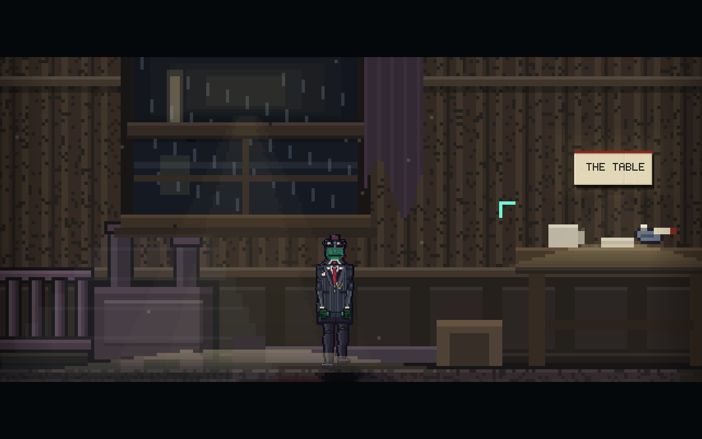

**The ashtray.** Two cups on the low table and one of them is not yours. The
camera cuts in, his arm goes out and comes up with the thing in his hand —
the same arm pose the barman uses for a rag and the drinker uses for a glass.
Half smoked. Still warm. And through the glass it is **the second one that
day**: same print, same four-point type. He stood in the front room and
finished it while he waited.

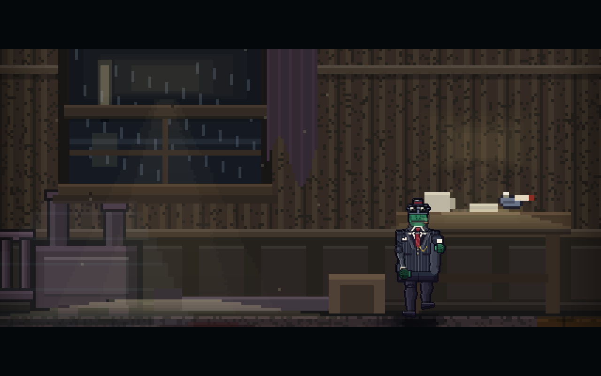

**Orly, three weeks later.** A security hall with a split-flap board, a wall
of glass with an aircraft parked behind it, and a counter you can walk up to
with two officers behind it — behind it, because a room can now paint a
foreground over its cast. Hand the iron over the counter or put it through
the machine in your case. That is the first real decision in the game, and
the machine does not care what you told it.

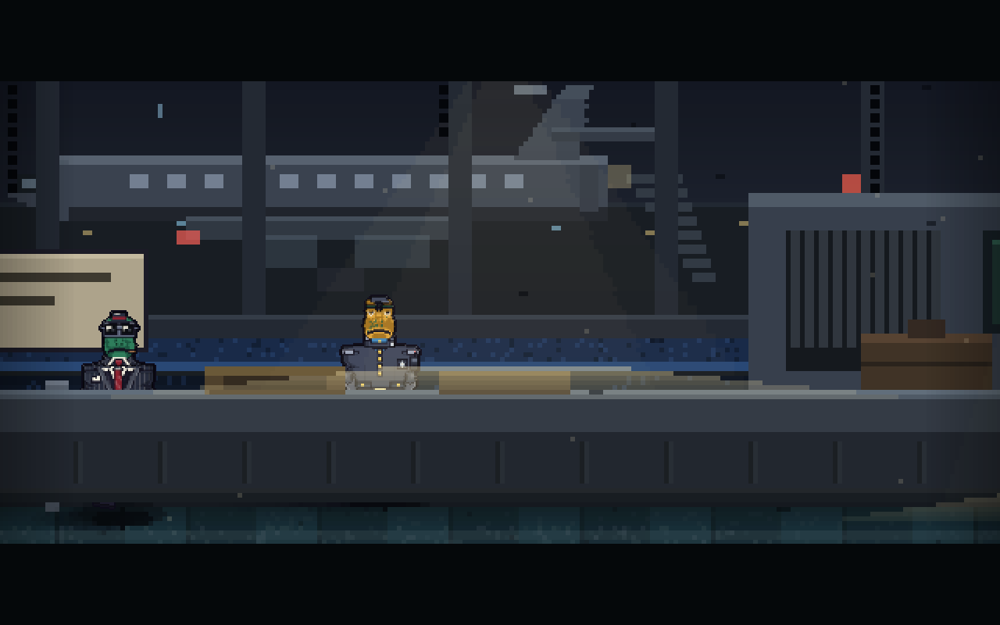

**The cabin.** Rows of seats in profile, reading lights, the aisle. The
camera walks the tube. Then the windows fill up with Paris and the card lands
over the live room rather than over black.

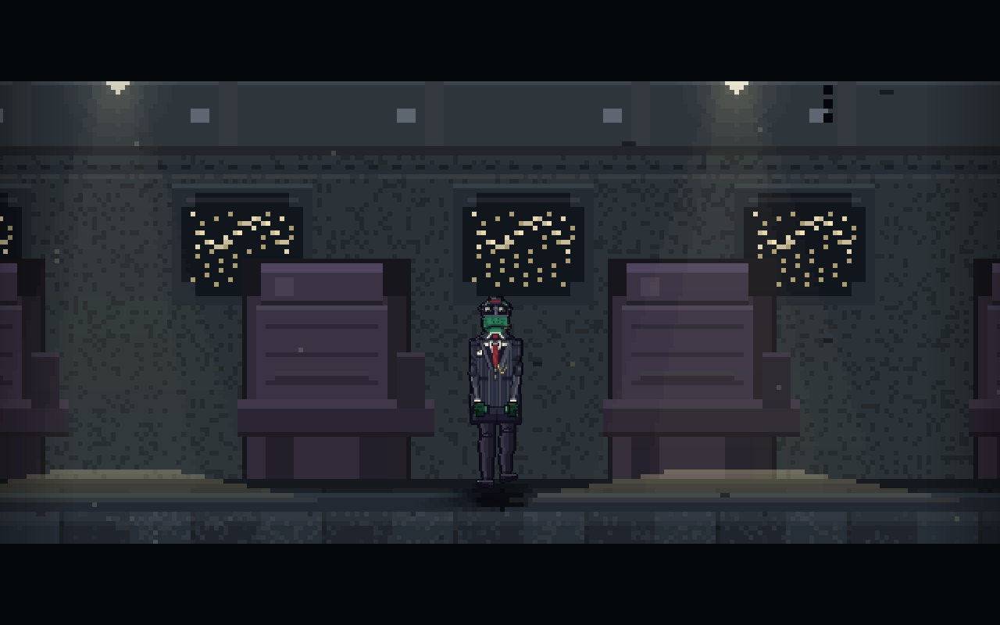

Every beat is something you do or something the camera does, and Escape drops
out of all of it — a player who has seen the opening once should never have to
sit through it again.

### And then the Brigade wants a form filled in

A foreign policeman with a missing family and a cigarette end does not get
handed a case. He gets handed paperwork. Four questions, whose answers are
the game's own rules — *a story you cannot break is a story that holds*, *you
work a city in the order it closes*, *three minutes with a glass saves
eighteen with your hands* — and the captain reads your answers back to you
across his desk.

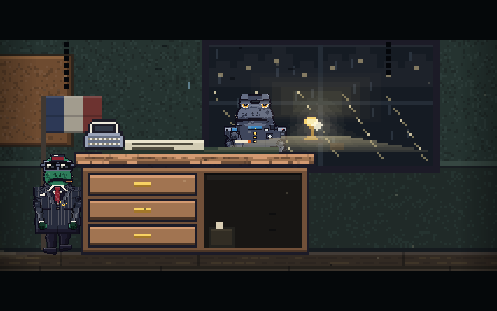

Then six shots downstairs, four of which have to land, on the same
steady-hand meter every other trade in this game uses. Get both and you walk
out with twenty francs and a captain who thinks you might be worth the desk.

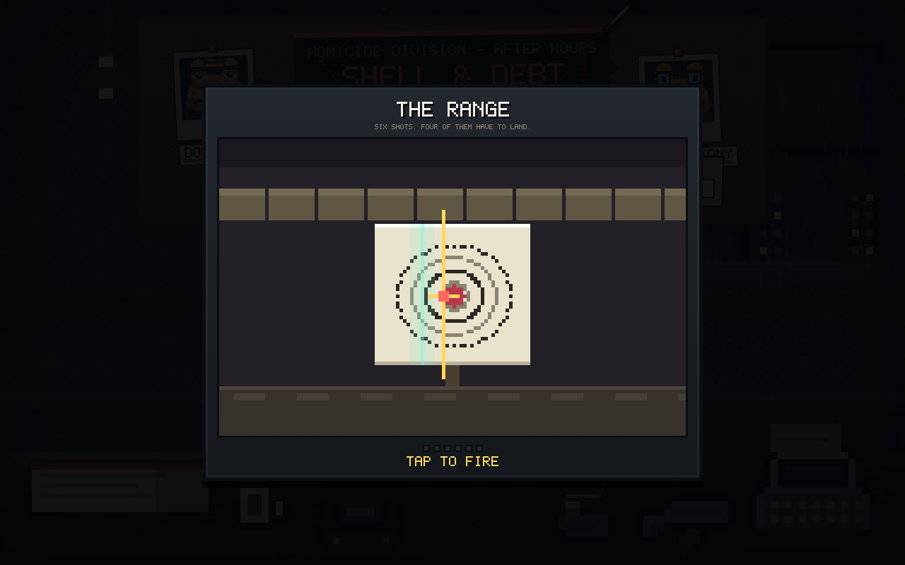

### It is drawn at the size it is drawn at

Every room is a canvas of world pixels blown up by a **whole number**, which
sounds like a detail and is the difference between a game and a magnified
game. There is no resampling filter anywhere between the pixels a frog is
drawn with and the pixels on your screen. Which whole number is the camera's
business, below.

The rooms paint above their own top edge, too, so the Eiffel Tower goes all
the way up instead of stopping in mid-air, and an interior's wall carries on
to a ceiling instead of meeting a black bar.

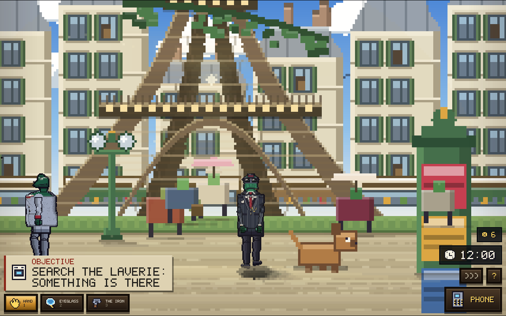

### Nothing is painted over the picture

There is no filter on this game. There was one, twice: a CRT overlay and a
radial vignette in the CSS, which went a while ago, and then a much quieter
one that survived — two translucent sheets laid over the finished frame every
tick, a warm one and a cool one, three or four per cent each. Measured on a
real room that came to **plus four red, plus five green, plus six blue on the
mean pixel**, blue shifted, over every pixel in the picture. Which is the
definition of a filter over the game, and is exactly what it looked like.

The hour is baked into the room canvas when the room is painted, which is the
honest place for it, so the cast over the frame was a second pass doing the
same job worse. It is gone, and it is measured back to zero. The two soft
gradient bands the CSS drew across the top and bottom of the room went with
it: a soft gradient over a picture made of hard pixels is the other thing
that reads as a filter.

### The camera stands close

FOOT is three, so the only display scales that keep the rig at full detail
are **three and six** — nothing clean sits between them, and any other number
downscales the rig through a smoothing filter, which is real blur. Three puts
four hundred and twenty-seven room pixels in frame and a cast eighty screen
pixels tall in the middle of it. Six halves the frame and doubles the cast.

Six is the default now. It used to look wrong and that was the cast over the
frame; with the frame clean, six is plainly the better shot for a game about
faces — the detective reads as a frog in a pinstripe suit with shades, a
fedora, a red tie and a cigar rather than as a green smudge. A short or
narrow window still gets three, and **Z** switches between them and remembers
which you chose.

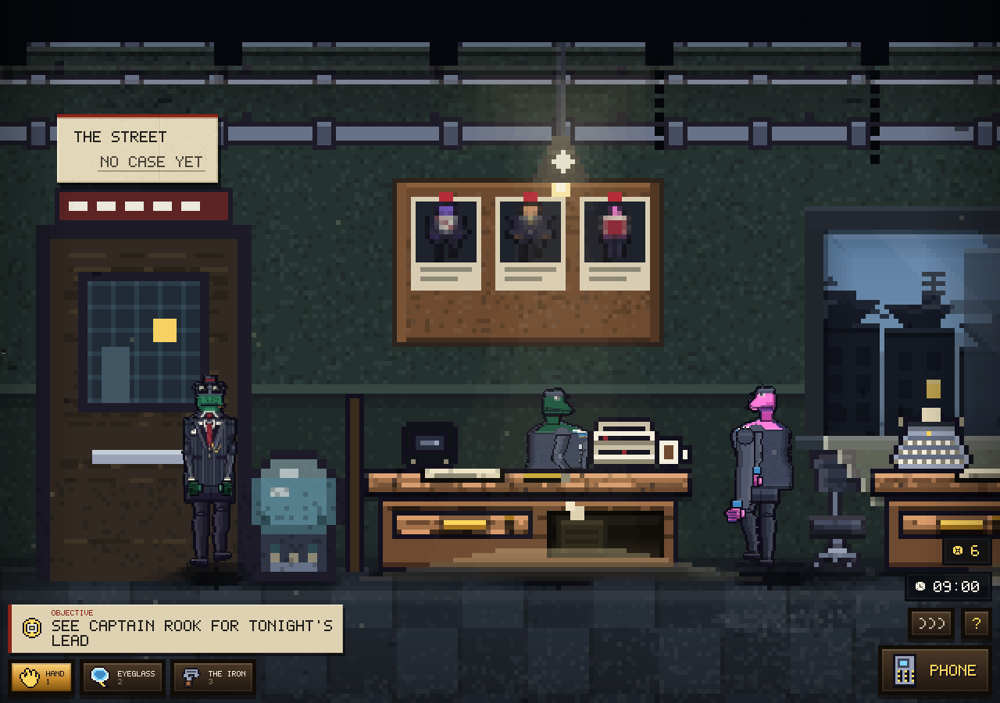

### The brightness filter was in the bake

Third time. The CRT overlay went, then the cast over the frame went, and the
last one was hiding somewhere worse: **inside the room art**. `DAY.bake` ran a
screen pass with a per-band lift over every interior it painted, so the
brightness was not on top of the picture, it *was* the picture, and there was
nothing to turn off.

Measured on the bar. The room as authored has a mean pixel of **37, 31, 28** —
proper noir. After bake it was **84, 80, 73**: more than twice as bright, with
every shadow in the room flattened on the way. The lift is gone and the indoor
tints are clamped to three and a half per cent warm, four and a half cool.
The same room now bakes to **45, 41, 39**.

### And the lamps do the lighting instead

Dark only works if something is lit. The room lights used to be a five per
cent hint of a cone; each one is now four things — a bounce on the wall
behind the bulb, a stepped cone falling through the room, an elliptical pool
on the surface underneath, and a bloom at the source — at fourteen per cent,
with an optional `fy` so a lamp pools on a counter instead of the floor, and a
`bare` flag for the ones with no fitting to bloom on (moonlight through a
sash, spill from the next room). A light with no lamp under it draws a white
star on the wallpaper, which is worse than no light.

The cone is drawn a row at a time with a soft edge, too. Twelve stacked
rectangles of increasing width read as a **staircase**: the light under a hall
pendant came out as a stepped pyramid standing on the floor.

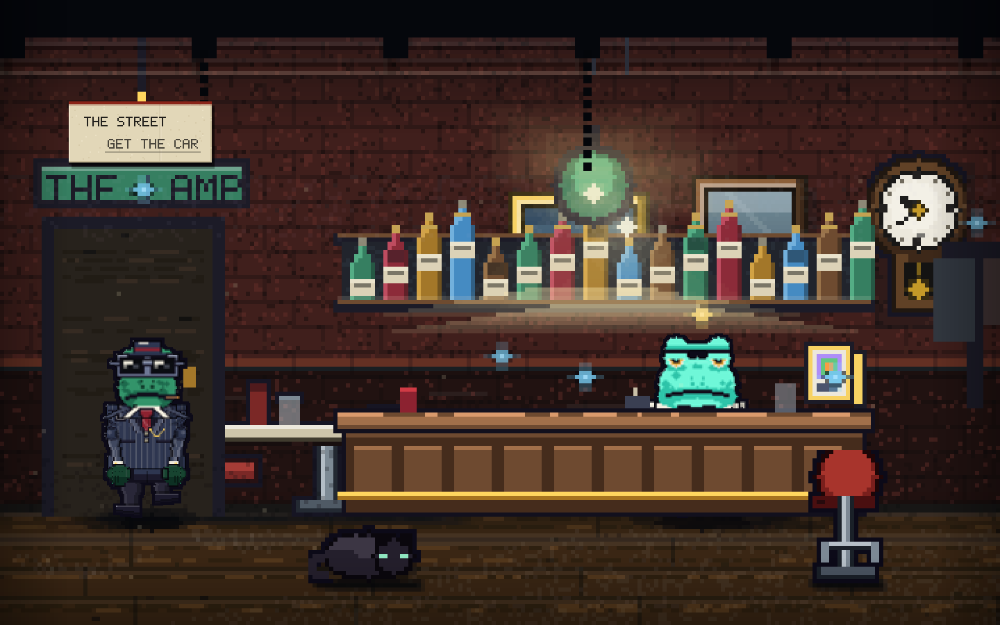

### Everybody has an elbow and a knee

The limbs were slabs. The arm ran twelve pixels wide from the shoulder cap to
the cuff with one pixel of taper in it, and the leg was a single fourteen-wide
rectangle from the hip to the shoe with a crease painted across it — a table
leg in a trouser. Neither had a joint anywhere, which is the whole reason the
cast read as furniture.

Both are now **two tapered bones and a joint**. The arm is full at the
deltoid, narrows into an elbow that folds through the stride, swells over the
top of the forearm and pinches to a wrist half the width of the shoulder. The
leg is a thigh, a knob of a knee, a shin with the calf under it, and a foot
that rolls: flat through the stance, toe down at the push-off, toe up coming
in to land.

Direction drives it. Sine says where in the stride a leg is; **cosine says
which way it is going** — so the leg in the air folds and the leg on the
ground locks. The bob was upside down as well, and it moved the feet with it:
you are tallest at the passing beat, and the foot on the ground does not move
at all. The hips rise and fall over it now, and the soles rest on a fixed row.

### And a hand the size of a hand

There was one hand pose — splayed flat, drawn for a hand lying on the felt —
and hung off the end of a standing frog's sleeve it was a bright green cabbage
at hip height on every body in the game. The felt keeps that pose. Everything
else gets a closed one: nine across and ten down, about a fifth of the width
of his head, with knuckles along the outward edge, digits curling under with
grooves between them, a thumb across the front, and a shadow on it, because a
hand at somebody's side is in his own shade.

Five poses, built from row tables rather than a loop of digits — `hang`,
`fist`, `point`, `grip`, `splay` — and `SPR.ARM_POSE` on top of them, so a
room can put an arm somewhere and get told where the hand ended up. The
barman's rag is in his hand now and the drinker's glass reaches his mouth,
instead of both floating at chest height beside them.

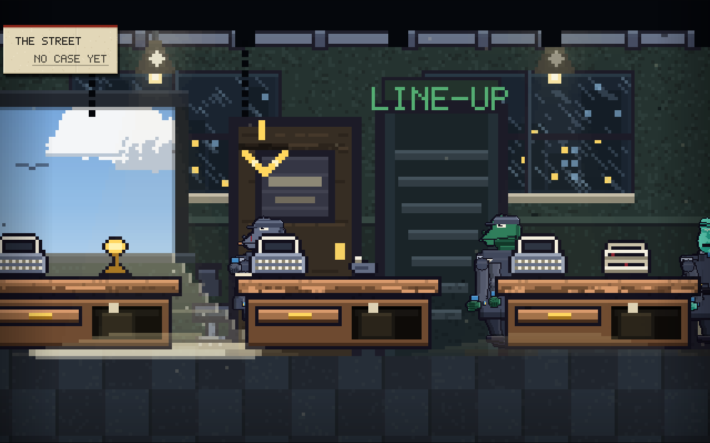

### The light is the clock

Nothing in here tells you the time as insistently as the sky does. The shift
opens in a cold blue morning, goes white at noon, turns the limestone apricot
at half past four, and ends with the sun going down behind the rooftops — and
when the shadows go long you are nearly out of afternoon. Interiors get it
through their windows: a slab of warm air leaning across a laundry with the
dust turning over inside it, and a bright patch of floor at the end of it.

The frogs who know things go home. The launderer locks up at five, the
catacombs at five, the pawn at six; the man on the quay works late and the
cabaret does not open until the evening. **The order the city closes in is
the order the day has to be worked**, and the plan on your phone counts down
the doors.

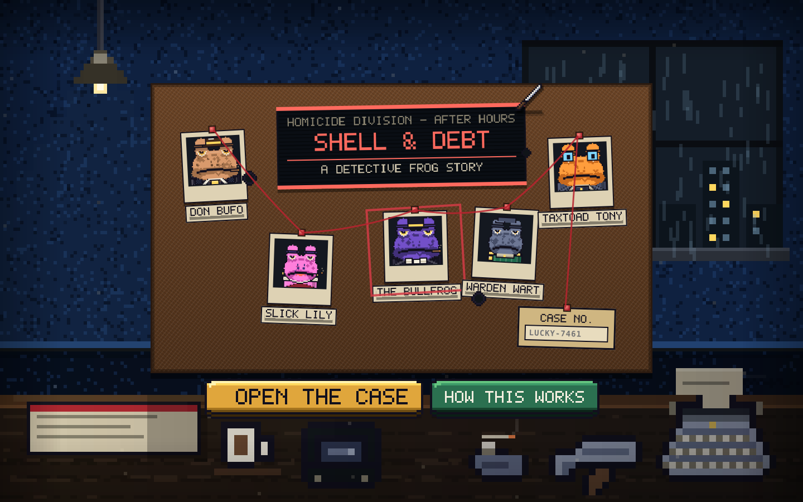

## Play it

```
# open index.html in a browser, or:
python3 -m http.server 8080   # then visit http://localhost:8080
```

Plain HTML/CSS/JS. Every sprite, prop, room, letter, cloud and cutscene is
drawn by the game from code — there is not one image file in the repository.
The sky is a stepped gradient with two banks of cloud in it and a sun that
blooms in rings; the Eiffel Tower is a profile curve and an X-brace lattice;
the plan of Paris is printed on paper that creases where it folds. Works on
phones. Sounds are synthesized with WebAudio. Cases are seeded. What the
department remembers about you persists in localStorage.

## The rooms you walk around in

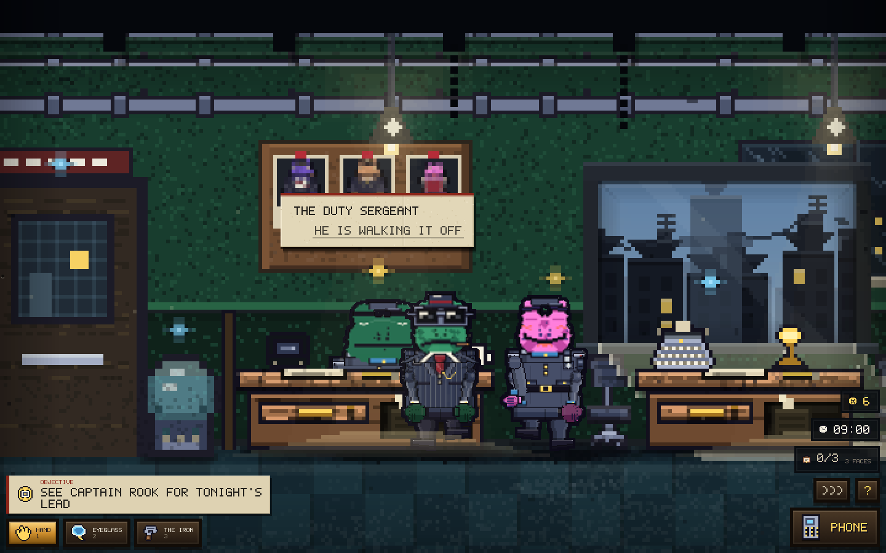

There is no menu strip and no button bar. A room is a place: **tap the floor
and the detective walks there**, drag to look down the room, and the things
you can do are objects in it. Walk up to a thing and it says what it is on a
little drawn plate over its own head; tap again and you do it.

Rooms arrive like scenes in a film. The cinema bars close, the camera pans
the length of the room while the name of the place types itself onto a card,
and only then does it hand the controls back. When somebody talks the bars
come back, the camera holds on the two of you, nobody walks anywhere, and the
line types itself out under his face one key at a time.

The bullpen at two in the morning has a front desk with a phone and a
percolator, three desks with typewriters and one live lamp, a water cooler, a
dead plant, filing cabinets, lockers, a radiator, a wall clock nobody winds,
a holding cell with somebody in it, rain on the windows, pipes along the
ceiling, and the board at the far end. People stand *behind* the furniture,
the lamps put light on the floor, and the ceiling has joists in the dark.

- **Captain Rook** hands you the next chapter of the case.
- **Officer Maybelle** works the front desk. Talk to her once a day.
- **Patrolman Dill** has nothing to report. The **drunk tank** has a lot.
- **Your desk** holds the lead. **The lockers** hold your iron and your belt.
  **The cooler** is worth one heart a day.
- **The street door** gets the car, which means **the phone** (`P`).
- **The stairs** go down to the line-up room, when you have something on
  somebody.

### The board

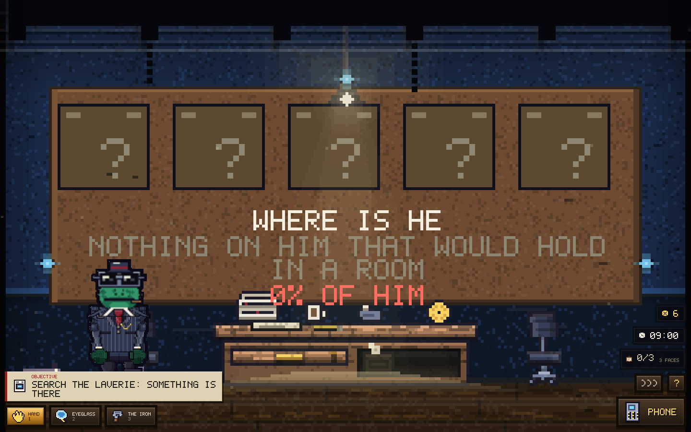

Five pieces make a case: a **photograph**, the **vig ledger**, the **route**,
the **name on the deed**, and the **address**. Each one is a thing you take
off a body and pin to cork, and the red string grows between them as you go.
At five pieces the gap in the middle spells out fourteen Marsh Row.

The board is also the readout the old ante ladder used to be — **the only
number this game shows you is how much of him you have.**

## The case

Eight chapters, bottom to top: the collector, the bookkeeper, the driver,
the lawyer, the cousin, the enforcer, the floor below his, and him. Each
chapter is a room of his people and the frog who runs it — **and every
lieutenant carries one piece of the board.**

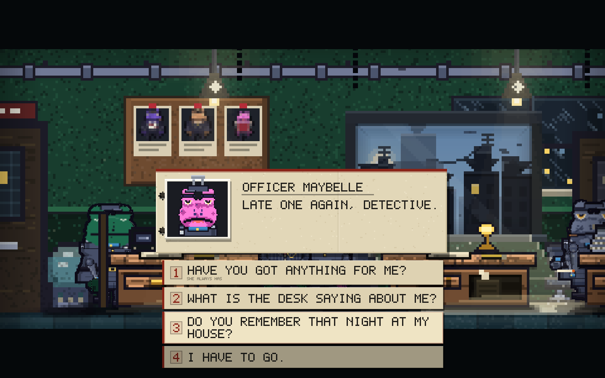

Maybelle's trust is slow and it is real: it starts as talk, becomes coffee
money in your coat, then a file pulled before the shift change (**+1 look at
the evidence, all day**), and one evening, *"whatever happens up there — come
home after"* — **+1 heart, all day**. It carries between cases.

## The city is Paris

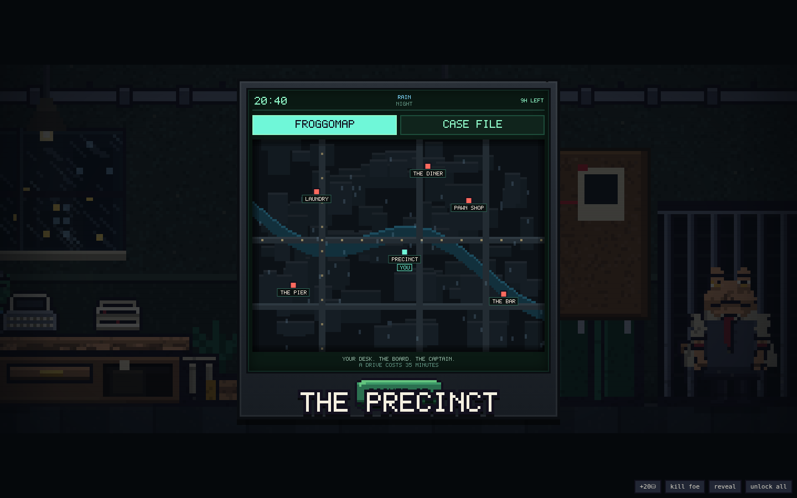

The case is not in one room any more. **It is buried across the city**, and
the only way to it is the phone in your coat.

Five of the stops are work: a laundry on the canal where they found him, the
quay, the pawn, the café, the cabaret under the windmill. The other six are
Paris, and they are why you took this job:

| | |
|---|---|
| **LA TOUR** | eight thousand tons of iron over the Champ de Mars, and nobody looking down |
| **L'ARC** | twelve avenues, a flame that has not gone out since 1923, and the metro underneath |
| **LA BUTTE** | Montmartre: the whitest church in France, painters, and a frog with three cups |
| **LE MUSÉE** | the palace courtyard after closing, a glass pyramid lit from below |
| **LES CATACOMBES** | six million of them, and the only room in this city nobody has ever bugged |
| **LE MÉTRO** | white tile, an enamel sign, and the last train long gone |


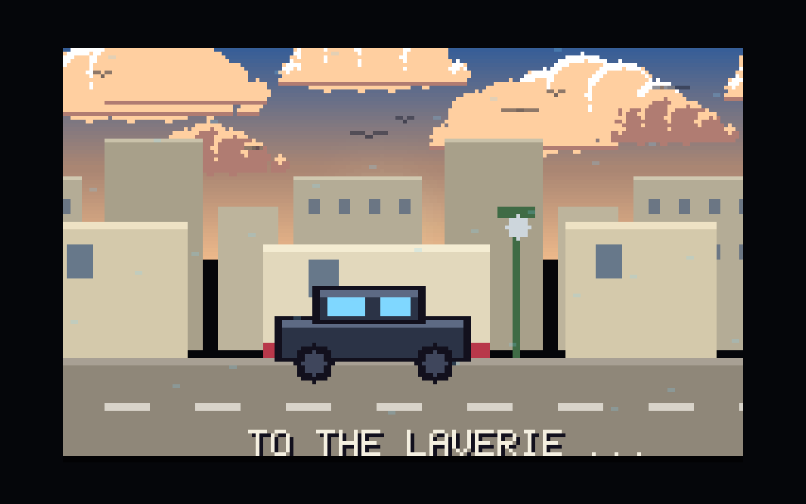

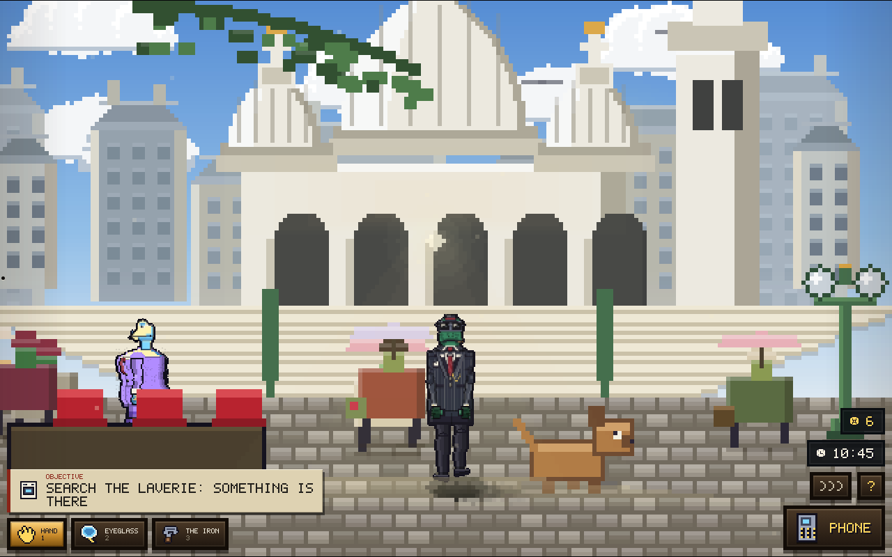

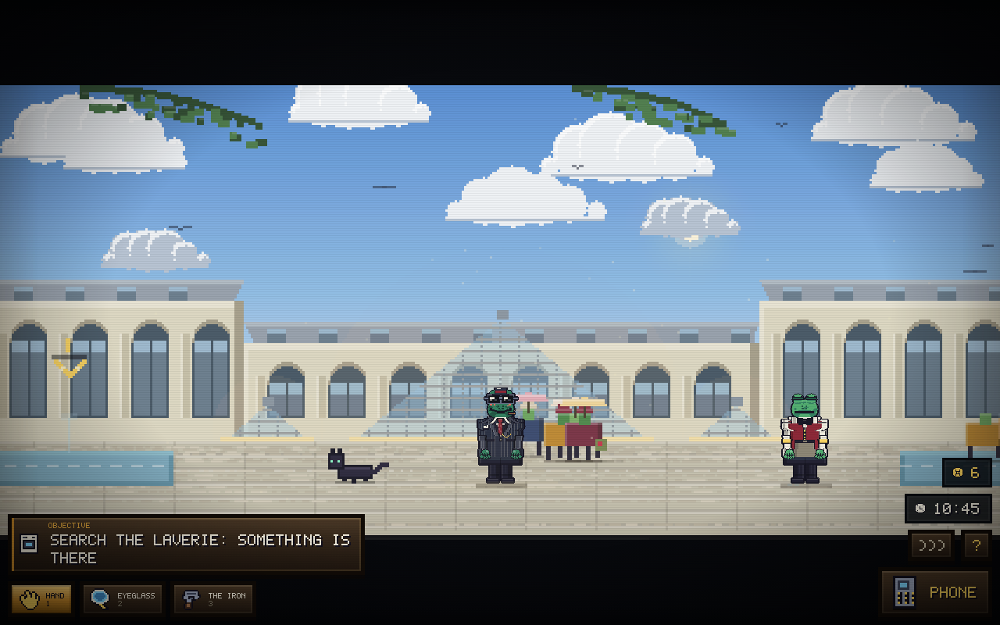

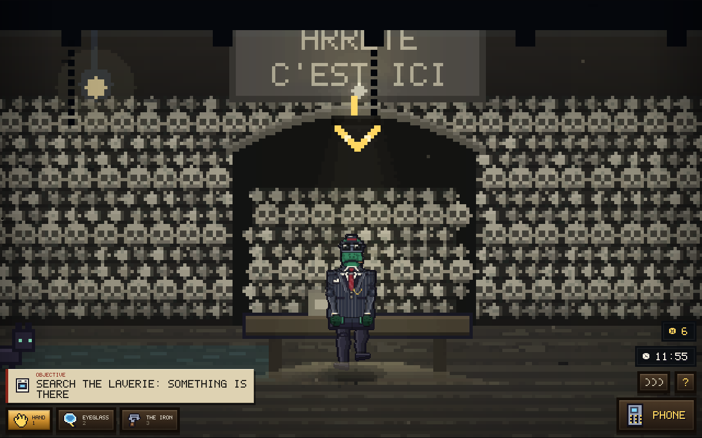

None of it is a photograph. The tower is a profile curve and an X-brace
lattice, the basilica is three domes that are widest where they meet the
roof, the ossuary is a wall of skulls generated a row at a time — all of it
drawn by the same code that draws the frog, at boot, from nothing.

Today's file only touches seven of the eleven, and the plan dims the ones
it does not — nobody should burn thirty-five minutes driving to the
catacombs for nothing. The rest of Paris is still there, with work in it.

### It has quarters, and three of them are shut to you

Eleven pins on a sheet of paper is a list. The same eleven inside named
quarters is a city, so the plan is divided into the ones Paris actually has —
**MONTMARTRE**, **L'ETOILE**, **CHAMP DE MARS**, **LE LOUVRE**, **L'ILE**,
**LE MARAIS**, **BERCY**, **MONTPARNASSE** — with the boundary drawn in
dot-dash and the name written across the top of it, the way a plan does.

And three quarters are locked. Nobody drives a new man to the Opera on his
first afternoon, nobody gives him a name up at the cemetery, and nobody takes
him under the ring road until there is a reason to. The reason is the board:
each piece you pin on it opens a door.

- **L'OPERA** — one piece. The money in this city goes in the front. The rest
  goes round the back.
- **PERE-LACHAISE** — two pieces. The one place in Paris where standing still
  is not suspicious.
- **LA ZONE** — four pieces. Under the ring road, where the city keeps the
  things it does not want photographed.

A locked pin is not dimmed like an off-case stop. It is barred, it has a
padlock on it, and tapping it tells you what it wants instead of driving you
there.

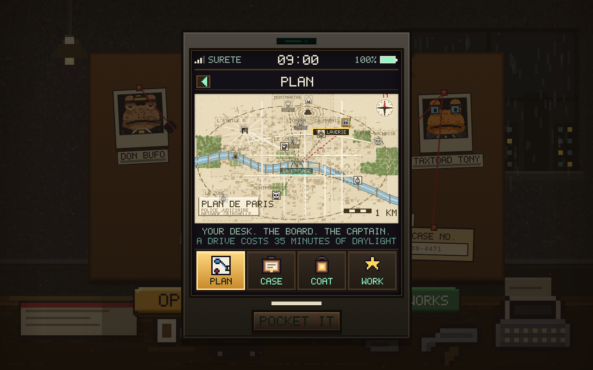

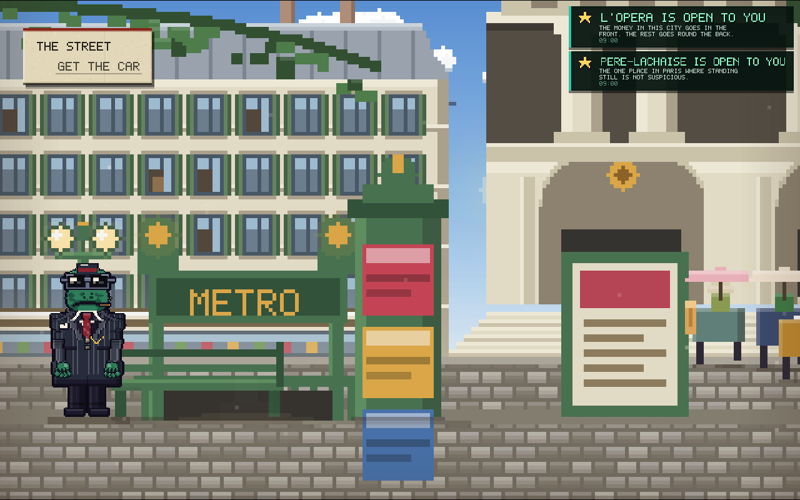

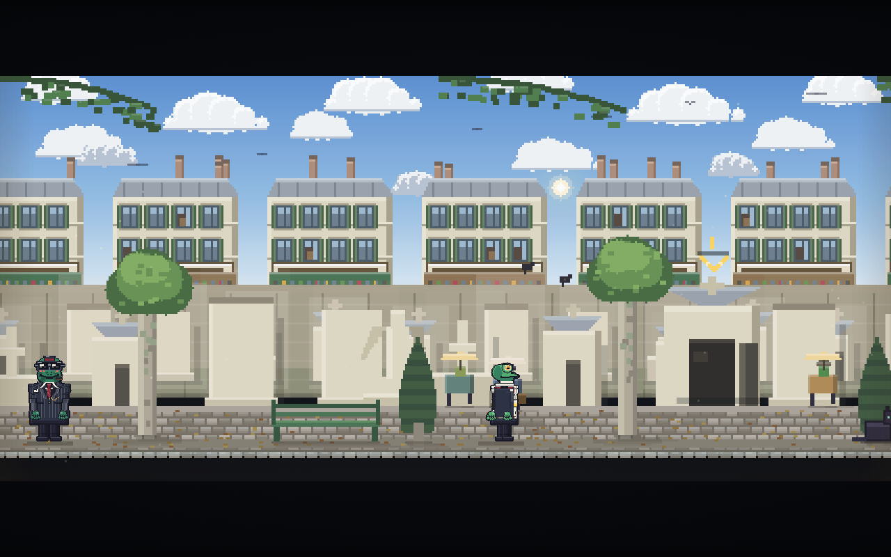

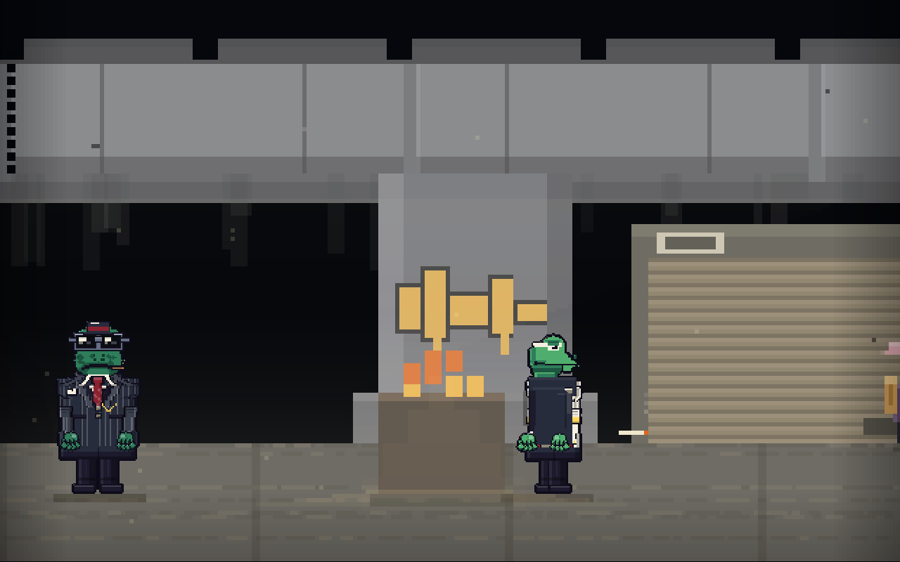

### You can lean over the plan

Two whole-number magnifications — the sheet is made of pixels and half a
pixel is a smudge — so: **fit**, where the whole plan is on screen, and
**close**, where it is twice that and you drag the paper about with your
thumb. A wheel zooms on the pointer, the buttons zoom on the middle of what
you are looking at, and it remembers where you were looking.

Close in, the sheet has something to reward leaning over: the named
streets — Rivoli, Sébastopol, Haussmann, Saint-Germain, the Champs-Élysées,
the quays — and the arrondissement numbers in roman, in the ink a plan uses
for lettering.

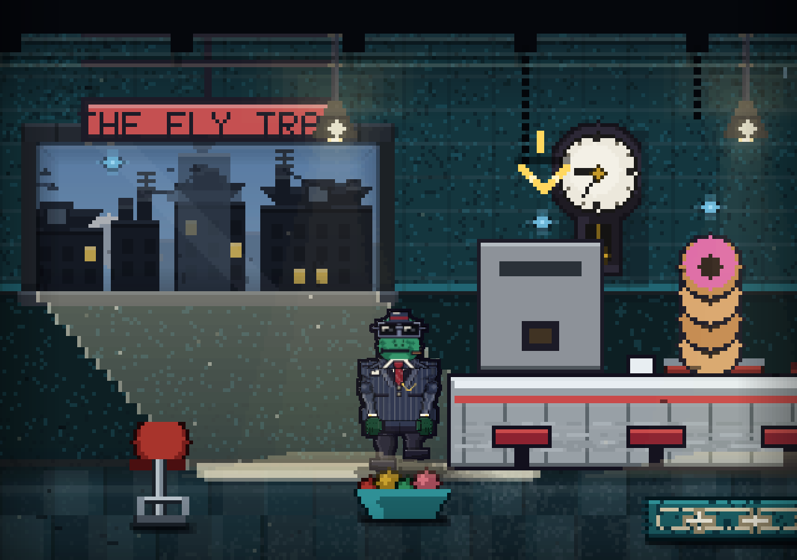

### Ten apps, and three of them are new

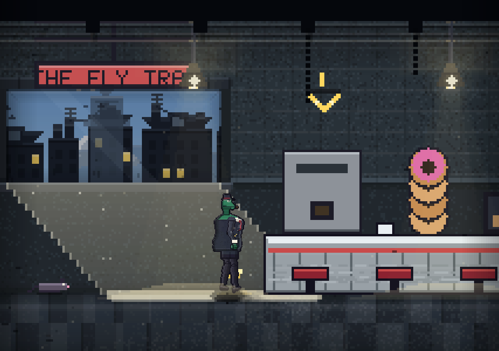

**WIRE** is the case log as a thread — his lines in grey on the left, yours
in green on the right — because a run of short messages from one person over
one afternoon is already a thread and it may as well look like one.

**ROLL** is every piece of evidence as a photograph, in a white border, with
what it says and where it came from written under it. The case app tells you
what each clue *rules out*, which is the working view; this is the other one,
and it is the only place you see the whole afternoon at once.

**TELLS** is the notebook: every tell you have ever learned off a corpse,
kept between runs, with what it does to a man across a table. It has been in
the save file since the second week and there has never been a way to read
it.

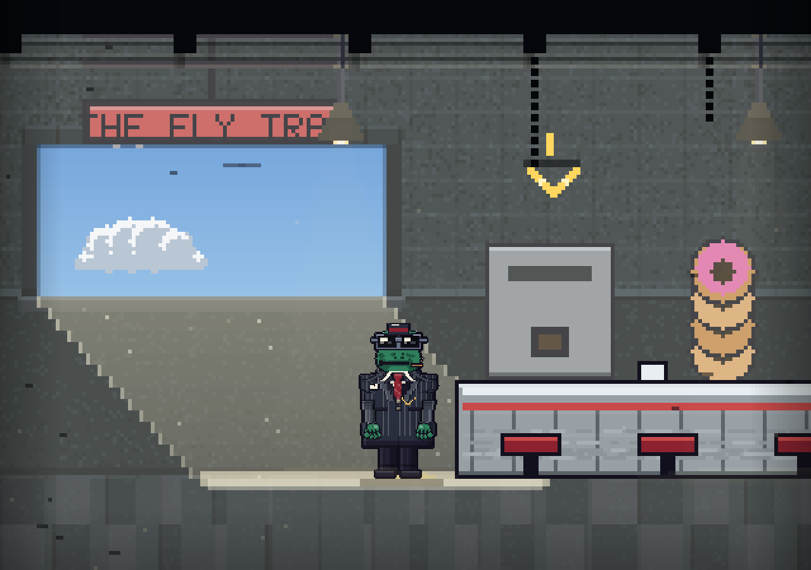

### The phone tells you things

The city used to tell you things by putting a line in a log nobody opened.
Now it tells you the way a phone tells you: a banner slides in over the top
right for four seconds, a red number appears on the phone in your belt, and
the whole run of them is kept on the lock screen and in **ALERTS** so you can
go back and read what you were too busy to read the first time.

Five things ring it, and they are the five things worth interrupting you
for: a quarter of the city opening, a door about to shut on a witness you
still need, a story coming apart, an errand paying off, and finding
something nobody put there. Nothing else does — a notification you learn to
ignore is worse than no notification at all.

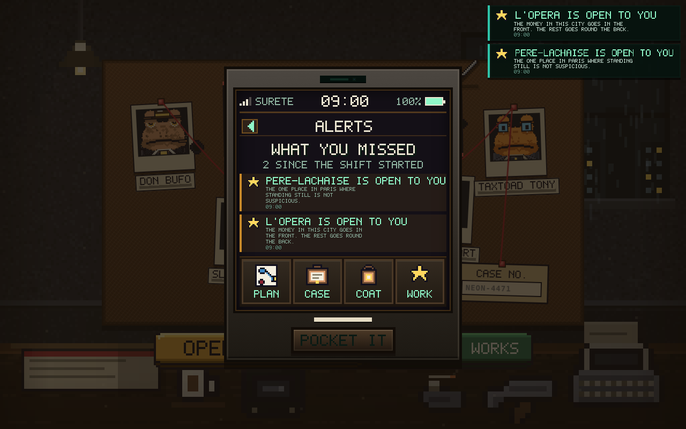

The last-call warning is the one that matters. The whole afternoon is a
question of which door shuts first, and that used to be buried in a badge on
a pin nobody was looking at. Now, the first time a stop **tonight's file
actually wants** drops under forty-five minutes, the phone says so once — and
only once, and never about a stop the case does not care about.

### You can walk into it

The rooms are not a line any more. Every street has a **depth band** you can
walk up and down — `W`/`S`, the arrows, or just tap where you want to stand —
and the frog gets smaller as he goes back, turns his back to you when he
walks away, and sorts in front of and behind everything else in the room.
The boulevards are full of people doing the same thing under umbrellas, and
the traffic at the Étoile does not stop for any of them.

**The phone** (tap `PHONE`, or `P`) is the only menu in the game, and it is a
slab of glass with a bite out of the top of it, which is the one thing in
1937 nobody in this game remarks on. It has a lock screen with the hour, the
day's weather and what came in; a home screen of apps with badges on them;
and a dock:

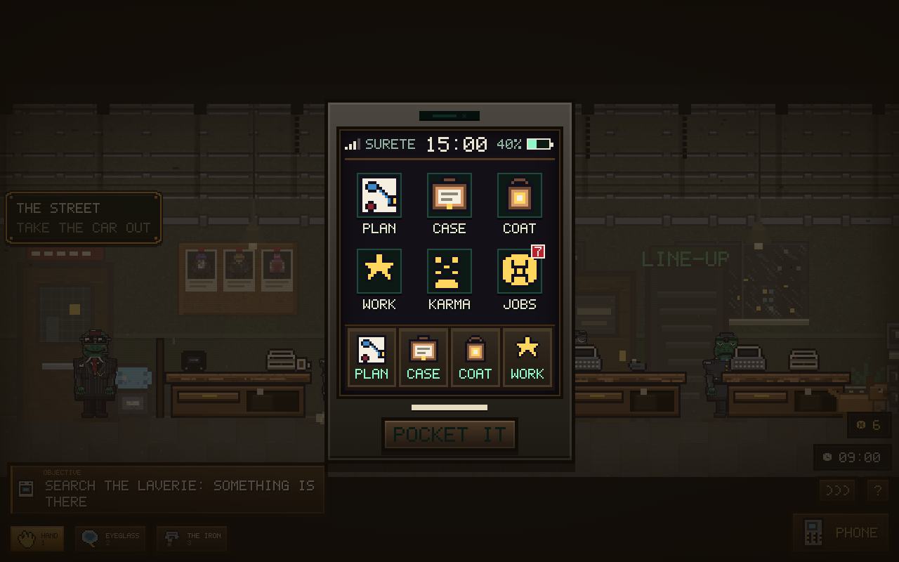

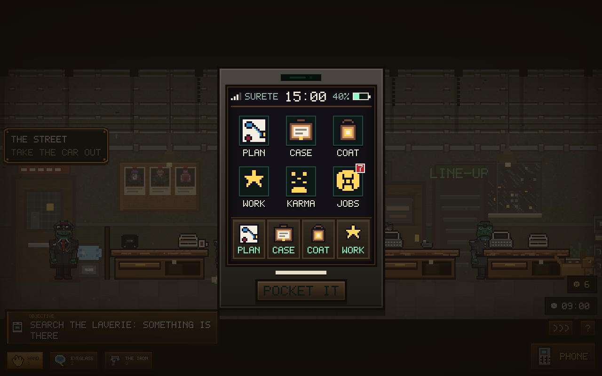

- **PLAN** — the city drawn from above, the river cutting through it, eleven
  stops and the Brigade. Tap one and you drive there. A stop with something
  in it wears a gold `!`; a stop where somebody is owed a favour wears the
  errand bag; a stop today's file does not touch is dimmed.
- **CASE FILE** — what you have turned over, what each piece rules out, and
  which faces still fit.
- **THE KIT** — your coat, laid out: the iron, the belt, every evidence bag
  you are carrying, and anything you agreed to run across town for somebody
  else.
- **WORK** — what you are supposed to be doing *right now*, today's
  chapter, the Bullfrog board, every errand you are in the middle of, and the
  last few lines of the file.
- **KARMA** — what this city thinks of you, and every deed that got you
  there.
- **JOBS** — everything going on today that pays, and where it is.

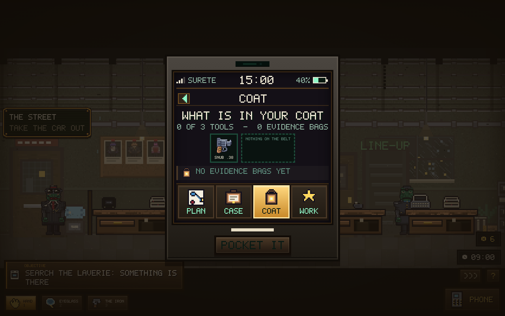

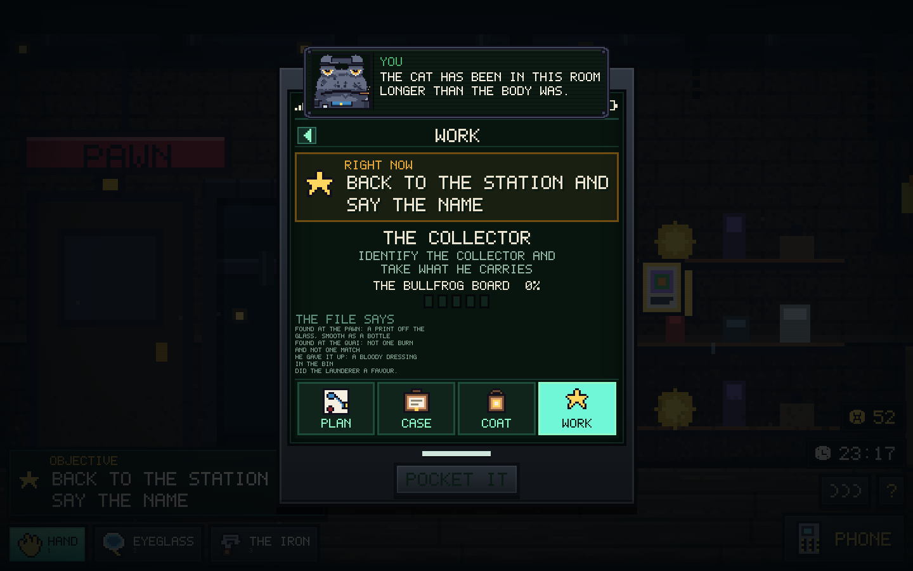

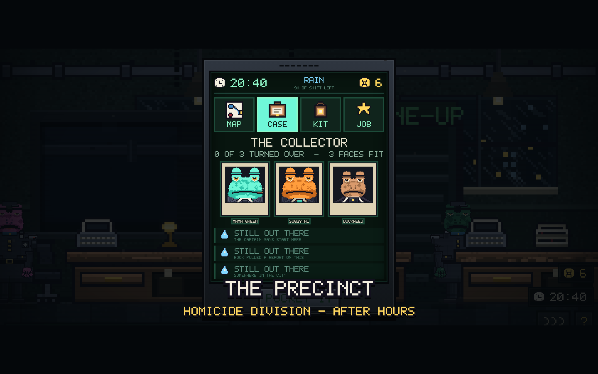

The five stops, and what they are:

| Where | What is in it |
|---|---|
| **THE CANAL LAUNDRY** | the crime scene: three drums, a chalk outline, a floor drain, the tape still up |
| **PIER NINETEEN** | crates nobody signed for, a fire barrel, black water, a shed with a new lock |
| **MARSH ROW PAWN** | everything taken off a body, behind glass, and a ledger of who brought it in |
| **THE FLY TRAP** | coffee, donuts, the night shift, and a cook who watches the street |
| **THE GREEN LAMP** | where the crew drinks, with a barman who answers if you work a shift |

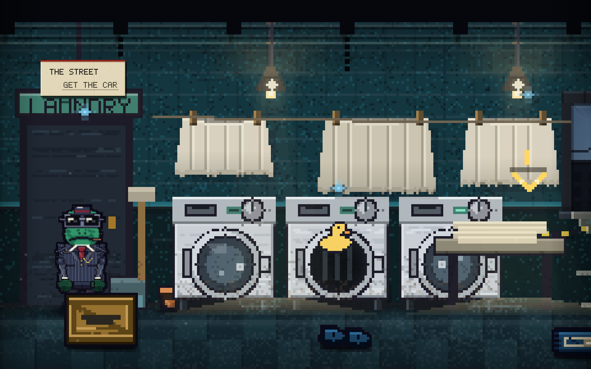

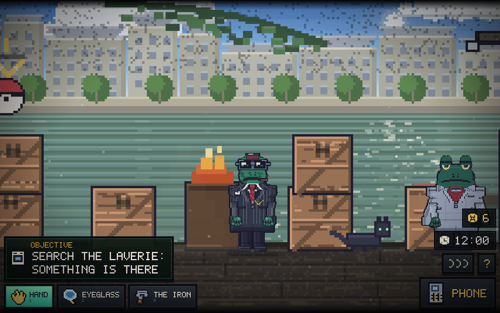

### The buildings have floors

A stop is not one room. There are **cellar steps** in the laundry down to
where the canal comes in, and **stairs over the pawn shop** to the room the
broker actually sleeps in — each its own painted room, with its own props, and
the case can be buried on either floor.

### Everybody is doing something

For a long time every frog in every room breathed, and that was the whole of
it: nine people standing perfectly still with their chests going up and down.
At the old camera distance you could not tell. You can now.

An actor has a **job**, and a job is three things — a loop with its own
period, what the body does on that loop, and the thing in his hands while he
does it. Typing (the shoulders peck; the desk already has the machine). A pad
and a pencil working down the page. A file, and a page turning over. A glass
raised and set down. Something with a piece gone out of it. A cigarette, and
the smoke off it. A rag going back and forth along a counter he has wiped a
thousand times. A broom. Hands working through a rack. And **pacing**, which
is the only one that has to move him rather than move his arms: four steps
one way, a pause, four steps back.

Every phase is offset by the actor's own position, so two clerks at two desks
are never in step. The bullpen has six people in it now: Maybelle typing, the
captain smoking outside his own door, two at the machines, one going through
a file, and a duty sergeant walking the length of the room.

### The animals

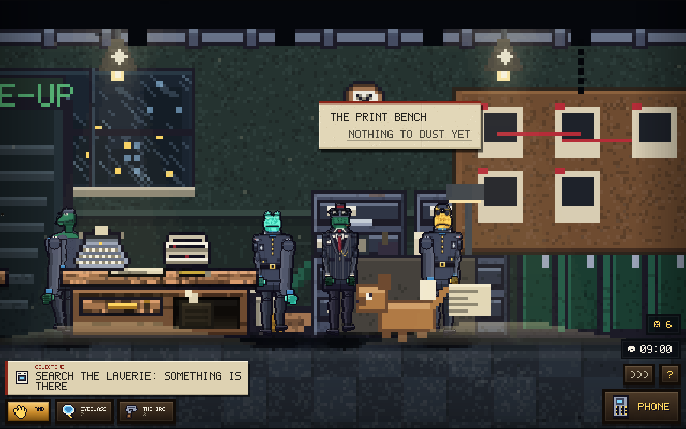

There is a cat at every stop and a **dog at the station**, and none of them
have anything to do with the case. They wander a few feet, sit down, wash, and
if you walk up and put a hand out they come over. That is the whole feature.

### The things that are just there

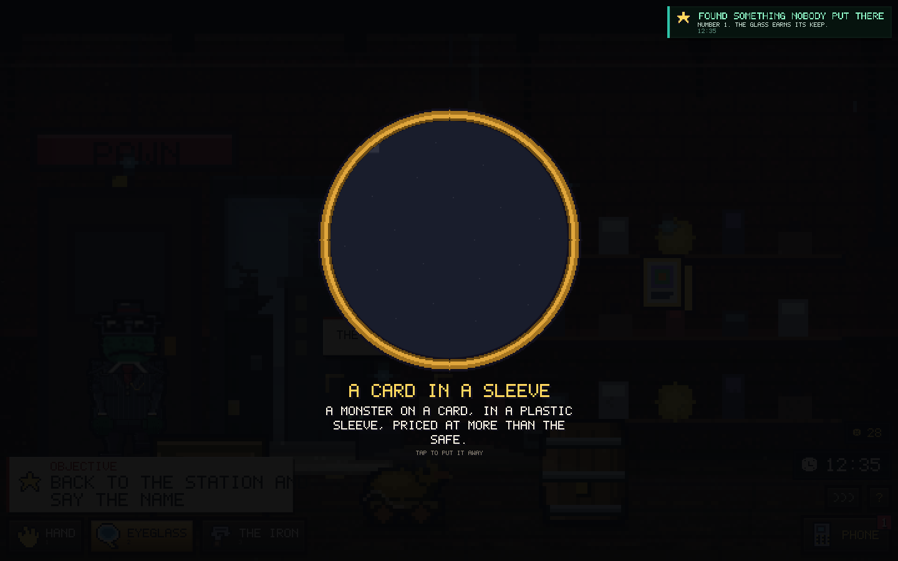

A pokeball in a crate marked KANTO. A monster card in a sleeve, priced above
the safe. A little flag from somewhere warmer over the kitchen hatch. A rubber
duck going round in a drum with somebody's shirts. They are painted into the
rooms at their real size, which at room scale is a smudge — the only way to
know what any of them is is to hold the eyeglass up to it.

### The secrets are actually secret

There are small things hidden in the rooms that have nothing to do with the
case — a card in a sleeve, a red-and-white ball, a flag, things left on
shelves and under tills. They used to shout their own names at anybody who
walked past them, which is the opposite of a secret.

Now they are not targets at all unless the **eyeglass** is in your hand.
Point at one bare-handed and you get whatever real prop it is sitting on;
walk past one and the game says nothing. With the glass out, each of them
catches a little light on a slow count out of phase with its neighbours — one
pixel, blinking — and even then the plate says only SOMETHING SMALL until you
have actually held the glass up to it.

Sweep a room, watch for the sparkle. Every one you find is counted across
every case you ever play, and the phone tells you what number it was.

### The day is the budget

Every place you drive to costs **35 minutes**, every prop you put your hand
in costs **18**, a look through the eyeglass costs **3**, a question costs
**12**. The shift runs **20:00 to 06:00** — **600 minutes** against a city
with about **forty-five things** in it to turn over, which is well over a
thousand minutes of searching. It is deliberately impossible, so *where you
look* is the whole game. Run the day out and the captain pulls you off the
street; you keep what you found.

The sky is not decoration either. It rolls every time you drive: **rain**,
**hard rain**, **storm**, **fog**, **clear and cold**. Fog and heavy rain
cost a witness a detail; clear weather means the street can see you working.

### Clues are things, not hunches

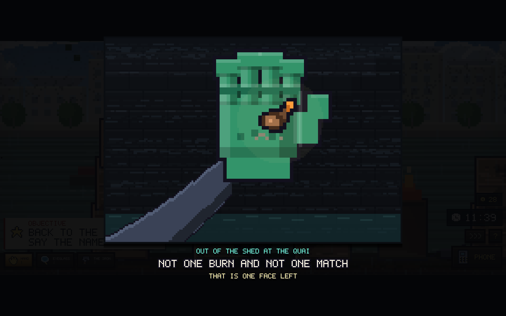

Finding something is your own hand coming up out of the drain with the thing
in it: first person, the room gone dark around the hole, the object turning
over in your glove. There is a drawing of every kind of evidence in the game —
a photograph, a cracked lens, a lift card, a brass casing, a cigar burned
down, a matchbook, a folded note — and the one you found is the one in your
fist, on the card, and in your coat afterwards.


Every clue in the case is planted in exactly one prop in one place. Put your
hand in the right drain and you come out with **a gold tooth cap**, **a
cracked lens**, **a bloody dressing**, **cigar ash still soft**, **a coat let
out twice at the seams** — and every one of them crosses faces off. Put your
hand in the wrong one and you get lint, a bus ticket from March, sometimes a
few loose notes, and sometimes somebody watching you do it.

Witnesses fill the gaps: the launderer, the watchman, the broker, the
waitress, the barman. *Was he wearing a hat? Both eyes? Any gold in his
mouth?* They answer honestly — and the weather decides how much they saw.

### The belt is your hands. Everything else is the phone.

There are two places the interface lives and the rule is simple: **the belt
along the bottom holds only what is in your hands** — the hand, the eyeglass,
the iron, with the number key that picks each one printed on it — and
**everything else is an app**. The plan, the case file with its alibi board,
the coat with what you are carrying, tonight's work, the karma ledger, the
jobs going spare and the alerts: seven apps, a dock, a lock screen, and a red
number on the phone when something is waiting in one of them.

What is left in the corner is not a panel: the objective you are on, the
money, the clock, and the two switches every game has. Nothing you have to
open.

### What is in your hands

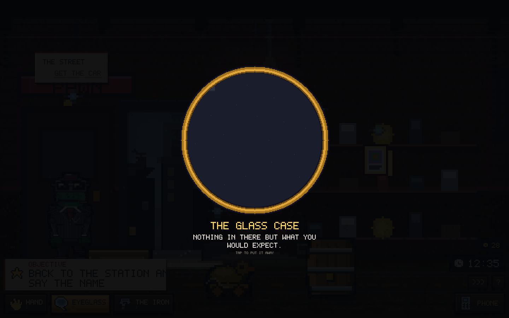

Three tools, three big drawn buttons, and which one is out changes what a
click means. `1`, `2`, `3` or the buttons; the mouse cursor changes with them.

| | | |
|---|---|---|
| **THE HAND** | walk, open, search, talk | the default |
| **THE EYEGLASS** | **three minutes** to find out whether a prop is worth the **eighteen** that turning it over costs | it lies about a dry prop one time in four |
| **THE IRON** | point it at something | rats are fair game. A witness is not, and the game will let you anyway |

The eyeglass is not a gimmick: the rooms are painted at a pixel detail nobody
can see at room scale, and the glass blows the **actual painted room** up five
times inside a brass rim. Everything hidden in the art is really in there.

The city has twenty-five things in it and the day has 600 minutes. Turning
everything over is not on the table — so the glass is how you decide, and a
prop the glass called hot wears a gold chevron until you get to it.

### Talking back

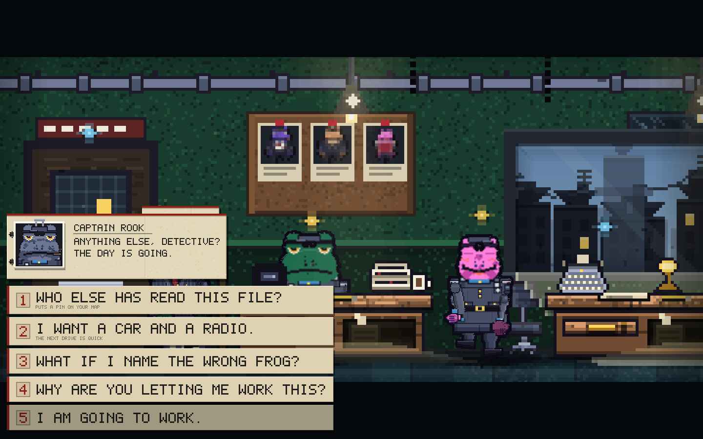

Nobody talks *at* you any more. Every conversation in the game ends in a rack
of things you can actually say, big enough to hit with a thumb and numbered
if you would rather use the keys. The captain's brief is a conversation you
can push on — *who else has read this file?* puts a pin on your map, *I want
a car and a radio* gets you across town in half the time, *what if I name the
wrong frog?* gets you the count of faces that still fit. The front desk, the
hospital bed and the frog behind the line-up glass all answer the same way,
and every rack has a way out on the bottom of it.

### Side work

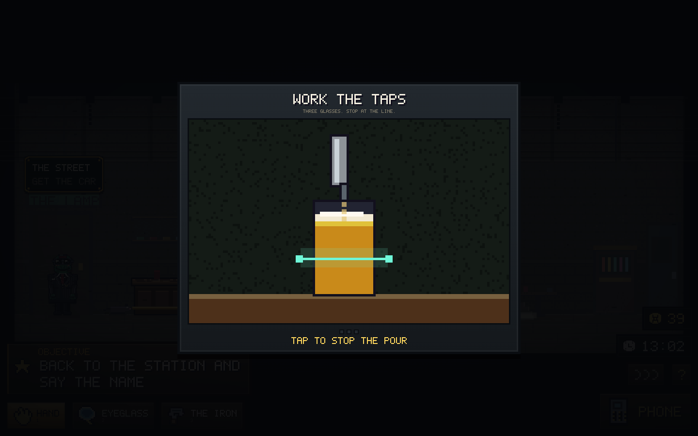

Nobody on this salary can afford petrol. **Work the taps** at the Green Lamp
(three pints, stop each pour on the line) and the barman owes you an answer.
**Make a batch** at the Fly Trap (three donuts, stop the needle in the heat)
and you eat one — *the only medicine in this game* — and the cook tells you
which end of the city still has something in it.

**Pick the lock.** The shed on Pier Nineteen has a new lock on it, and nobody
puts a new lock on an empty shed. Three pins on the shear line and it opens;
miss and it drops back.

**Dust it for prints.** There is a print bench at the station. Powder, tape, a
card and a steady hand will lift a name off what you carried back — worth a
face off the wall, for half an hour of a day that has none, once a case.

### Karma

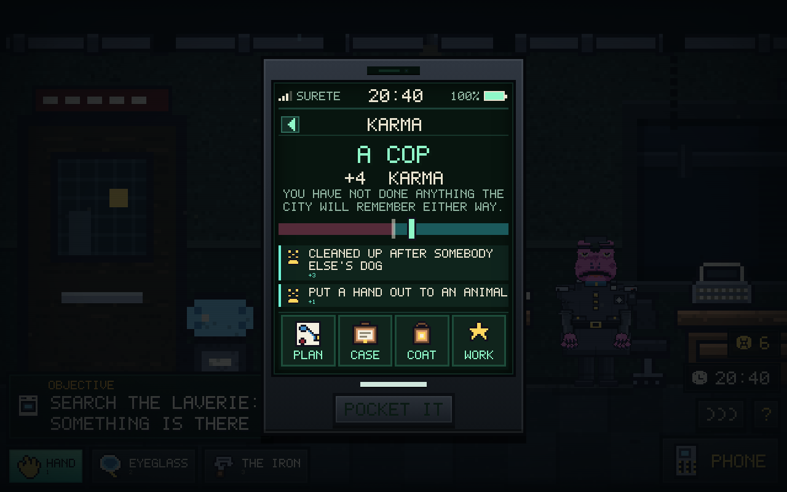

Nobody in this city keeps a ledger of what you do, so the game does. Cleaning
up after somebody else's dog is worth three. Sitting for a painter who has
nobody to look at is worth two. Warning a mark off the cups is worth two.
Putting a gun in a witness's face is worth **minus six**, and it works, which
is the problem with it. Running the cups yourself is minus three and pays
better than the job.

It follows you between cases, the street reads it before you open your mouth,
and at the end it is weighed with everything else.

### The jobs

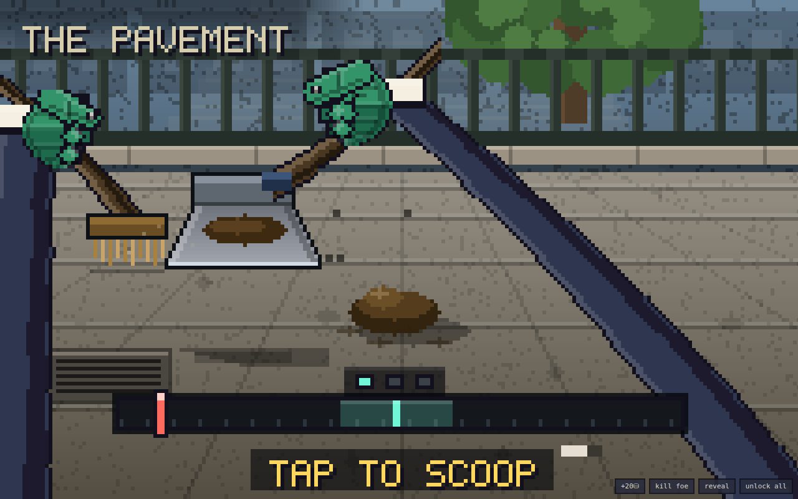

Nobody lives on this salary. **Work the taps** at the Moulin, **make a batch**
at the café, **clear the drums** at the laundry, **pick the lock** on the shed
at the quay, **dust for prints** at the Brigade — and, this being Paris:

- **THE PAVEMENT.** Every dog in this city fouls it and nobody picks it up.
  There is a scoop on the back of the cart, three passes to get it, and the
  only reward is that somebody does not step in it.
- **THE THREE CUPS.** A frog with a folding table on the Butte. Play him and
  he is faster than your eye. Warn the mark off and he loses his rent. Or run
  the table yourself, which pays and costs.
- **THE PAINTER.** Eleven years painting the same street, half a loaf in his
  coat and nobody to sit for him. Twenty minutes of a day you cannot spare
  — and he watches that square all day, so he has seen things.

### Errands, which pay in evidence

Everybody in this city wants something, and none of them take money. Ask a
witness a question and he will ask you for a favour first — **and the favour
pays in a piece of evidence he has been sitting on all week.** One per
stop, one a day each:

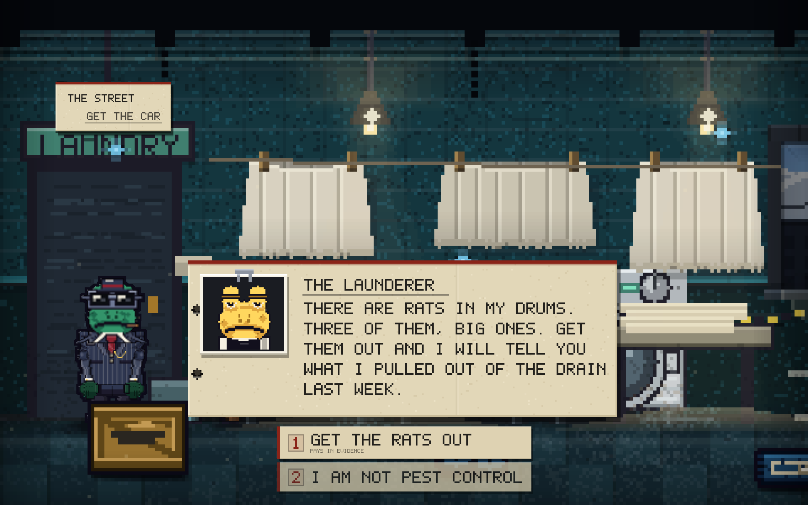

| Who | What he wants | What it actually is |
|---|---|---|
| **THE LAUNDERER** | three rats out of his drums | drop the lid on a rat running the pipe, three times |
| **THE WATCHMAN** | his tally book out of the canal | put your hand in the black water under the pier |
| **THE BROKER** | a parcel run to Pier Nineteen | *and he told you not to look in it* |
| **THE WAITRESS** | a tray of donuts to the night shift | drive it to the precinct before it goes cold |
| **THE BARMAN** | twenty minutes on the door | twenty minutes off your clock, paid on the spot |

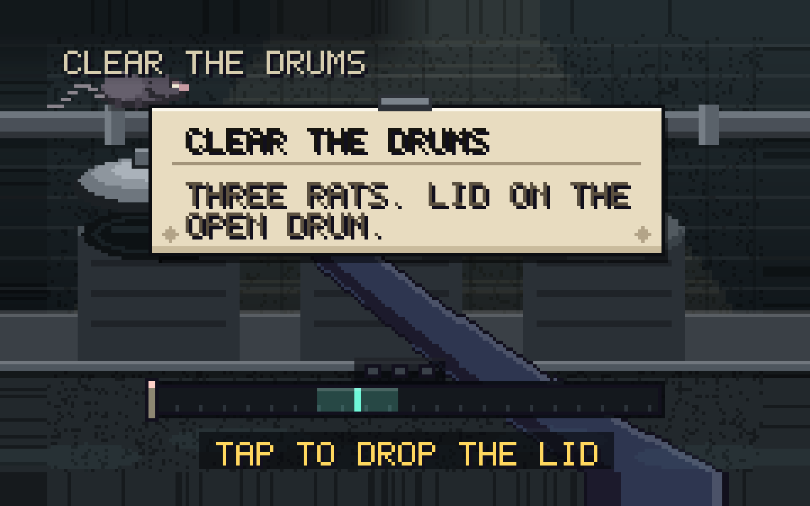

The evidence comes out of *his own place first*, so a favour where you are
standing is worth more than one across town. Refuse and nothing is lost —
he still answers your questions. And the parcel is the interesting one:
carry it to the pier and you can drop it and drive back for the full payoff,
**or open it there** and keep what is inside today — which costs you his
money and every answer he had, because he will not talk to you again before
morning.

## Where they say they were

Crossing faces off a wall is deduction. It is not police work.

**Every suspect states an alibi** — a stop in the city and an afternoon spent
at it — and one of those stories is a lie, because the innocent have nothing
to invent. The file on your phone lists all of them and which have been
settled.

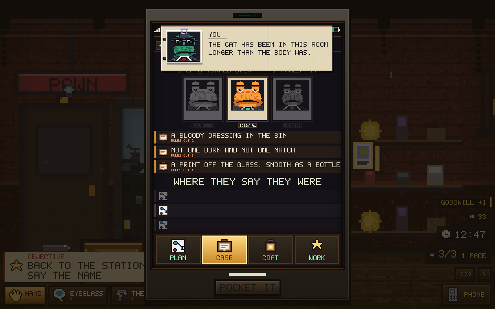

Breaking one takes two things in the same room:

1. **the frog who would have vouched for him** — so you have to go to the
   stop his story is set at, and get there before it shuts, and
2. **one specific piece of evidence** to put on the counter — so the thing
   you pulled out of a floor drain has a second use, and a stop you had no
   reason to visit suddenly has one.

Ask without it and he tells you what he told everybody: *"He was here. That
is what I said to the other one."* You know he is lying and you cannot prove
it. Ask with it, and:

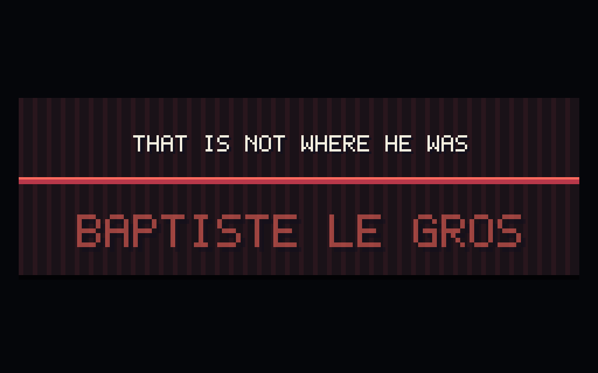

The plan marks it for you: a stop with a story you can already take apart
wears a red query, and a stop about to lock up wears its countdown.

| At the table | |
|---|---|
| **you broke his story** | he sits down **a heart short** and knows it |
| **his story still stands** | he has an answer ready and **plays it harder** |

## The line-up

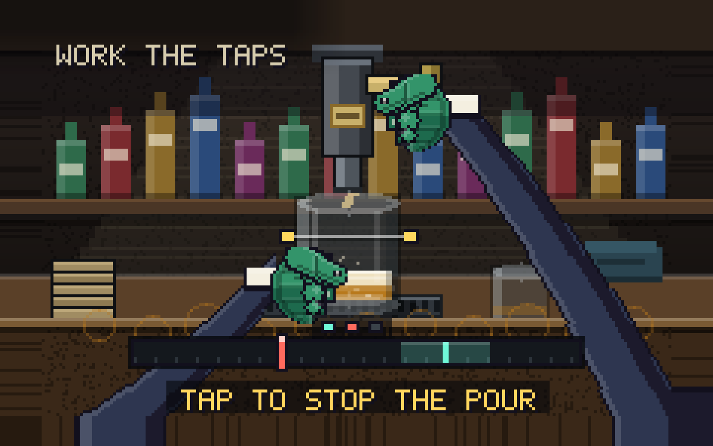

You do not name anybody in the field. You take what you dug up back to the
station, go **down the stairs off the bullpen**, and they stand them against
the height chart under a light that does nobody any favours. What you found
is on the table behind you. Anybody your evidence rules out is **crossed off
where he stands**.

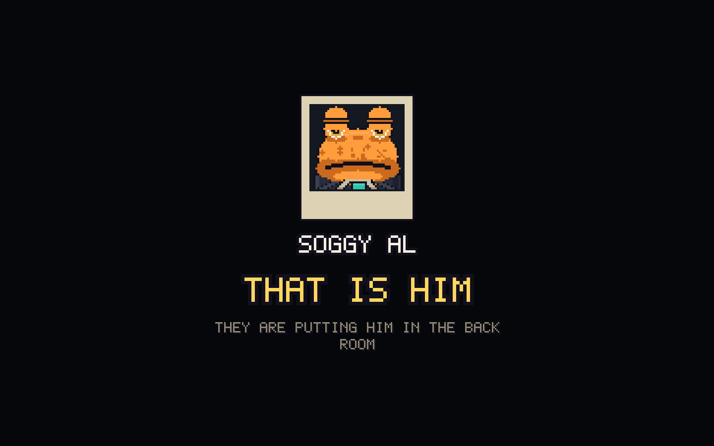

Then you say one name out loud.

| Naming him | What happens |
|---|---|
| **right** | they put him in the back room, and the bounty pays **30% more** |
| **wrong** | he walks out past you, −6 chips, he sits down with **an extra heart**, and **he shoots first** |

A frog you already know — a lieutenant, the Bullfrog himself — needs no
line-up. You have had his face on your own wall for six years. They wave you
straight through.

## The interface is paper

Everything you read in this game is on paper, because the man reading it
carries a case file everywhere he goes.

The plate people talk on was a dark green slab behind a chunky bezel with
rivets in the corners and scanlines over the fill — a pocket calculator, in
1937. It is a sheet out of the file now: manila stock with a tooth to it, a
red rule across the head, the speaker's name typed on it in ink, and the
words under that in the same ink. The portrait is a **photograph clipped to
the sheet** with a steel clip. What you say back is a **buff index card**
with a red rule down its left edge and the key that presses it typed in the
corner. The one line telling you what you are supposed to be doing is the
card clipped to the front of the folder.

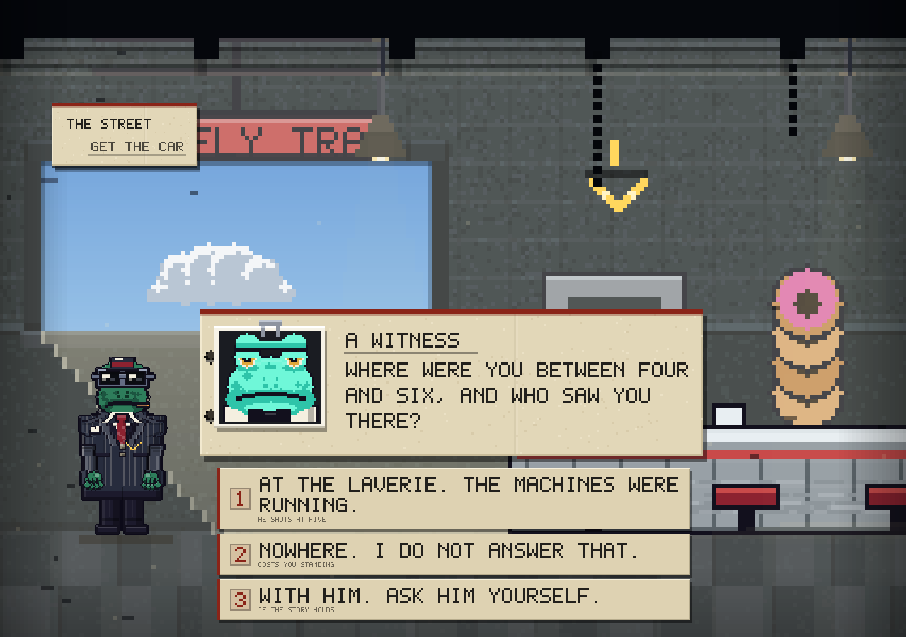

### And the face on it is the face of whoever is talking

A hundred and thirty-eight lines of dialogue in this game and **not one of
them passed a portrait**, so every one of them showed the captain — including
the twenty-five spoken as YOU. You had been having conversations with
yourself wearing somebody else's face all game.

The portrait is resolved from the speaker's name now, which is the one thing
every caller already passes and already gets right: YOU is your own frog, the
captain is the captain, Maybelle is Maybelle, and a witness the game has
never written a face for gets one of the fifteen hand-drawn faces by the hash
of his own name — so he is a different frog from everybody else and the same
frog every time that name speaks.

A lock, a print kit and the case log have **no face at all** any more,
because they do not have faces. They get a rubber stamp in the margin.

## Faces

Twenty expressions, and none of them are decoration: a frog's mouth is very
wide, which means two pixels at the corners is the whole difference between
content and delighted.

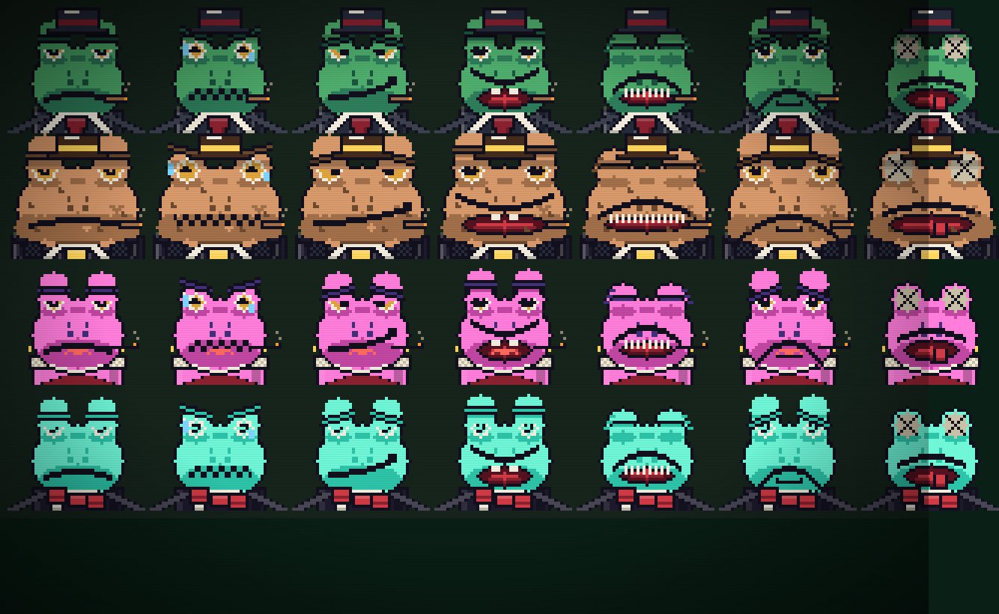

The machinery behind them is what makes them read at room scale — eyes that
close into upward arcs rather than flat blinks, a **lower** lid that comes up
the way a real smile pushes the cheek into the eye, pupils that roll off you
when somebody is thinking, brows that disagree with each other, stippled
cheeks.

And they reach the rooms, not just the conversation portraits. Everybody
behind a counter has a temperament — the barman is hard, the cabbie is
pleased to see anybody, the keeper of the catacombs is sad — and drifts
through a small loop of blinks and glances **seeded off their own position**,
so two frogs in the same room are never in step. They look up when you get
close. The ones at work keep working.

Your own face reads the day back to you: squinting with a hand in something,
wincing on your last two hearts, and — if the city has decided it likes you —
a hop in the middle of your stride.

## The table

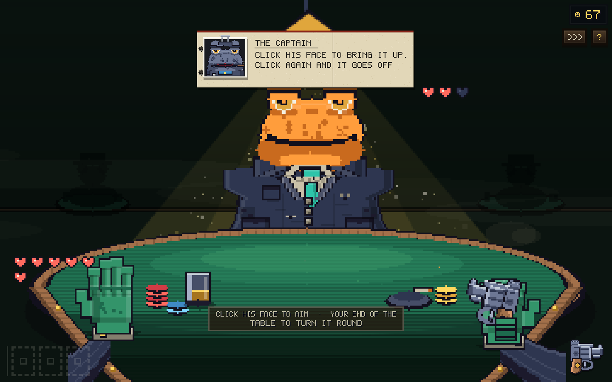

Through the back door there is a revolver, a posted mix of **LIVE** and
**blank** shells in an order nobody knows, and a table. You are the camera:
your own two hands on the felt and the iron in your right fist.

- **Click his face** — the iron comes up. **Click again** and it goes off.
- **Click your own end of the table** — the camera crosses it and you see
  yourself from his chair, the muzzle against your own temple. A blank
  **keeps your turn**. That is the whole game.

### Breaking the shot

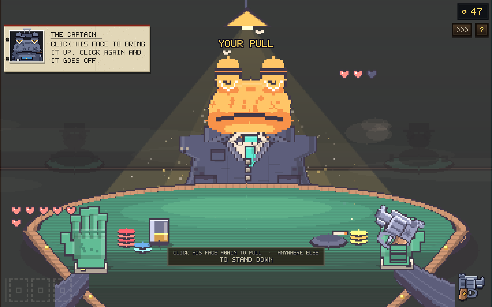

Across a table is a shot you can miss. Point and pull and the bore drifts: a
rail comes up with a marker sweeping it, a green band and a gold one inside
that.

| Where you break it | What happens |
|---|---|
| **the gold band** | through the eye — **+2 damage** |
| **the green band** | a normal hit |
| **outside both** | into the wall behind his ear, and the chamber is gone |

Faster and tighter every chapter. Against your own head there is no check.

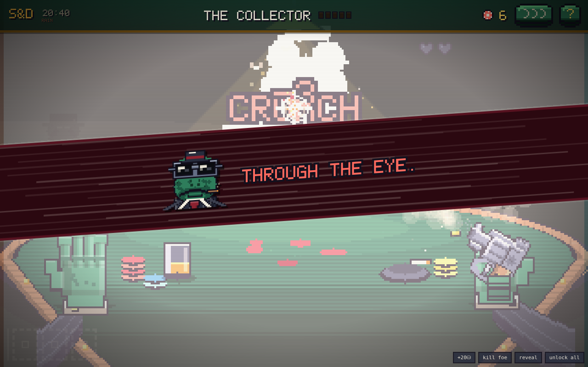

The moment a live round commits, somebody's face crosses the frame on a
skewed banner. It runs black most days. **When the round is going to end
somebody, it runs red.** Down to one heart, the lens closes in and you can
hear your own pulse.

## Out back

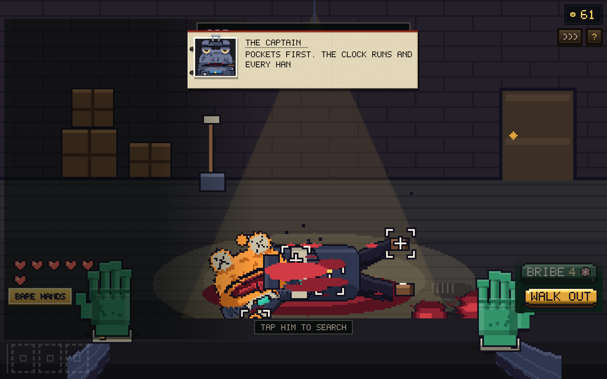

You never watch him fall. The shot goes off, the lens goes red, and when it
wipes you are already out back with the door shut — and between the two
rooms there is a small sad loading scene of you dragging him by the boots
under a swinging bulb.

The body is **fully intact**, because this was never about what the round
did. It is about what is in his coat. Almost no interface: a strip of meters,
your tools in the corner, and the room. **Search him with your own hands** —
hat, coat, vest, hand, boot, mouth.

- **TIME** — real seconds, shorter every chapter.
- **NOISE** — every pocket makes some; a boot or a gold tooth makes a lot.
- **THE TRAIL** — dragging a frog through a doorway leaves marks. Tap one and
  your arm goes out with the mop: three passes each, and the boards come back.

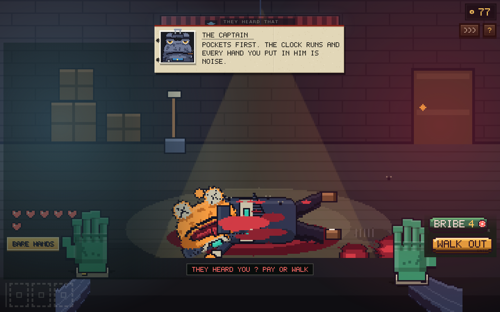

Get heard and a uniform comes through the back door tapping his nightstick:
**bribe** him or walk. After a lieutenant, the department wants protection
money — and if you cannot pay it, **they take your badge instead**, which
quietly closes one of the two endings.

## Dying is not the end of it

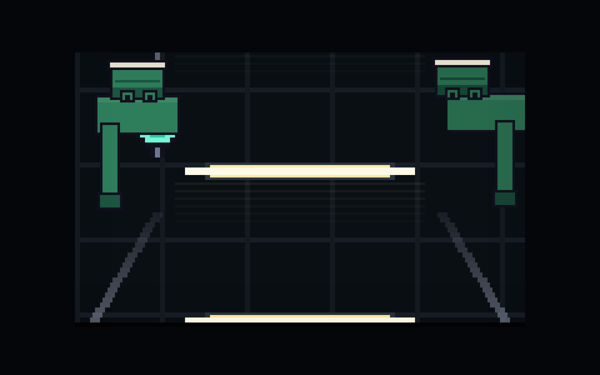

There is no game over in this game. Lose the table and an ambulance comes
through the rain, the ceiling of a corridor goes past your own eyes, and a
clerk stamps a form: gunshot, treated, discharged against advice.

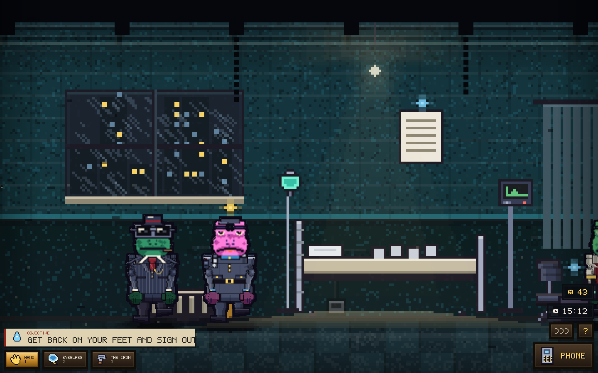

You wake up in the ward with rain on the window, a machine counting, a chart
with your name on it — and Maybelle, who was off at eleven and stayed. It
costs chips, and after the second trip it can cost you a piece of the board
out of your coat. **Three trips and the department takes the badge.**

Then you discharge yourself and go back to work, because nobody else is going
to.

## The two endings

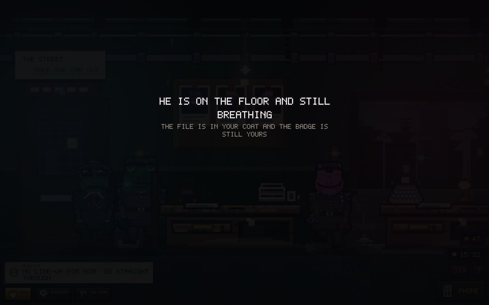

Fill the board, walk into fourteen Marsh Row, and put him on the floor. He is
still breathing. You get one decision:

- **THE BADGE** — cuff him and let the file do it. Available only if the
  board is full **and** the badge is still yours. He goes down in a
  courtroom, the sun comes up through the high windows, and it stops raining
  over two headstones.
- **THE BULLET** — one flash in a dark room, nobody writes it down, and the
  last shot of the game is you sitting in his chair with his board burning on
  the wall behind you.

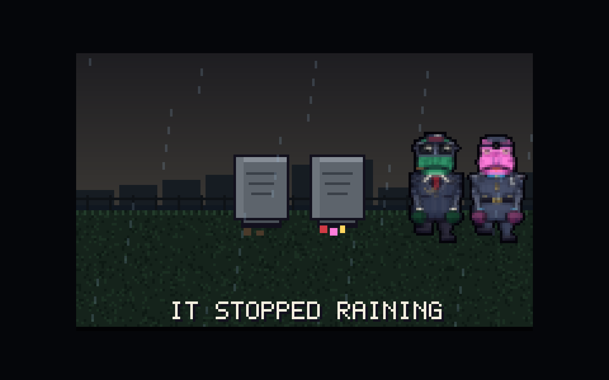

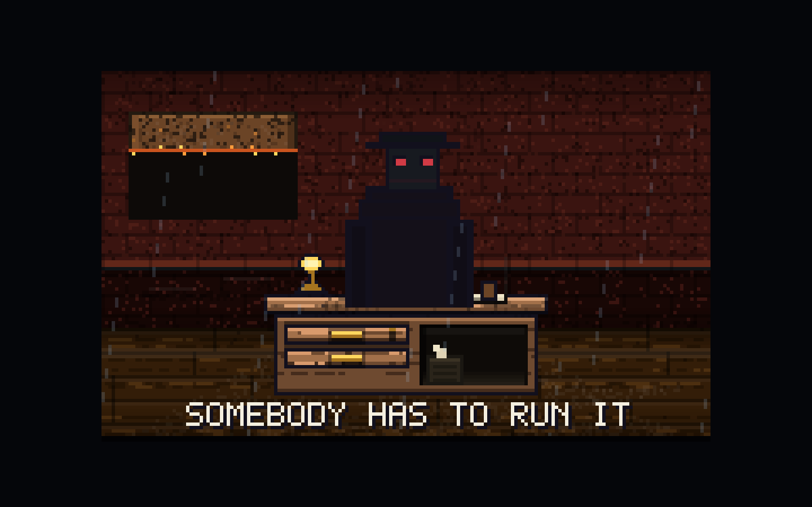

## He turns sideways properly now

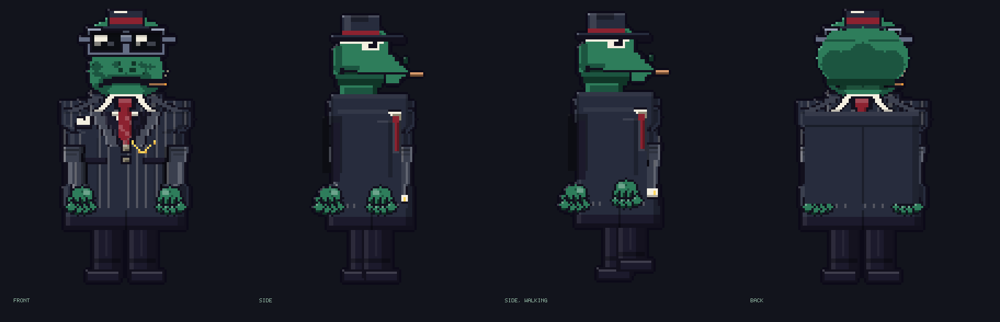

The side view was a wedge with a long horizontal bill on it and a gold ring
for an eye: a duck with a bullseye. It is built from what actually makes a
frog read side on, in order of how much each matters — the **eye bulge**
standing proud of the skull, which is the single most recognisable thing
about the animal; a **mouth line** running most of the head's length with a
slight lift at the back; a short **rounded** snout, not a beak; and a full
throat sloping back to a neck that reaches the collar. Plus a collar that
reads edge-on instead of as a row of white teeth, and a hat with a crown
behind its brim.

### And he does not smile

Good standing used to put him in the cheerful rotation, which on a man who
came home to an open door six years ago and flew to another country with a
cigarette end in a bag read as ridiculous. His register is flat, tired,
watchful, and hard when it is warranted. The warm face still exists — it just
has to be **earned** by something specific happening, and it lasts about two
seconds: the dog leans on him, an errand pays off, a story comes apart.

## Everything that moves

All drawn, all procedural, no sprite sheets, tap to skip the long ones.
Every frog in this list is the **same model** — one head, one costumed body,
one pair of legs, built once and integer-downsampled for rooms. The frog who
walks the bullpen, the frog pinned to the cork, the frog across the table and
the frog leaning into a cut-in are the same frog.

1. The title room — rain on the glass, the lamp over the desk, a city awake
2. The lore reel — the line-up, the verdict, the door, the rain, the oath
3. The arrival — bars close, the camera pans the room, and the name of the
   place types itself onto the card with the hour and the weather under it
4. The drive across town — parallax skylines, rain, wipers, a destination
5. The walk — he leans into it, coasts, brakes into the mark and lands on it
   with a squash, a heel knock and a puff of dust
6. The walk cycle — four frames off the ground covered, not off the clock
7. The card-file wipe between rooms (venetian blinds, with an evidence tab)
8. Rain falling through an outdoor room, splashing on the boards, and the
   lightning off the bay
9. Fog in soft banks, and the city smeared down into the canal
10. The evidence card — what you pulled out of the drain, held up to the light
11. Saying the name: his mugshot, and the stamp that lands on it
12. The taps — a glass filling, a head on it, and the line you are aiming for
13. The fryer — oil moving, a needle sweeping, three donuts glazed
14. The drums — a fat wet rat running a pipe, and a lid on a chain
15. The lock — three pins, a pick, and a shed nobody wants opened
16. The print bench — powder, tape, and a whorl coming up ring by ring
17. The pick-up — your own hand out of the dark with the thing in it
18. The eyeglass — the painted room, five times closer, inside brass
19. A dog that wags, a cat that sits and washes, and neither of them cares
20. The FroggoMap — a city from above with the rain falling on all of it
21. Idle blinks, weight shifts, and the tongue taking flies (a verlet chain)
22. Lamp cones, floor pools, flickering tubes and dust in the air
23. Dialogue under cinema bars: the camera holds, the line types, a key ticks
24. The sit-down — dark room, his eyes, the lamp stuttering on
25. A lieutenant's entrance under cinema bars, with his name stamped on it
26. The four-beat cock: hammer, cylinder, the held beat, the drop
27. The steady check — the sweep, the bands, and the break
28. Muzzle flash, cordite, the casing on the felt
29. The slug in the air, with a shock ring and a wake
30. The Persona cut-in — skewed banner, speed lines, red when it is lethal
31. His grip, in four styles, arm anchored at the shoulder
32. His reactions — the facepalm, the raised digit, the shrug
33. Blood that lands, runs and stays — on him, and on your lens
34. The blood-splat kill wipe, coming off like a sleeve on glass
35. The drag loader — you, him, one swinging bulb, a smear on the boards
36. First-person searching: your arm out, dust off the lining, his weight
37. The mop — three passes a stain
38. The bribe — chips arcing into a glove, one at a time
39. The last-heart dread: a closing vignette and a heartbeat, twice a bar
40. The ambulance — the wagon in the rain, then the corridor from a gurney
41. The chapter card, and the take raining past the lens
42. The dawn card — the sky coming up grey and the shift ending on you
43. The courtroom, the gavel, and the first daylight in the game
44. Two headstones and the rain stopping
45. A burning board, and a frog-shaped hole in a chair

## Keys

Tapping is the whole control scheme, but: `A`/`D` walk, **`W`/`S` walk up and
down the road**, the arrows do both, `E` or
`SPACE` uses what you are standing next to, **`1` `2` `3` are the hand, the
eyeglass and the iron** (`Q` cycles them), **`P` takes the phone out of your
coat**, `ENTER` sits down or walks out, `6–8` are the belt, `R` bribes, `TAB`
opens the case, `M` mutes, `H` is the house rules. A mouse gets a drawn cursor
per tool, corner brackets on whatever it is over, and numbered replies in
every conversation.

## Project layout

```
index.html        entry point
style.css         the pixel skin: chunky panels, CRT overlay, zero radius
js/util.js        seeded RNG (mulberry32), helpers, procedural WebAudio SFX
js/pixfont.js     the hand-drawn 5×7 typeface every letter is set in
js/pix.js         pixel engine: the palette, a sprite compiler, draw helpers
js/art.js         THE PROP SHOP: painted pixel maps + the shading kit
js/scene.js       the side-on rooms: tap-to-move, camera, walk rig, plates
js/city.js        THE CITY: five stops, the clock, the sky, what is searchable
js/places.js      the working stops, and the floors under and over them
js/day.js         THE LIGHT: seven hours of the day, baked into the room
js/cut.js         CUTSCENES THAT ARE ROOMS: the family house at breakfast,
                  the school gate, his desk, the tabac, the same house
                  that night, the security hall at Orly, the cabin, the
                  captain's office -- all built as real SCENE rooms and
                  driven by a shot list (camera pans, scripted walks, arm
                  poses, the eyeglass, dialogue over the live room)
js/intro.js       the exam the Brigade makes you sit before it signs a card
js/paris.js       the city itself: the Tower, the Arch, the Butte, the
                  Museum, the Catacombs, the Metro, the Opera, the
                  cemetery, the ring road, and the furniture of Paris —
                  Haussmann, plane trees, Wallace fountains
js/phone.js       the FroggoPhone: the map, the file, the kit, the only menu
js/jobs.js        the side work: taps, fryer, drums, lock, prints, scoop,
                  and three cups with a ball under one of them
js/tools.js       the belt: the hand, the eyeglass, the iron, the cursors
js/rooms.js       the station: bullpen, board room, ward, line-up room
js/story.js       THE CASE: chapters, the board, dialogue, errands, endings
js/data.js        the crew, the guns, the belt, the questions, the tuning
js/meta.js        what survives a case: stats, learned tells, her trust
js/sprites.js     THE ONE FROG MODEL, the iron rig, mugshots, splats, plates
js/engine.js      pure rules: the duel, his brain, the loot, the heat
js/case.js        the identification game: suspects, evidence, questions
js/duel.js        the drawn table: expressions, grips, the steady check
js/cine.js        every cutscene, and the film rig they all run on
js/cops.js        the uniforms: the walk-in, the bribe, the bust
js/loot.js        out back: first-person searching, the meters, the mop
js/tutor.js       the drawn speech plate, the reply rack, and the handler
js/ui.js          the story HUD, the live title room, the duel frame, help
js/btn.js         the arcade buttons the few remaining screens use
js/fx.js          smoke, gore, chip arcs, slow-mo, ambient dust
js/main.js        boot (+ ?debug harness)
dev/sim.js        headless balance + fuzz harness (node dev/sim.js)
dev/smoke.js      full browser smoke test (node dev/smoke.js)
```

### Tuning knobs

- The identification game — `CASE_TUNING` and `CASE_ASKS` in `js/data.js`
- The steady check — `AIM_TUNING` (sweep speed and band widths per chapter)
- The trail and what it costs — `MESS_TUNING`
- Bounties, heat, bribes — `BLIND_PURSE` / `HEAT_COST` / `LOOT_TUNING`
- The chapters and the five pieces — `CHAPTERS` / `INTEL_CARDS` in `js/story.js`
- What a room is furnished with — the scene definitions in `js/rooms.js`
- The day, the sky and what a search costs — `COST` / `WEATHER` in `js/city.js`
- Which props exist to be searched — `CITY.PROPS` in `js/city.js`
- What each NPC does with their hands — `DOING` in `js/scene.js`, and the
  `job` field on any actor
- Who has a face and which one — `speakerArt` in `js/tutor.js`
- The quarters and what unlocks them — `CITY.ZONES` and each place's `lock`
  in `js/city.js`
- The four questions on the form — `INTRO.PAPER` in `js/intro.js`
- The opening, shot by shot — `CUT.prologue` / `opening` / `airport` /
  `flight` in `js/cut.js`; the sets are `CUT.home()` / `school()` / `desk()` /
  `tabac()` / `house()` / `orly()` / `cabin()` / `office()`
- The hour and the weather a story beat runs in — `DAY.pin()` and the
  script's own `S.hour()` / `S.weather()`
- Breakfast — `JOBS.breakfast()`, on the same meter as every other trade
- What an arm can be doing — `SPR.ARM_POSE` in `js/sprites.js`

### Dev checks

```
node dev/sim.js      # 500 bot cases + 200 fuzz cases against the real engine
node dev/smoke.js    # drives the whole story in headless Chromium
```

Visual claims in this file are measured, not eyeballed. `SCENE.debugRes()`
reports what the frame is actually rendering at; the filter over the picture
was found by turning each translucent layer off in a live room and diffing
the mean pixel, which is how a three-per-cent cast that nobody could point at
turned out to be the thing everybody could see.

The smoke test plays the game rather than mashing at it. It taps through the
first beats of the opening and skips the rest, and — new — it **picks locks
properly**: a skill meter cannot be beaten by clicking blindly, so the
harness polls the live sweep through `JOBS.debugMeter()` and taps when the
needle is inside the band, which is what a player does with their eyes. It
had been clicking three times and missing three times, which left the shed on
the pier locked and everything behind that door untested.

It also asserts the easter-egg rules directly: `SCENE.debugPick(x, y)` finds
the prop with the hand out and the egg with the glass out, and an egg nobody
has looked at yet must still be calling itself SOMETHING SMALL.

Current curve, for a bot with **no eyes and no hunches**: it drives to a
random stop, puts its hand in things at random, pays the clock for all of it,
and names whoever is left standing.

- **39%** fill the board
- **33%** reach the Bullfrog at all
- **16%** could still take the good ending when they get there
- **4.2** trips to the ward per run
- **40** props searched per case, **17** stories checked and **1.3** broken,
  and **26 arrivals a run at a door that had already shut**

A player who follows the captain's tip, reads what the evidence actually
rules out, asks the witness the one question that splits the field, breaks
the shot clean and mops the floor does far better than that on every line.
That is the point.

---

*A blank in your own head is a free turn. Take his papers — the board is five
holes wide.* 🐸🔎
