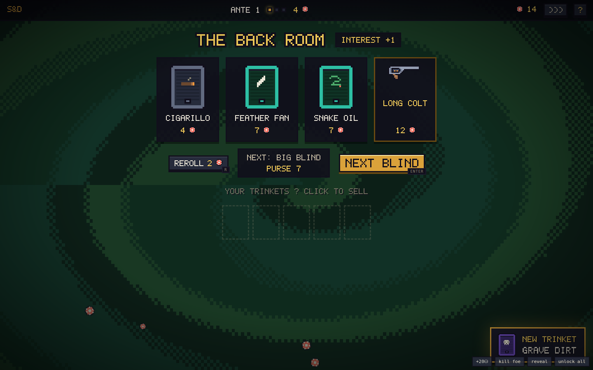

# SHELL & DEBT

**Russian roulette with the frog mob, in hand-drawn pixel art.** You are 'Lucky' Verde.
You owe the Bullfrog everything, and the only way to clear the marker is at the table:
a revolver, a mix of **LIVE** and **blank** shells, and whoever's sitting across from you.
Eight antes. Three blinds each. The last chair belongs to the Bullfrog himself.


## Play it

No build, no dependencies, no assets, no network — plain HTML/CSS/JS:

```
# either just open index.html in a browser, or:
python3 -m http.server 8080   # then visit http://localhost:8080
```

Every sprite is drawn by the game at boot (the whole cast comes from one parameterized
frog rig); sounds are synthesized with WebAudio. Runs are seeded. Unlocks persist in
localStorage.

## The duel


The drum loads with a posted mix — say **2 LIVE, 3 blank** — in an order nobody knows.
Take turns with the mark across the felt:

- **Aim at him** — live hurts him, blank wastes the pull. Turn passes.
- **Aim at yourself** — a blank **keeps your turn** (that's the whole game), a live
  costs a heart.
- Empty drum reloads with a fresh mix. Zero hearts ends somebody. Lose, and the swamp
  keeps your marker — the run is over.

Win and you collect the blind's purse **plus 1 chip per heart you kept**, then hit the
shop. Every ante runs SMALL BLIND → BIG BLIND → **BOSS BLIND**, Balatro-style.

## The mob


Eight bosses, one per ante, each with a house rule:

| # | Boss | The rule |
|---|---|---|
| 1 | **CROAKER** | blanks you fire at him *heal* him |
| 2 | **BLIND NEWT** | the load counts stay hidden |
| 3 | **TAXTOAD TONY** | every pull you take costs 1 chip |
| 4 | **DIZZY SAL** | the drum re-shuffles after every shot |
| 5 | **SLICK LILY** | your gun tricks are locked |
| 6 | **WARDEN WART** | trinket actives are locked |
| 7 | **DON BUFO** | nine hearts of blubber, no trick |
| 8 | **THE BULLFROG** | gets back up once — then hits for 2 |

Small and big blinds are procedural mooks and capos from the same portrait rig — new
face, new suit, new temper every time.

## Trinkets & the shop



Between duels: three trinket cards, a reroll that gets greedier, and the next gun on
the ladder. **24 trinkets** (5 slots) across four rarities — passives like BAD BLOOD
(+1 damage on full-health marks) and LOADED SCALES (every load gets an extra blank),
and actives on keys **1–5** like the MONOCLE (peek the chamber), FLAT BEER (rack a
shell out) and the MIRROR SHARD (flip the shell under the hammer). Interest pays
+1 chip per 10 held, capped at +5.

The iron ladder stacks as you climb:
**SNUB .38 → LONG COLT** (first live hit +1) **→ SAWN-OFF** (Q: next shot ×2)
**→ TOMMY GUN** (E: double tap) **→ THE GOLDEN GUN** (payouts ×1.5, +1 heart).

## The collection


Nine trinkets start locked behind account-wide feats — die once, clear ante 5, watch a
mark shoot himself, win a duel at your last heart. The collection screen tracks every
card, every gun ever owned, and every boss you've dropped. All of it survives death.

## Keys

`A` aim at yourself · `D` aim at the mark · `SPACE` fire · `1–5` trinkets ·
`Q`/`E` gun tricks · `R` reroll · `ENTER` continue · `M` mute · `H` house rules

## Project layout

```
index.html        entry point
style.css         pixel skin: chunky panels, CRT overlay
js/util.js        seeded RNG (mulberry32), helpers, procedural WebAudio SFX
js/pixfont.js     hand-drawn 5×7 typeface (every numeral in the game)
js/pix.js         pixel engine: palette, sprite compiler, draw helpers
js/data.js        content: trinkets, guns, the mob, blinds, economy, keybinds
js/meta.js        persistence: account stats, unlocks, collection (localStorage)
js/sprites.js     ALL the art: the frog rig, guns, shells, trinket cards, hearts
js/bg.js          the swirling paint background
js/engine.js      pure rules: the duel, the mark's brain, payouts, shop (no DOM)
js/ui.js          screens: title, duel frame, overlays, collection, help, keys
js/duel.js        the drawn table scene: animations, muzzle flash, the fall
js/shop.js        the back room
js/main.js        boot (+ ?debug harness)
dev/sim.js        headless balance & fuzz harness (node dev/sim.js)
dev/smoke.js      full browser smoke test (playwright-core)
```

### Tuning knobs (for modders)

- Blind purses, mook hearts, load sizes — top of `js/data.js`
- Live-shell fraction per ante — `E.reload()` in `js/engine.js`
- The mark's brain — `E.oppDecide()` (aggression per boss in `BOSSES`)
- New trinket: one entry in `TRINKETS` (glyph included) + one hook in `E.pull()`
- New boss: a `BOSSES` row + a `FROG_DEFS` portrait + one `bossIs()` check

### Dev checks

```
node dev/sim.js      # 500 bot runs + 200 random-action fuzz runs against the real engine
node dev/smoke.js    # drives the full UI in headless Chromium, fails on any console error
```

Current curve (counting bot): ~84% clear ante 1, ~59% reach the Bullfrog, ~12% walk
out clean. Humans who can't count blanks do worse. That's the point.

---

*A blank in your own head is a free turn. The Bullfrog is waiting.* 🐸🔫
