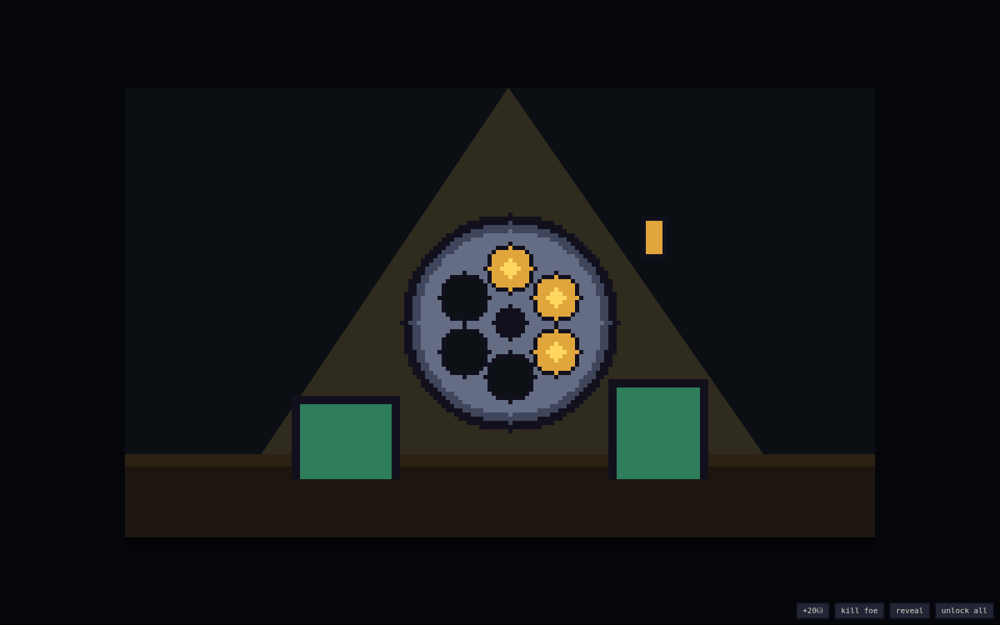
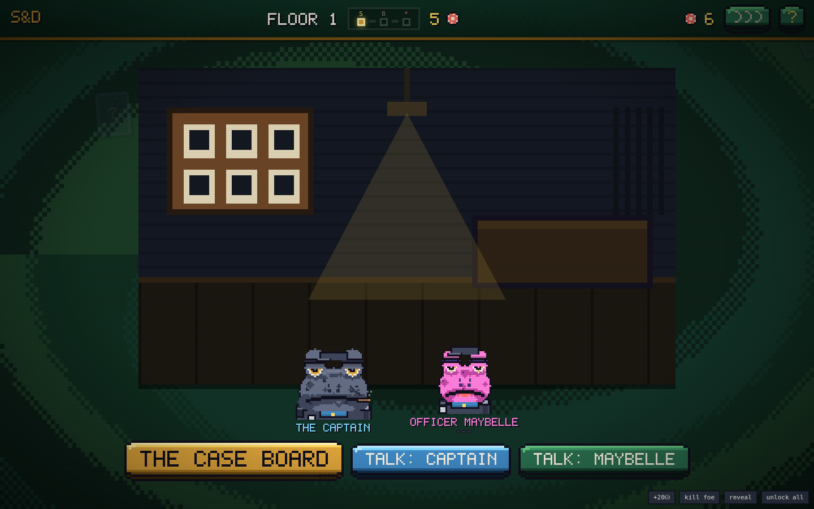
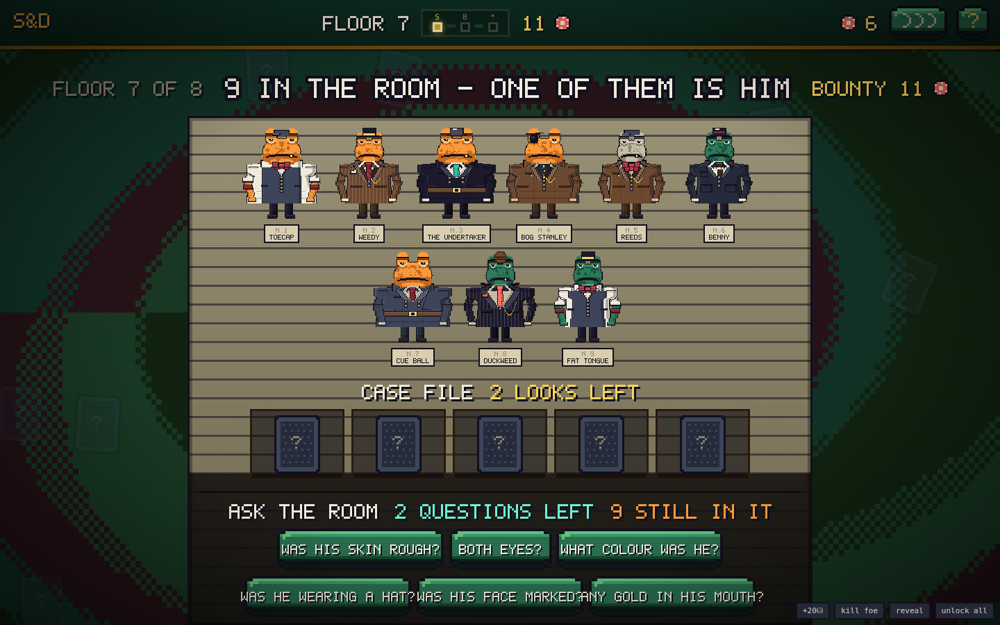
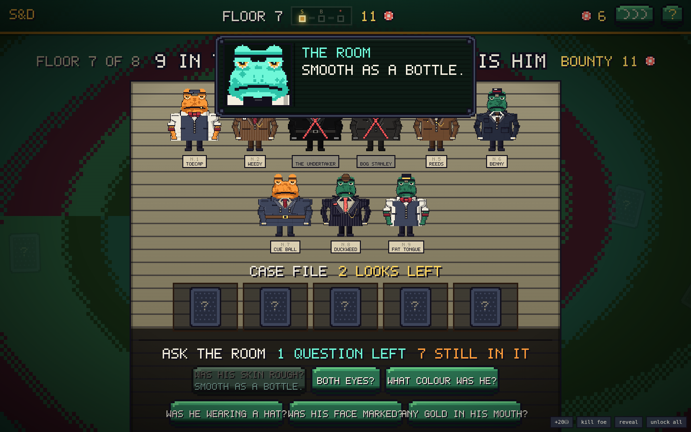
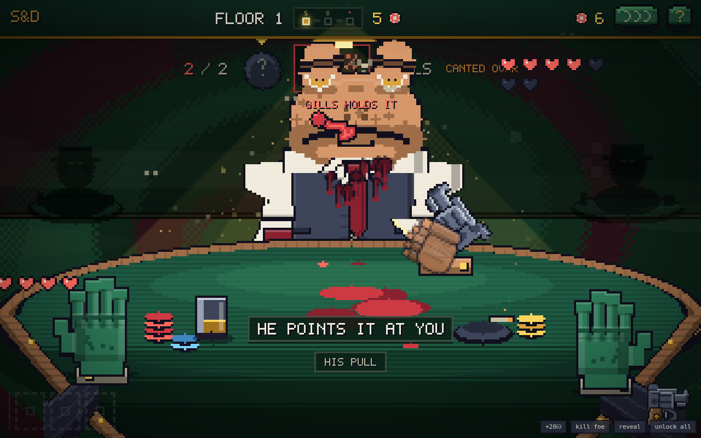
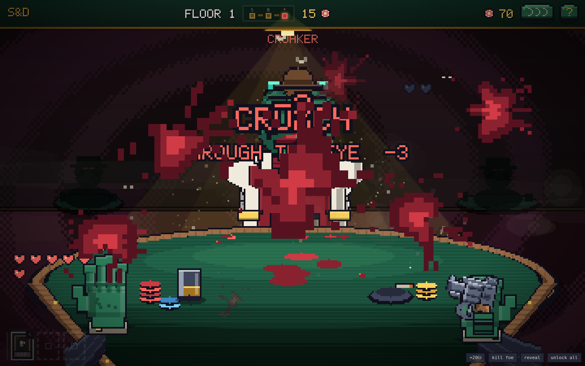
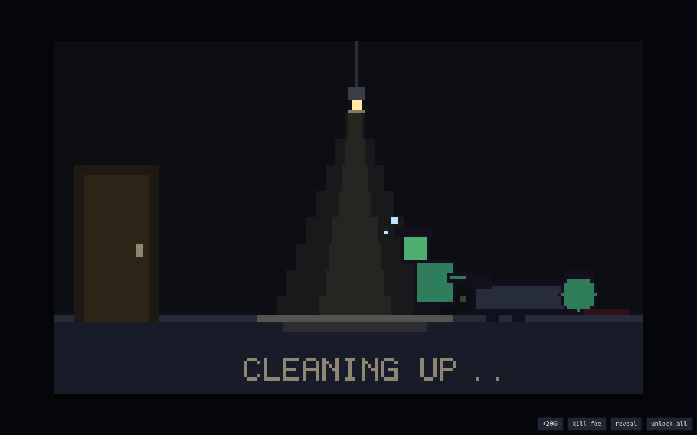

# SHELL & DEBT

**HOMICIDE DIVISION — AFTER HOURS. A detective frog story, in hand-drawn pixel art.**

You were the good cop. You picked the Bullfrog out of the line and his lawyers had him
out by noon. At seven, the door came in. It rained at the funeral; he sent flowers.
You kept the badge. And the gun.

Now you work his organisation the only way that's left: one back room at a time. Find
the right frog in the line-up, sit down across a table with a revolver and a posted mix
of **LIVE** and **blank** shells, and take turns. Kill him, drag him out back, go
through his coat for the papers that point at the next one, and mop the floor before
the noise brings anybody. Eight floors up, the Bullfrog is waiting to find out which
of you the city misses less.


The main menu **is your board**: his crew pinned up on cork, red string between them, a
knife through the case card, and two holes where somebody shot at it. The CASE NO. slip
is the run seed. OPEN THE CASE and the night starts.

## How it starts


Five panels, one line each, no music you'd call music. The line-up. The verdict that
didn't hold. The door. The rain. The oath you swear at nobody. It plays once at the
top of a run and any tap skips it; after the first time you only get the short version.

Then two little films, because a night like this has a ritual: the lamp room where you
**load six shells into the drum one at a time** and spin it shut —



— and the drive across town in the rain, skylines sliding past the car, wipers going,
until the precinct sign resolves out of the dark.


## Play it

No build, no dependencies, no assets, no network — plain HTML/CSS/JS:

```
# either just open index.html in a browser, or:
python3 -m http.server 8080   # then visit http://localhost:8080
```

Every sprite is drawn by the game at boot from one parameterized frog rig. Every panel,
plate, button, and letter on screen is drawn too — the prose renders **one small canvas
per word** in a hand-drawn 5×7 typeface, the buttons are moulded arcade caps painted as
pixel art at whatever size they land, and there is **not one rounded corner in the
game**. Sounds are synthesized with WebAudio. Runs are seeded. Progress persists in
localStorage. Works on phones — the buttons grow to thumb size.

## The precinct



Between the drive and the board you're standing in the squad room, and nobody makes you
leave it. The **captain** will brief you — he's the tutorial, one drawn speech plate at
a time, and every line he says is marked read in your save so a second run is silent.
Or go straight to work. The board doesn't get any colder either way.


**Officer Maybelle works the desk.** Talk to her once a night. The first few nights it's
just talk — she signed you in at eight, she worries, that's all. Keep coming back and it
becomes coffee money in your coat pocket (+4 chips), then a file pulled before the shift
change (**+1 evidence look, all night**), and one night, if you've come home enough
times, *"whatever happens up there... come home after"* — and that's **+1 max heart, all
night**. Trust is saved across runs. It is slow, and it is real, and she means it.

## The line-up


Eight floors, three cases each — STREET CASE, MAJOR CASE, and THE KINGPIN at the top.
Before every chair you're in the identification room: **the whole line standing
against the height chart, full length**, hats, rings, cigars, bad suits and all.
One of them is him. Nobody is going to point.

What you have is a **case file** — a limited number of looks. Turn a card and it's a
piece of physical evidence: a scale off a glass, a matchbook scratched by a ring, a
cigar burned down in an ashtray. Every clue is true, and every clue **crosses frogs off
the line** — the ones it rules out go grey under a stepped red X.

### And you can ask



The other half of the game is **Guess Who with a badge**. You get a handful of questions
to put to the room — *was he wearing a hat? both eyes? any gold in his mouth?* — and the
answer comes back on a drawn plate, true every time, and takes every face that doesn't
match off the line at once.



It starts honest: **three in the line** on floor one, four looks and four questions,
enough to actually solve it. By floor seven it's **nine strangers and two questions**,
the decoys are built to answer most questions the same way he would, and no single
question is ever allowed to finish the job on a big line — it always takes two, and
sometimes it takes nerve.

When the file and the questions run dry you can still **grease a palm** — somebody will
turn one more card or answer one more question for chips, and the price climbs every
time you ask.

Then click the frog and call it:

- **Right** — he comes quietly to the table, and the bounty pays **30% more**.
- **Wrong** — the whole room heard you. It costs you **6 chips**, he sits down with
  **an extra heart**, a faster trigger, and **the first pull of the night is his**.
- A **KINGPIN** is never a mystery. His face has been on your wall for years. The
  line-up is one frog, stepping forward.

**His papers travel.** Roughly half the frogs you put down carry a dossier in the coat.
Take it, and the next line-up starts with **one clue already turned**. That's the whole
career: each body points at the next one.

## The table


You're not a sprite on the far side; **you are the camera**. Your own two frog hands on
the felt, your forearms coming up out of the bottom of the frame, the iron in your right
fist. The drum loads with a posted mix — say **2 LIVE, 3 blank** — in an order nobody
knows, and you take turns:

- **Aim at him** — live hurts him, blank wastes the pull. Turn passes.
- **Aim at yourself** — a blank **keeps your turn** (that's the whole game), a live
  costs a heart. The camera crosses the table for it: you see yourself from **his
  chair**, front-on, the iron against your own temple.


Every pull is four beats: the hammer back, the cylinder indexing, one held beat on
nothing at all, and then it falls.

### Breaking the shot


Across a table is a shot **you can miss**. Point at his face and pull, and the bore
drifts — a rail comes up on the felt with a marker sweeping it, a green band and a gold
band inside that, and you break the shot when the marker is where you want it:

| Where you break it | What happens |
|---|---|
| **the gold band** | through the eye — **+2 damage** |
| **the green band** | on him — a normal hit |
| **outside both** | into the wall behind his ear, chamber gone anyway |

The sweep gets faster and the bands get tighter every floor. Against your own head
there's no check — nothing to steady at that range.

### The cut-in


The moment a live round commits, somebody's face crosses the frame on a skewed banner
with speed lines behind it — your shades and one word when it's your pull, his grin and
a worse word when it's his. The banner runs black most nights. **When the round is
going to end somebody, it runs red.**

### His pull



When it's his turn you see all of it: the iron comes up out of his lap, his arm closes
on the grip — an arm that is **part of him**, shoulder to fist — the barrel levels, and
he thumbs the hammer back on the same four beats you get. **Not everybody in this crew
shoots the same way**: the grip is picked off his own name and stays his for the whole
duel — from the hip, high and formal, canted over sideways, or both hands wrapped round
it like he means it. It says which, next to his name.


Nobody talks while you hold the iron. The moment it's in **his** hand he has a line for
you — different ones when he's hurt, when you're nearly out of frog, and when he's one
of the crew who remembers your door.

### The last heart

Get down to one heart and the game stops being a card game: the lens closes in at the
edges, and under everything you can hear it — **your own heartbeat**, twice a bar, until
you're safe or you're not.

## The kill, and the back room

You never watch him fall. The shot goes off and the next thing on the lens is red — one
splat, then four, then the frame is gone — and when it wipes away you're already out
back with the door shut.



Between the two rooms there's a little loading scene, because even this has a ritual:
you, small, under one swinging bulb, **dragging him toward the door by the boots**.



### First person, out back


The body is **fully intact** — this isn't about what the round did, it's about what's
in his coat. There's almost no interface: a strip of meters up top, your tools in the
corner, and the room. **Look around and search him with your own hands** — point at the
hat, the coat, the vest, his hand, his boot, his mouth; your arm goes out across the
floor, digs, and comes back with what was in there.


Three meters run the whole time:

- **TIME** — real seconds, shorter every floor.
- **NOISE** — every pocket makes some; a boot or a gold tooth makes a lot. It bleeds
  away if you hold still. Cross the line and somebody at the door has heard enough.
- **THE TRAIL** — dragging a frog through a doorway leaves marks from the door to where
  he stopped. Tap a stain and your arm goes out with the **mop** — three passes each,
  satisfying as scratching a lottery ticket, a couple of seconds off the clock. Walk
  out over the rest and somebody finds it in the morning: chips out of your pocket,
  and everything at this address gets more expensive for the rest of the run.


Get heard and a uniform comes through the back door and stands over the body tapping
his nightstick. **Bribe** him to keep working (the price climbs) or walk with what you
have. What comes out of the pockets: chips, belt items, **his dossier** — and off the
crew's own tables, **your next iron**.

## The crew


Eight of them between you and the Bullfrog, one per floor, each with a house rule:

| # | The mark | The rule |
|---|---|---|
| 1 | **CROAKER** | blanks you fire at him *heal* him |
| 2 | **BLIND NEWT** | the live/blank counts stay hidden |
| 3 | **TAXTOAD TONY** | every pull you take costs 1 chip |
| 4 | **DIZZY SAL** | the drum re-shuffles after every shot |
| 5 | **SLICK LILY** | your gun tricks are locked |
| 6 | **WARDEN WART** | your belt is locked |
| 7 | **DON BUFO** | too fat to fall — start shooting |
| 8 | **THE BULLFROG** | gets back up once, then hits for 2 |

## The iron, and the belt

The gun ladder stacks as you take it off the crew's corpses:
**SNUB .38 → LONG COLT** (first live hit +1) **→ SAWN-OFF** (Q: next shot ×2)
**→ TOMMY GUN** (E: double tap) **→ THE GOLDEN GUN** (bounties ×1.5, +1 heart).
None of them are flat art — frame, cylinder, hammer, and grip are separate parts, so
the scene can cock one and index the drum frame by frame.

Three belt loops, keys **6–8**, one-shot items out of pockets: BAD WHISKEY (heal 2),
PLIERS (peek the last shell — or pull a gold tooth), TWO-HEAD COIN, SPARE BLANK, SPARE
LIVE, BRASS KNUCKLES, FILE FOLDER (heat clears free), HOLLOW POINT (+2 on your next
live), SMOKE BOMB (his next shot misses), THE SHIV (slit an emptied pocket's lining),
JEWELLER'S LOUPE (every bulge shows, +1 free pocket), SAINT'S MEDAL (the shell under
the hammer becomes a blank).

There is no shop and nothing passive to hoard — everything you own, somebody was
carrying.

## The animations

The user manual counts them so you don't have to. All drawn, all procedural, no sprite
sheets, tap to skip any of the long ones:

1. The lore reel — five drawn panels with rain
2. The reload room — six shells thumbed in one at a time, drum spin
3. The drive — parallax skylines, rain, wipers
4. The captain's speech plates, letter by letter
5. The card-rack wipe between screens
6. The sit-down — dark room, his eyes, the lamp stutters on
7. The crew entrance — cinema bars and a name stamp
8. Blink, weight-shift, and the tongue (a nine-point verlet chain) taking flies
9. Sweat, cigar smoke, and hat-brim shadows, per frog
10. The four-beat cock: hammer, cylinder index, the held beat, the drop
11. The steady check — sweep, bands, and the break
12. Muzzle flash, cone, cordite, and the casing on the felt
13. The slug in the air — shock ring, wake, slow-mo
14. The Persona cut-in — skewed banner, speed lines, red on lethal
15. His grip animation, in four styles, arm anchored at the shoulder
16. His reactions — facepalm on your self-blank, one digit raised, a shrug
17. Blood that lands, runs, and stays — on him, and on your lens
18. The blood-splat kill wipe, and the wipe coming off like a sleeve on glass
19. The drag loader — you, him, one swinging bulb, a smear
20. First-person searching — your arm out, dust off the lining, his weight rocking
21. The mop — three passes a stain, the boards coming back
22. The bribe — chips arcing into a glove, one at a time
23. The last-heart dread — closing vignette and a heartbeat, twice a bar
24. The climb between floors, the take raining past the lens, and the iris when you die

## Keys

`A` aim at yourself · `D` aim at the mark · `SPACE` fire · `6–8` belt items ·
`Q`/`E` gun tricks · `R` bribe · `ENTER` sit down / walk out · `M` mute · `H` house rules

Or just **tap**: tap his face to aim, tap again to fire. Tap during any animation to
fast-forward it. The whole game is playable with one thumb, portrait or landscape.

## Project layout

```
index.html        entry point
style.css         pixel skin: chunky panels, CRT overlay, zero border-radius
js/util.js        seeded RNG (mulberry32), helpers, procedural WebAudio SFX
js/pixfont.js     hand-drawn 5×7 typeface (every letter in the game)
js/pix.js         pixel engine: palette, sprite compiler, draw helpers
js/data.js        content: the crew, guns, items, questions, case + aim + mess tuning
js/meta.js        persistence: stats, tutorial marks, Maybelle's trust (localStorage)
js/sprites.js     ALL the art: frog rig, full bodies, the iron rig, hands, splats
js/bg.js          the swirling paint background
js/engine.js      pure rules: the duel, the mark's brain, the loot, the heat (no DOM)
js/ui.js          screens: murder board, precinct, line-up, duel frame, help
js/btn.js         the arcade buttons: sockets, moulded caps, pixel-art faces
js/fx.js          the effects engine: smoke, gore, chip arcs, slow-mo, ambient dust
js/case.js        the case: suspects, evidence, questions, the accusation
js/duel.js        the drawn table: expressions, grips, the steady check, the corpse
js/cine.js        the wipes, the reel, the reload, the drive, the drag, the cut-in
js/cops.js        the uniforms: the walk-in, the bribe handoff, the bust
js/loot.js        out back: first-person searching, the meters, the mop, the bill
js/tutor.js       the captain, Maybelle, the mark's lines, the drawn speech plate
js/main.js        boot (+ ?debug harness)
dev/sim.js        headless balance & fuzz harness (node dev/sim.js)
dev/smoke.js      full browser smoke test (playwright-core)
```

### Tuning knobs (for modders)

- The case — `CASE_TUNING` (line size, looks, questions, the price of being wrong)
  and `CASE_ASKS` in `js/data.js`
- The steady check — `AIM_TUNING` (sweep speed and band widths per floor)
- The mess — `MESS_TUNING` (stains, mop time, the fine)
- Bounties, heat, bribes — `BLIND_PURSE` / `HEAT_COST` / `LOOT_TUNING`
- The mark's brain — `E.oppDecide()` (aggression per boss in `BOSSES`)
- What he says — `MARK_LINES`; what she says — `UI.talkMaybelle`

### Dev checks

```
node dev/sim.js      # 500 bot runs + 200 random-action fuzz runs against the real engine
node dev/smoke.js    # drives the full UI in headless Chromium, fails on any console error
```

Current curve (counting a bot with average nerves — it breaks a clean shot about a
third of the time and never reads the line-up, it just guesses): ~89% clear floor 1,
~27% reach the Bullfrog, ~2% walk out clean. A player who works the questions, mops
the floor, and learns the sweep does far better than the bot on every one of those
numbers. That's the point.

---

*A blank in your own head is a free turn. Take his papers — the next line-up is
already forming.* 🐸🔫
