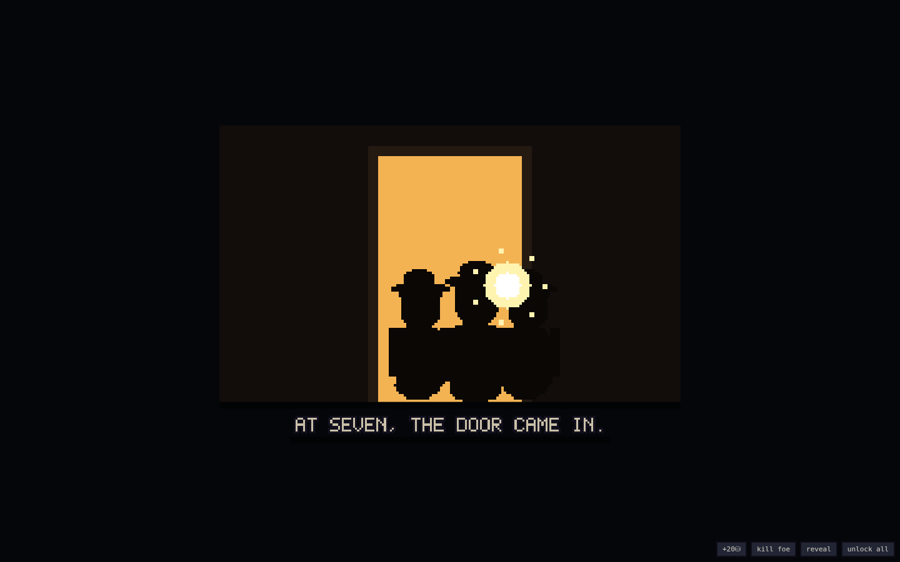
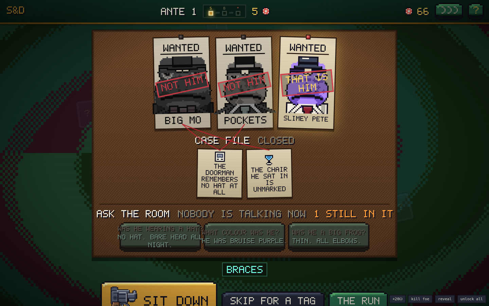
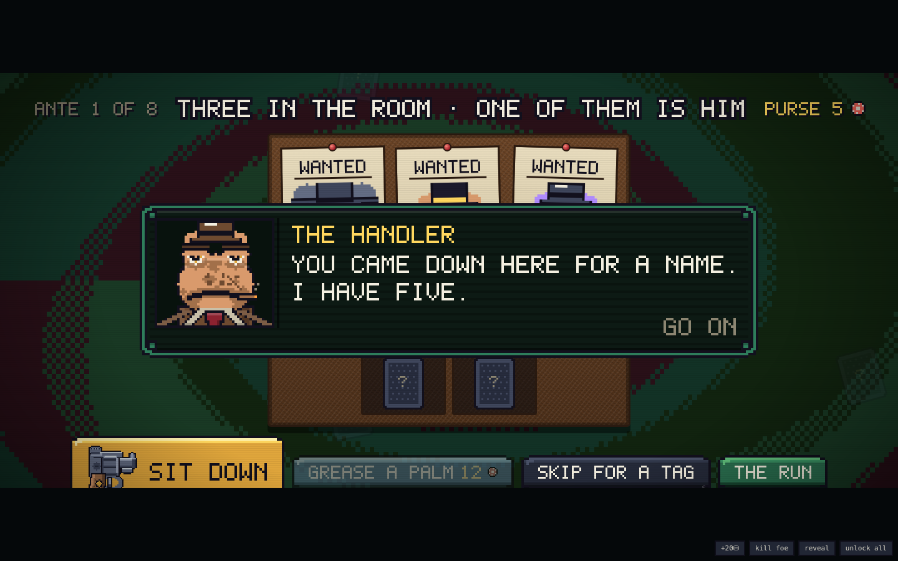
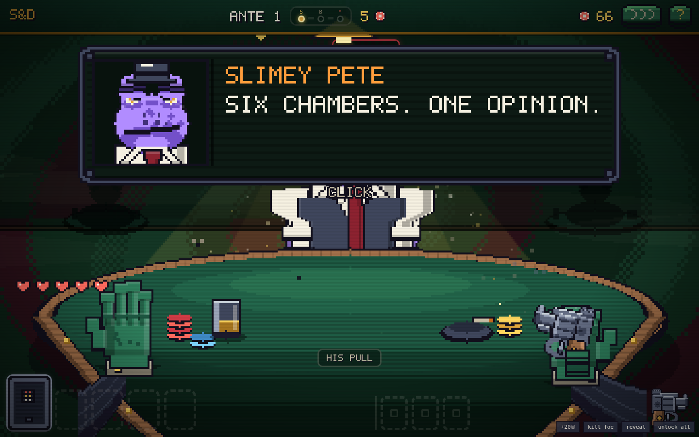
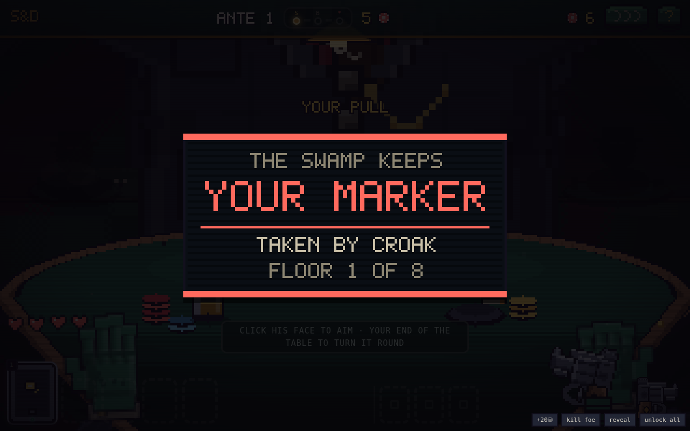

# SHELL & DEBT

**Russian roulette with the frog mob, in hand-drawn pixel art.** You are 'Lucky' Verde.
They ate at six; at seven the door came in; the house took everything but you. The house
is eight floors high and they are all upstairs.

Work the cork board until you know which frog in the room is the one you came for, call
him out, and sit down: a revolver, a mix of **LIVE** and **blank** shells, and a table
between you. Kill him, drag him out back and **go through his pockets before the noise
brings the badges**. Then one more floor. The top one belongs to the Bullfrog.


## How you got here



Five rooms, one line each, no faces — because that is how it comes back to you at four
in the morning. They ate at six. At seven the door came in. The house took everything
but you, and the house is eight floors high. It plays once at the top of a run, any tap
skips it, and after that you only get the last two panels: the tower, and the stairs.

Between antes the camera goes back outside and shows you the building with one more
floor of it behind you.

## Play it

No build, no dependencies, no assets, no network — plain HTML/CSS/JS:

```
# either just open index.html in a browser, or:
python3 -m http.server 8080   # then visit http://localhost:8080
```

Every frog wears a real outfit, built from a wardrobe of **15 named costumes** — 3-piece
pinstripe, double-breasted, dinner jacket, white tie and tails, belted trench,
shirtsleeves with braces, croupier livery, warden's tunic, evening gown, zoot suit — with
shirt collars, waistcoats, lapels in notch/peak/shawl, watch chains and pocket squares.
Arms sit *under* the coat and end in four-fingered frog hands resting on the felt.

The whole game plays **fullscreen over a Balatro-style paint swirl** — the table, the
lamp and the mark sit right on the casino floor, and the UI is felt and gold trim. Every
sprite is drawn by the game at boot from one parameterized frog rig: eye bulbs that are
part of the skull rather than stuck on top of it, and a mouth nearly as wide as the head.

**These frogs do not emote.** They are professionals sitting across a table from a man
with a gun and they have done it before, so every expression is one or two pixels off
deadpan — what moves is the lid and the pupil, not the whole face. A grin is the line
going up two pixels at the ends. Anger is a jaw held shut. What tells you he is alive is
that he **blinks**, shifts his weight in the chair, and every so often puts his tongue
through a fly.

**No teeth anywhere.** Frogs don't have any, so an open mouth shows gum, the pale
maxillary ridge along the top jaw, and tongue — and the GOLD TOOTH tell is a stud set in
his lip. Every frog is also freckled: a mottle scatter seeded off his own def, so the
same frog is speckled the same way every time you meet him, with a wet slick over the
crown and each eye bulb. Suits with lapels, cuffs and frog hands, and every tell drawn
right on the frog. Works on phones — the buttons grow to thumb size. Sounds are
synthesized with WebAudio. Runs are seeded. Unlocks persist in localStorage.

The table is dressed to match: baize with a visible nap, grain running round the wooden
rail, and behind him **the house** — two more tables with somebody still sitting at them,
cigarette haze crossing the room, and dust turning over in the lamp cone.

That tongue is a **nine-point verlet chain anchored in his mouth**, not an animation
curve. Flies work the room; when one drifts inside range he snaps at it and the whole
length whips out after the tip with momentum and sag, then comes back slack with the fly
stuck to the end of it.

**Every button is an arcade button** — a socket bolted into the panel with a moulded
cap sitting in it, a glint on the crown, and a press that drops the cap into the socket
and takes the label down with it. None of that is CSS: `js/btn.js` paints each button's
face as pixel art on its own canvas at whatever size it ends up, so the same button reads
identically at 360px and 1920.

The irons are built out of parts rather than drawn as flat art, which means the duel can
**cock the hammer and index the cylinder** frame by frame. Thumb it back, watch the
flutes scroll a chamber round, and the hammer drops: a directional flame cone off the
crown, powder smoke out of the muzzle *and* the cylinder gap, the iron kicking straight
back down the bore line with your fist still wrapped round it, and the case spinning out
onto the felt.

Every screen change goes behind a **rack of card backs** that sweeps shut, changes the
world behind it, and keeps going off the other side. Sit down and the room is dark: you
can see the mark's eyes across the felt before the lamp above the table stutters, catches,
and the camera settles in on the green. A boss doesn't get a menu — **bars close over the
top and bottom of the frame** and he crosses the room while his name lands like a stamp.
Clear an ante and the night's take **rains past the lens**. Die and the lights iris shut.
Tap through any of it.

## The board


Eight floors, three chairs each. Before every one you are standing in front of a cork
board with **three wanted posters pinned to it**. Three frogs are drinking in this room
and exactly one of them is the bounty. Nobody is going to point him out.

What you have is a **case file**: a scale off a glass, a matchbook scratched by a ring,
a cigar burned down in an ashtray, a doorman who remembers a hat. Every clue is true and
every clue cuts the field. You get a limited number of **looks** into the file — turn one
over and **red string** runs from it across the cork to whoever it rules out, and their
poster gets stamped NOT HIM and goes grey.

When the string only reaches one poster, click it and say the name:

- **Right** — he walks over without his hand near his coat. The purse pays **25% more**
  and you have read every tell he carries.
- **Wrong** — the whole room heard you. He sits down with **an extra heart** and a
  faster trigger.
- **Neither** — just sit down and take whoever comes. No bonus, no penalty.

You can still **skip for a tag** — walk past the chair and take a favour instead of a
corpse (a fat envelope, an inside man at the precinct, a care package, dutch courage,
a gunrunner). Bosses can never be skipped, and a boss is never a mystery: his poster has
been on your wall since the night they did it.

There is **nothing to buy and nothing to own**. The looks you get into the file are the
looks the job gives you — four at ante 1, down to one by the end — and the board gets
harder as you climb: three faces on the wall, then four, then five, and the decoys are
built to answer most of the same questions the same way. At most one clue halves the
field; the rest cross off a single face each, so it always takes several looks and
sometimes it takes a guess.

When the file runs dry you can still **grease a palm** — somebody in the room will turn
one more card over for money, and the price goes up every time you ask.



### The handler

Every panel, plate, card and label in the game is drawn — including the letters. The
speech plates are a single canvas each (frame, rivets, portrait well, scanline hatch,
pixel font) blown up by an integer, and the prose panels render **one small canvas per
word**, so the browser still wraps between words but nothing on screen is set in a
system font.



Somebody has to tell you how this works once, and then never again. He is a frog in a
bad coat who hands you the file, says the three things that will keep you alive — turn a
card over, click his face, do the floor before you leave — and goes. Every line is one
click to dismiss, each one is marked read in the save, and a second run is silent. If you
want him back, the title screen has **BRIEF ME AGAIN**.

`TAB` opens **the run** at any time — every trinket and item spelled out, your iron,
tags taken, and what the night has cost so far.


## The duel — first person


You're not a sprite on the far side of the table; **you are the camera**. What you see of
yourself is your own two frog hands on your end of the felt, your pinstripe forearms
coming up out of the bottom of the frame, and the iron in your right fist. The table is
built to match: the far half is an ellipse under the lamp, the near half dips off the
bottom of the shot the way your own edge of a card table actually does, going dark as it
comes toward you — and your glass, your ashtray with the cigar still going and your
hearts all sit on it.

**There are no aim buttons.** Every turn starts with the iron down and pointed at
nothing, and you shoot by pointing at a head:

- **Click his face** — the iron comes up and a sight picture lands on him. **Click it
  again** and it goes off.
- **Click your own end of the table** — and the camera *crosses the table*. You see
  yourself from **his chair**: front-on in the same head rig every frog in this game
  wears, the pinstripe, the fedora, the shades, the iron against your temple, and his
  shoulder in the bottom of frame because this is the view over it. Click your own head
  to pull, anywhere else to stand down.


Every pull is four beats and a camera move: the hammer back, the cylinder indexing, one
held beat on nothing at all — the last moment in which everybody at this table is still
alive — and then it falls. Live, and the room is briefly overexposed: one white frame,
a thump, a ring that hangs on, cordite, a casing on the felt.


Nobody at this table talks while you are holding it. The moment the iron is in **his**
hand he has something to say about it, and it goes up on a drawn plate in his own colour
without waiting for you to click it — different lines when he is hurt, when you are
nearly out of frog, and when he is a boss who remembers your door.



The rest of the time his hands do the talking: one comes up out of the dark under the
felt — a flat hand over his own eyes when you put the muzzle to your head and it clicks,
one digit raised at the lamp when you hit him and he is still upright, a shrug when he
watches you take a live one. Then it goes back down.

And when it is you who goes: the room tips over because your head does, he stands up and
looks down at the lens for a while, and the marker changes hands.



What lands on him stays on him: every hit spatters where the lead went in, runs downhill
while he sits there, and does not wipe off between pulls. What he puts on you goes on
your own face, and you see it every time the camera comes round.

The drum loads with a posted mix — say **2 LIVE, 3 blank** — in an order nobody knows.
Take turns with the mark across the felt:

- **Aim at him** — live hurts him (blood on the felt is yours to keep), blank wastes
  the pull. Turn passes.
- **Aim at yourself** — a blank **keeps your turn** (that's the whole game), a live
  costs a heart.
- Empty drum reloads with a fresh mix. Zero hearts ends somebody. Lose, and the swamp
  keeps your marker.


## Tells & the little black book

Every mook and capo is **procedurally generated** — face, build, suit, and 0–3 **tells**
you can read across the table:

| Tell | What it means |
|---|---|
| 🎩 **TOP HAT** | big hat, deep pockets: +6 corpse chips |
| 👒 **BOWLER** | a careful frog — slower to shoot you |
| 🧢 **FLAT CAP** | hungry and mean — quicker to shoot you, lighter pockets |
| ✨ **GOLD TOOTH** | pliers pay +5 at the loot |
| 💍 **RINGS** | the HAND pocket always pays |
| ⚔ **SCAR** | he's done this before: +1 heart |
| 🏴 **EYE PATCH** | no depth perception, no fear |
| 💧 **THE SWEATS** | panics — points it at himself more |
| 🚬 **CIGAR** | cool head, thick skin: +1 heart |
| 🦺 **FANCY VEST** | the VEST pocket always pays |

You don't start knowing any of this. **Loot a frog that carries a tell and you can
read it forever** — hover the mark's name and every learned tell is spelled out;
the ones you haven't earned yet stay `???`.

## The loot, and the law


There is no shop. Kill the mark — he sprawls across the felt, legs, splayed hand, wounds
where your lead landed, a pool that keeps spreading — and then **you go through him
yourself**. His pockets aren't a list of buttons next to a corpse: they're places *on*
him. Hat, coat, vest, his hand, his boot, his mouth. Point at one and it lights up; tap
it and your arm goes out across the felt, shrinking with the distance, digs — cloth
shifting, dust off the lining, his weight rocking under your hand — and comes back with
whatever was in there. Nothing detonates. You're going through a dead frog's coat.

You never watch him fall. The shot goes off and the next thing that happens is **on the
lens in front of you** — one splat, then four, then eight, then the frame is gone — and
it comes off the way a sleeve comes off glass. Behind the red you are already out back
with the door shut, the body on the floor and a bare bulb on a wire.

Three meters run the whole time you are back there:

- **TIME** — a clock, in real seconds, and it does not stop for you. It gets shorter
  every ante.
- **NOISE** — every pocket makes some, and a boot or a gold tooth makes a lot. It bleeds
  away if you hold still. Cross the red line and somebody at the door has heard enough.
- **THE TRAIL** — dragging a frog through a doorway leaves stains from the door to where
  he stopped. Tap one and your arm goes out with a rag: three passes, a couple of seconds
  off the clock, a little noise. Walk out over the rest and somebody finds it in the
  morning — chips out of your pocket now, and dearer protection for the rest of the run.

Get heard and a cop comes through the back door and stands over the body tapping his
nightstick. **Bribe** him to keep going (the price climbs) or walk with what you have.
Run the clock out and you leave with what is in your hands. Trinket cards and guns come
out of corpses — **boss holsters carry your next iron**.

### What you brought with you

| Tool | At the corpse |
|---|---|
| 🔧 **PLIERS** | yank the gold tooth free — the badges don't count it |
| 🔪 **THE SHIV** | arm it, then go back into a pocket you already emptied and slit the lining |
| 🔍 **JEWELLER'S LOUPE** | every bulge on him shows at once, and you get one more pocket for free |
| 📁 **FILE FOLDER** | hand them somebody else's paperwork: the heat here clears, free |

The badges are not an abstraction. Bribe him and the chips arc across the floor into his
glove one at a time — he pockets them, tips his cap and leaves. Refuse and he folds his
arms and stays.


After every boss, **Swamp PD wants protection money**, scaling with the ante. Two or
three of them march in flanking the table under a red-and-blue light wash. Pay and they
salute and go. Can't pay, and the cuffs come out, the paddy wagon rolls past, and the
screen tips over. That's the debt now.

## The belt

Trinkets are permanent; **items are one-shot** and come out of the same pockets. Three
belt loops, keys **6–8**:

| Item | What it does |
|---|---|
| 🥃 **WHISKEY** | heal 2 hearts |
| 🔧 **PLIERS** | look at the LAST shell — or pull a gold tooth at the corpse |
| 🪙 **COIN FLIP** | heal 1 or take 1, but always +6 chips |
| ⚪ **SPARE BLANK** | slip an extra blank into the drum (the count changes) |
| 🔴 **SPARE LIVE** | slip an extra live in — for a mark about to take the gun |
| 👊 **BRASS KNUCKLE** | 1 damage right now, no shell spent |
| 📁 **FILE FOLDER** | make the current heat level go away, free |
| 💥 **HOLLOW POINT** | your next live hit deals +2 |
| 💨 **SMOKE BOMB** | the mark's next shot at you misses entirely |
| 🍀 **LUCKY PENNY** | force the shell under the hammer to be a blank |
| 🔪 **THE SHIV** | slit the lining of a pocket you already emptied — no heat |
| 🔍 **LOUPE** | every bulge on the corpse shows, and one more free pocket |

## The mob


Eight bosses, one per ante, each with a house rule and signature tells:

| # | Boss | The rule |
|---|---|---|
| 1 | **CROAKER** | blanks you fire at him *heal* him |
| 2 | **BLIND NEWT** | the load counts stay hidden |
| 3 | **TAXTOAD TONY** | every pull you take costs 1 chip |
| 4 | **DIZZY SAL** | the drum re-shuffles after every shot |
| 5 | **SLICK LILY** | your gun tricks are locked |
| 6 | **WARDEN WART** | trinket actives are locked |
| 7 | **DON BUFO** | nine hearts of blubber, no trick |
| 8 | **THE BULLFROG** | gets back up once — then hits for 2 |

Pay the badges after a boss and the ante closes out on its own screen:


## The irons

Five guns, none of them flat art. Each is assembled from parts — frame, top strap,
cylinder, ejector shroud, rib, front sight, hammer, guard, checkered walnut — so the
scene can pose one, cock it, and turn the cylinder without needing a sprite sheet.
Left to right below: hammer down, hammer back, one chamber round, two.


## Trinkets & the iron

**32 trinket cards** (5 slots, four rarities) loot out of pockets — passives like BAD
BLOOD (+1 on full-health marks) and actives on keys **1–5** like the MONOCLE (peek the
chamber) and the MIRROR SHARD (flip the shell under the hammer). Nine start locked
behind account-wide feats; the collection screen tracks everything.

The gun ladder stacks as you take it off boss corpses:
**SNUB .38 → LONG COLT** (first live hit +1) **→ SAWN-OFF** (Q: next shot ×2)
**→ TOMMY GUN** (E: double tap) **→ THE GOLDEN GUN** (corpses ×1.5, +1 heart).


## Keys

`A` aim at yourself · `D` aim at the mark · `SPACE` fire · `1–5` trinkets · `6–8` belt
items · `Q`/`E` gun tricks · `R` bribe · `S` skip a blind · `TAB` the run · `ENTER` sit down /
walk out · `M` mute · `H` house rules

Or just **tap**: tap the mark to aim at him, tap again to fire. Tap during any animation
to fast-forward it. The whole game is playable with one thumb, portrait or landscape.


## Project layout

```
index.html        entry point
style.css         pixel skin: chunky panels, CRT overlay
js/util.js        seeded RNG (mulberry32), helpers, procedural WebAudio SFX
js/pixfont.js     hand-drawn 5×7 typeface (every numeral in the game)
js/pix.js         pixel engine: palette, sprite compiler, draw helpers
js/data.js        content: traits, trinkets, guns, the mob, detective tools, tuning
js/meta.js        persistence: stats, unlocks, learned tells (localStorage)
js/sprites.js     ALL the art: frog rig v2, the iron rig (hammer + cylinder), cards
js/bg.js          the swirling paint background
js/engine.js      pure rules: the duel, the mark's brain, the loot, the heat (no DOM)
js/ui.js          screens: title, duel frame, collection, help, keys
js/btn.js         the arcade buttons: sockets, moulded caps, pixel-art faces
js/fx.js          the effects engine: smoke, gore, chip arcs, slow-mo, ambient dust
js/case.js        the board: suspects, evidence, the red string, the case room
js/duel.js        the drawn table scene: expressions, blood, the fall, the corpse
js/cine.js        the wipe, the sit-down, the boss cut-in, the lore reel, the climb
js/cops.js        Swamp PD: the walk-in, the bribe handoff, the shakedown, the bust
js/loot.js        the take: pockets, the three meters, bribes, protection
js/tutor.js       the handler, the mark's lines, and the drawn speech plate
js/main.js        boot (+ ?debug harness)
dev/sim.js        headless balance & fuzz harness (node dev/sim.js)
dev/smoke.js      full browser smoke test (playwright-core)
```

### Tuning knobs (for modders)

- Corpse money, heat, bribes — `BLIND_PURSE` / `HEAT_COST` / `LOOT_TUNING` in `js/data.js`
- New tell: one `TRAITS` row + a visual flag in the rig (`js/sprites.js` `buildFrog`)
- New expression: one case in the eye/mouth switches in `buildFrog`
- The mark's brain — `E.oppDecide()` (aggression per boss in `BOSSES`)
- New trinket: one entry in `TRINKETS` (glyph included) + one hook in `E.pull()`

### Dev checks

```
node dev/sim.js      # 500 bot runs + 200 random-action fuzz runs against the real engine
node dev/smoke.js    # drives the full UI in headless Chromium, fails on any console error
```

Current curve (counting bot that plays its belt, mops the floor and sometimes skips, but
never works the board): ~83% clear ante 1, ~40% reach the Bullfrog, ~8% walk out clean,
~2.6 items burned and ~1 chair skipped per run. A player who reads the board and names
the right frog does better than the bot; a player who can't tell a top hat from a bowler,
or who walks out over the trail, does worse. That's the point.

---

*A blank in your own head is a free turn. Loot fast — the badges are coming.* 🐸🔫
