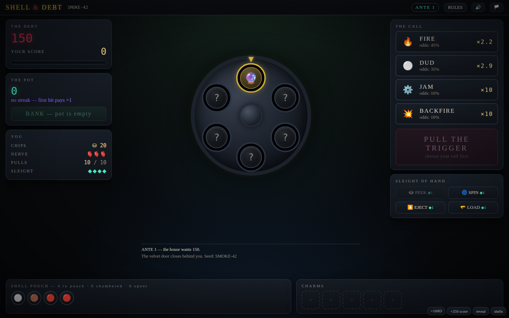
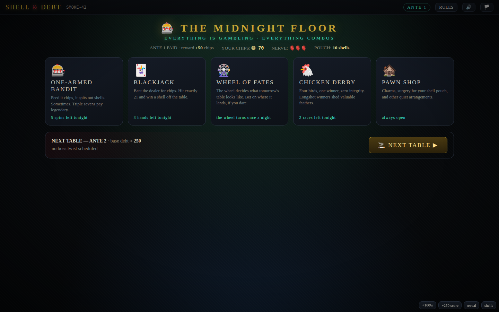
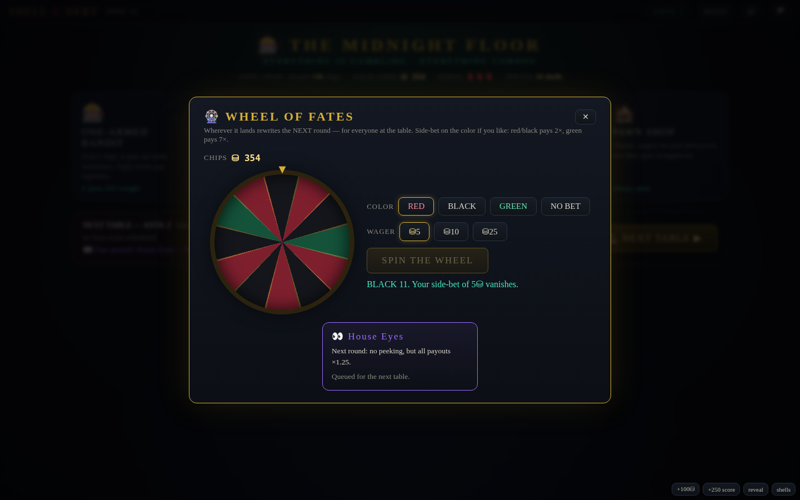

# SHELL & DEBT

**A 2D dark casino roguelike.** The house found you, the chamber is loaded, and the only way
out is through eight antes of escalating debt. Manipulate the shells in a cursed revolver
cylinder, call the shot — **FIRE**, **DUD**, **JAM** or **BACKFIRE** — and ride your pot down
the razor's edge between banking the streak and burning it all.

Between rounds, the casino itself is your shop: slot machines pay out in ammunition, blackjack
pays in chips and shells, the roulette wheel rewrites the next round, and yes, you can bet on
chickens. Everything is gambling. Everything combos. Every run gets more broken.

Inspired by Balatro's ante-and-shop skeleton, with a push-your-luck gamble where the deck of
cards would be.



## Play it

No build, no dependencies, no network — plain HTML/CSS/JS:

```
# either just open index.html in a browser, or:
python3 -m http.server 8080   # then visit http://localhost:8080
```

Works from `file://` directly. Runs are seeded — enter a "cursed seed" on the title screen to
replay or share a run.

## The core gamble

Each ante, the house names a **DEBT**. You have ~10 trigger pulls to bank that much score.

1. **The chamber** holds up to 6 shells drawn blind from your shell pouch. The shell under the
   hammer resolves as FIRE / DUD / JAM / BACKFIRE according to its own hidden weights.
2. **Call the outcome before you pull.** Posted odds set the payout multiplier — safe calls pay
   ×1.4, longshots pay up to ×25. Hidden shells show the *average* odds of everything hidden in
   the chamber; revealed shells show exact odds.
3. **Correct call** → payout enters **the pot** and your **streak multiplier** grows (×1, ×2,
   ×3… compounding ×1.5 on deep rides). **Wrong call** → the whole pot burns.
4. **BANK** whenever you like to convert pot into score — and reset the streak. Push or cash.
5. An **uncalled BACKFIRE** costs **Nerve**. At zero Nerve the run ends face-down on the felt.
   *Call* the backfire, though, and you ride the blast for one of the best payouts in the game.
6. A **JAM** keeps the shell in the cylinder (now revealed) and comes around again.

**Sleight of Hand** (limited uses per round) is where the manipulation lives:
**👁️ Peek** the top shell · **🌀 Spin** to reshuffle and re-hide · **⏏️ Eject** the top shell
unseen · **🫳 Load** a chosen shell from your pouch under the hammer.

The information game is the whole game: a peeked blank called DUD is a safe streak-builder; a
**Web Shell** forces the *next* shell to copy its outcome while the odds display still shows the
natural (wrong) percentages — which is how you call a 4% BACKFIRE at ×25 with total certainty.

## The casino floor (your shop)



| Station | What it does |
|---|---|
| 🎰 **One-Armed Bandit** | Pays out in *shells* — triples drop Shotgun/Web/Cursed shells, triple 7s drop a legendary. Three straight losses and the house slides you a blank in sympathy. |
| 🃏 **Blackjack** | Chips on a knife's edge; win with exactly 21 and a shell falls off the table. |
| 🎡 **Wheel of Fates** | One spin a night. Wherever it lands *rewrites the next round* — Fire Fever, Blood Night, the Long Table, Zero Hour… Side-bet on the color if you're feeling lucky. |
| 🐔 **Chicken Derby** | Four athletes of questionable provenance. Longshot winners you backed shed a Feather Shell. |
| 🏚️ **Pawn Shop** | Charms (passive artifacts, 5 slots), pouch surgery — melt a shell, mirror a shell, mystery jars, back-room stitches for your Nerve. |

15 shell types (blanks to Dead Man's Shells), 20 charms (Grave Dancer, Loaded Rabbit, Echo
Chamber, Second Wind…), 7 boss twists on antes 3/6/8 (The Blindfold, The Vig, THE OWNER), and
12 roulette fates. Beat ante 8 and the door to **Endless** opens.



## Controls

**1–4** select a call · **SPACE / ENTER** pull the trigger · **B** bank · mouse for everything
else. Hover anything for a tooltip. `RULES` in the top bar has the full house rules.

## Project layout

```
index.html        entry point
style.css         the whole dark-casino look
js/util.js        seeded RNG (mulberry32), helpers, procedural WebAudio SFX
js/data.js        content tables: shells, charms, bosses, fates, chickens, flavor
js/engine.js      pure game rules: chamber, odds, pulls, pot/streak, antes, economy
js/ui.js          screens, the cylinder, panels, tooltips, FX, keyboard
js/casino.js      the floor + all five mini-games
js/main.js        boot (+ ?debug harness)
dev/sim.js        headless balance & fuzz harness (node dev/sim.js)
dev/smoke.js      full browser smoke test (playwright-core)
```

No frameworks, no assets, no network calls; sounds are synthesized, art is CSS and emoji.
Everything is deterministic per seed except pure-juice animation randomness.

### Tuning knobs (for modders)

- `DEBTS` and the endless growth rate — `js/engine.js`
- Shell weights/base values and all content — `js/data.js`
- Call multiplier curve `callMult()` and streak curve `streakMult()` — `js/engine.js`
- Add a shell: one entry in `SHELLS` (+ pool listing); specials are small hooks in `doPull`
- Add a charm: one entry in `CHARMS` + an `E.has('id')` check where it bites

### Dev checks

```
node dev/sim.js      # plays 400 bot runs + 150 random-action fuzz runs against the real engine
node dev/smoke.js    # drives the full UI in headless Chromium, fails on any console error
```

Current curve (greedy bot, no real strategy): ~72% clear ante 1, ~35% ante 2, ~5% ante 3 —
humans exploiting webs, echoes, loaded chambers and charm stacks go much deeper. That's the
point.

---

*The wheel only turns once a night. The house always remembers.* 🎰
