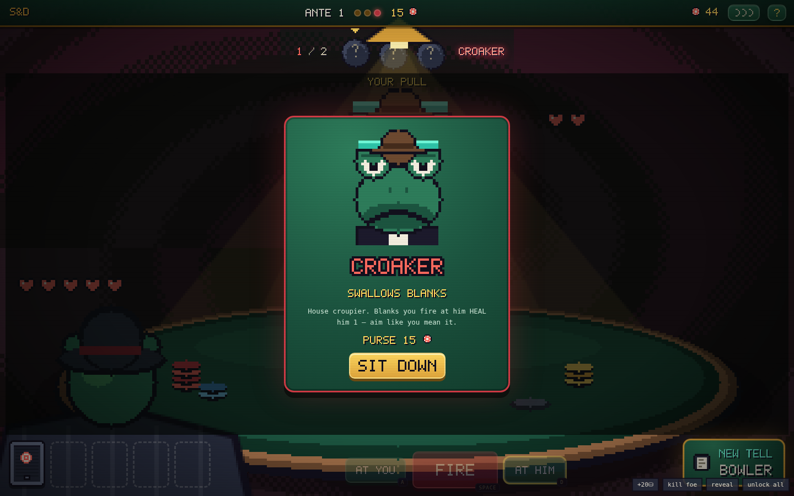
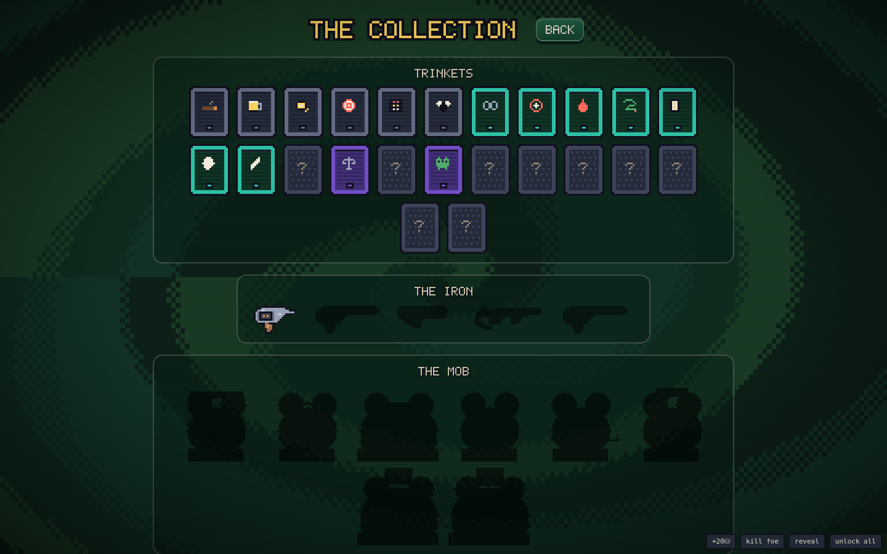
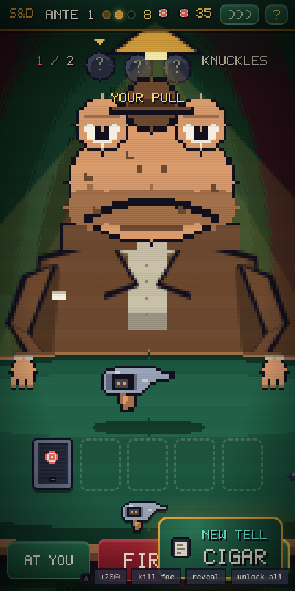

# SHELL & DEBT

**Russian roulette with the frog mob, in hand-drawn pixel art.** You are 'Lucky' Verde.
You owe the Bullfrog everything, and the only way to clear the marker is at the table:
a revolver, a mix of **LIVE** and **blank** shells, and whoever's sitting across from you.
Eight antes. Three blinds each. Kill the mark, **loot the corpse before the badges
arrive** — the last chair belongs to the Bullfrog himself.


## Play it

No build, no dependencies, no assets, no network — plain HTML/CSS/JS:

```
# either just open index.html in a browser, or:
python3 -m http.server 8080   # then visit http://localhost:8080
```

The whole game plays **fullscreen over a Balatro-style paint swirl** — the table, the
lamp and the mark sit right on the casino floor, and the UI is felt and gold trim. Every
sprite is drawn by the game at boot from one parameterized frog rig: big cartoon heads,
seven facial expressions (they grin when you get hit, sweat when they're losing, and die
with their tongue out), suits with lapels, cuffs and three-finger hands, and every tell
drawn right on the frog. Works on phones — the buttons grow to thumb size. Sounds are
synthesized with WebAudio. Runs are seeded. Unlocks persist in localStorage.

## The duel


The drum loads with a posted mix — say **2 LIVE, 3 blank** — in an order nobody knows.
Take turns with the mark across the felt:

- **Aim at him** — live hurts him (blood on the felt is yours to keep), blank wastes
  the pull. Turn passes.
- **Aim at yourself** — a blank **keeps your turn** (that's the whole game), a live
  costs a heart.
- Empty drum reloads with a fresh mix. Zero hearts ends somebody. Lose, and the swamp
  keeps your marker.

## Tells & the little black book

Every mook and capo is **procedurally generated** — face, build, suit, and 0–3 **tells**
you can read across the table:

| Tell | What it means |
|---|---|
| 🎩 **TOP HAT** | big hat, deep pockets: +6 corpse chips |
| 👒 **BOWLER** | a careful frog — slower to shoot you |
| 🧢 **FLAT CAP** | hungry and mean — quicker to shoot you, lighter pockets |
| ✨ **GOLD TOOTH** | pliers pay +5 at the loot |
| 💍 **RINGS** | the HAND pocket always pays |
| ⚔ **SCAR** | he's done this before: +1 heart |
| 🏴 **EYE PATCH** | no depth perception, no fear |
| 💧 **THE SWEATS** | panics — points it at himself more |
| 🚬 **CIGAR** | cool head, thick skin: +1 heart |
| 🦺 **FANCY VEST** | the VEST pocket always pays |

You don't start knowing any of this. **Loot a frog that carries a tell and you can
read it forever** — hover the mark's name and every learned tell is spelled out;
the ones you haven't earned yet stay `???`.

## The loot


There is no shop. Kill the mark — he sprawls across the felt, legs, splayed hand,
wounds where your lead landed, a pool that keeps spreading — and **go through his
pockets** while the corpse is warm: hat, jacket, vest, hand, boot — a bulge means
something better than chips. Every rifle brings **the badges** closer; three and they're
at the door. **Bribe** them to keep digging (the price climbs) or walk with what you've
got. Trinket cards and guns come out of corpses — **boss holsters carry your next iron**.

After every boss, **Swamp PD wants protection money**, scaling with the ante.
Can't pay? They take your marker. That's the debt now.

## The mob



Eight bosses, one per ante, each with a house rule and signature tells:

| # | Boss | The rule |
|---|---|---|
| 1 | **CROAKER** | blanks you fire at him *heal* him |
| 2 | **BLIND NEWT** | the load counts stay hidden |
| 3 | **TAXTOAD TONY** | every pull you take costs 1 chip |
| 4 | **DIZZY SAL** | the drum re-shuffles after every shot |
| 5 | **SLICK LILY** | your gun tricks are locked |
| 6 | **WARDEN WART** | trinket actives are locked |
| 7 | **DON BUFO** | nine hearts of blubber, no trick |
| 8 | **THE BULLFROG** | gets back up once — then hits for 2 |

## Trinkets & the iron

**24 trinket cards** (5 slots, four rarities) loot out of pockets — passives like BAD
BLOOD (+1 on full-health marks) and actives on keys **1–5** like the MONOCLE (peek the
chamber) and the MIRROR SHARD (flip the shell under the hammer). Nine start locked
behind account-wide feats; the collection screen tracks everything.

The gun ladder stacks as you take it off boss corpses:
**SNUB .38 → LONG COLT** (first live hit +1) **→ SAWN-OFF** (Q: next shot ×2)
**→ TOMMY GUN** (E: double tap) **→ THE GOLDEN GUN** (corpses ×1.5, +1 heart).



## Keys

`A` aim at yourself · `D` aim at the mark · `SPACE` fire · `1–5` trinkets ·
`Q`/`E` gun tricks · `R` bribe · `ENTER` walk out / continue · `M` mute · `H` house rules



## Project layout

```
index.html        entry point
style.css         pixel skin: chunky panels, CRT overlay
js/util.js        seeded RNG (mulberry32), helpers, procedural WebAudio SFX
js/pixfont.js     hand-drawn 5×7 typeface (every numeral in the game)
js/pix.js         pixel engine: palette, sprite compiler, draw helpers
js/data.js        content: traits, trinkets, guns, the mob, blinds, loot tuning
js/meta.js        persistence: stats, unlocks, learned tells (localStorage)
js/sprites.js     ALL the art: frog rig v2 (expressions, tells, bodies), cards, guns
js/bg.js          the swirling paint background
js/engine.js      pure rules: the duel, the mark's brain, the loot, the heat (no DOM)
js/ui.js          screens: title, duel frame, collection, help, keys
js/duel.js        the drawn table scene: expressions, blood, the fall, the corpse
js/loot.js        the take: pockets, the badges bar, bribes, Swamp PD
js/main.js        boot (+ ?debug harness)
dev/sim.js        headless balance & fuzz harness (node dev/sim.js)
dev/smoke.js      full browser smoke test (playwright-core)
```

### Tuning knobs (for modders)

- Corpse money, heat, bribes — `BLIND_PURSE` / `HEAT_COST` / `LOOT_TUNING` in `js/data.js`
- New tell: one `TRAITS` row + a visual flag in the rig (`js/sprites.js` `buildFrog`)
- New expression: one case in the eye/mouth switches in `buildFrog`
- The mark's brain — `E.oppDecide()` (aggression per boss in `BOSSES`)
- New trinket: one entry in `TRINKETS` (glyph included) + one hook in `E.pull()`

### Dev checks

```
node dev/sim.js      # 500 bot runs + 200 random-action fuzz runs against the real engine
node dev/smoke.js    # drives the full UI in headless Chromium, fails on any console error
```

Current curve (counting bot): ~80% clear ante 1, ~41% reach the Bullfrog, ~10% walk
out clean. Humans who can't read a top hat do worse. That's the point.

---

*A blank in your own head is a free turn. Loot fast — the badges are coming.* 🐸🔫
