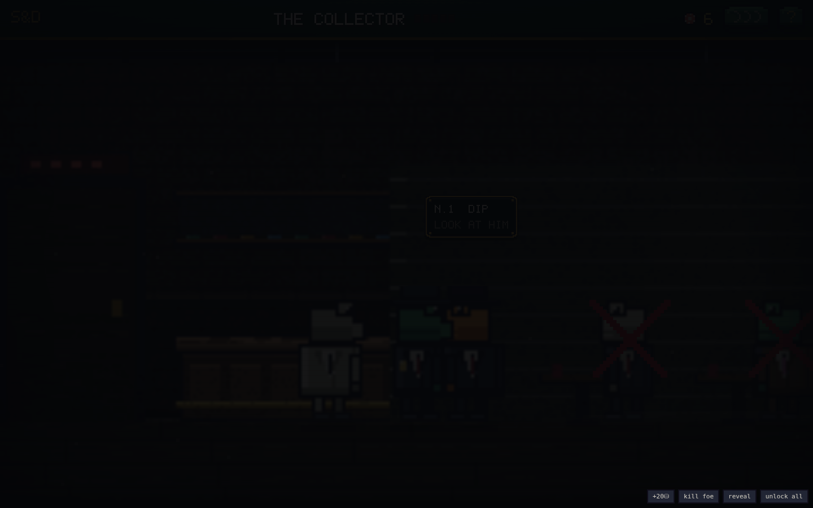

# SHELL & DEBT

**A murder-mystery in the swamp city, in hand-drawn pixel art. No build, no
assets, no network — every pixel is drawn by the game at boot.**

You were the good cop. You picked the Bullfrog out of a line-up and his
lawyers had him out by noon. At seven that night the door came in. It rained
at the funeral and he sent flowers. You kept the badge, and the gun.

Six years later there is a board in the back of the precinct with five holes
in it, and nobody's name on the case but yours. Fill the board and the man
goes down in a courtroom. Turn up at his door without it and the only thing
you can do to him is the thing he did to you.

That is the whole game, and it is the two endings.


## Play it

```
# open index.html in a browser, or:
python3 -m http.server 8080   # then visit http://localhost:8080
```

Plain HTML/CSS/JS. Every sprite, prop, room, letter and cutscene is drawn by
the game from code — there is not one image file in the repository. Works on
phones. Sounds are synthesized with WebAudio. Cases are seeded. What the
department remembers about you persists in localStorage.

## The rooms you walk around in


There is no menu strip and no button bar. A room is a place: **tap the floor
and the detective walks there**, drag to look down the room, and the things
you can do are objects in it. Walk up to a thing and it says what it is on a
little drawn plate over its own head; tap again and you do it.

The bullpen at two in the morning has a front desk with a phone and a
percolator, three desks with typewriters and one live lamp, a water cooler, a
dead plant, filing cabinets, lockers, a radiator, a wall clock nobody winds,
a holding cell with somebody in it, rain on the windows, pipes along the
ceiling, and the board at the far end. People stand *behind* the furniture,
the lamps put light on the floor, and the ceiling has joists in the dark.

- **Captain Rook** hands you the next chapter of the case.
- **Officer Maybelle** works the front desk. Talk to her once a night.
- **Patrolman Dill** has nothing to report. The **drunk tank** has a lot.
- **Your desk** holds the lead. **The lockers** hold your iron and your belt.
  **The cooler** is worth one heart a night.
- **The street door** takes you out to work it.

### The board


Five pieces make a case: a **photograph**, the **vig ledger**, the **route**,
the **name on the deed**, and the **address**. Each one is a thing you take
off a body and pin to cork, and the red string grows between them as you go.
At five pieces the gap in the middle spells out fourteen Marsh Row.

The board is also the readout the old ante ladder used to be — **the only
number this game shows you is how much of him you have.**

## The case

Eight chapters, bottom to top: the collector, the bookkeeper, the driver,
the lawyer, the cousin, the enforcer, the floor below his, and him. Each
chapter is a room of his people and the frog who runs it — **and every
lieutenant carries one piece of the board.**


Maybelle's trust is slow and it is real: it starts as talk, becomes coffee
money in your coat, then a file pulled before the shift change (**+1 look at
the evidence, all night**), and one night, *"whatever happens up there — come
home after"* — **+1 heart, all night**. It carries between cases.

## The line


Out at the lead you walk into the room they drink in. The crew is standing
against the height chart, the barman is behind his own bar, the file is on
it, and the back door is where the sit-down happens.

You have to work out which one of them you came for:

- **The file on the bar** — turn a page and it rules frogs out. A scale off a
  glass, a matchbook scratched by a ring, a cigar burned down in an ashtray.
  Everything in it is true.
- **The barman** — *was he wearing a hat? both eyes? any gold in his mouth?*
  He answers honestly and every face that doesn't match goes out of it.
- **Walk up and look at one.** You get his colour, his build, his hat, his
  smoke, his rings, whether his face is marked — the things a witness would
  actually remember. Then you can name him.



It starts fair — three in the room, four looks, four questions — and by the
top it is nine strangers, two questions, decoys built to answer most things
the same way he would, and no single question allowed to finish the job.
When the file runs dry, somebody downtown will pull one more page for money,
and the price climbs.

| Naming him | What happens |
|---|---|
| **right** | he comes quietly, and the bounty pays **30% more** |
| **wrong** | −6 chips, he sits down with **an extra heart**, and **he shoots first** |
| **not at all** | go through the back door and take whoever follows you |

## The table


Through the back door there is a revolver, a posted mix of **LIVE** and
**blank** shells in an order nobody knows, and a table. You are the camera:
your own two hands on the felt and the iron in your right fist.

- **Click his face** — the iron comes up. **Click again** and it goes off.
- **Click your own end of the table** — the camera crosses it and you see
  yourself from his chair, the muzzle against your own temple. A blank
  **keeps your turn**. That is the whole game.

### Breaking the shot


Across a table is a shot you can miss. Point and pull and the bore drifts: a
rail comes up with a marker sweeping it, a green band and a gold one inside
that.

| Where you break it | What happens |
|---|---|
| **the gold band** | through the eye — **+2 damage** |
| **the green band** | a normal hit |
| **outside both** | into the wall behind his ear, and the chamber is gone |

Faster and tighter every chapter. Against your own head there is no check.


The moment a live round commits, somebody's face crosses the frame on a
skewed banner. It runs black most nights. **When the round is going to end
somebody, it runs red.** Down to one heart, the lens closes in and you can
hear your own pulse.

## Out back


You never watch him fall. The shot goes off, the lens goes red, and when it
wipes you are already out back with the door shut — and between the two
rooms there is a small sad loading scene of you dragging him by the boots
under a swinging bulb.

The body is **fully intact**, because this was never about what the round
did. It is about what is in his coat. Almost no interface: a strip of meters,
your tools in the corner, and the room. **Search him with your own hands** —
hat, coat, vest, hand, boot, mouth.

- **TIME** — real seconds, shorter every chapter.
- **NOISE** — every pocket makes some; a boot or a gold tooth makes a lot.
- **THE TRAIL** — dragging a frog through a doorway leaves marks. Tap one and
  your arm goes out with the mop: three passes each, and the boards come back.


Get heard and a uniform comes through the back door tapping his nightstick:
**bribe** him or walk. After a lieutenant, the department wants protection
money — and if you cannot pay it, **they take your badge instead**, which
quietly closes one of the two endings.

## Dying is not the end of it


There is no game over in this game. Lose the table and an ambulance comes
through the rain, the ceiling of a corridor goes past your own eyes, and a
clerk stamps a form: gunshot, treated, discharged against advice.


You wake up in the ward with rain on the window, a machine counting, a chart
with your name on it — and Maybelle, who was off at eleven and stayed. It
costs chips, and after the second trip it can cost you a piece of the board
out of your coat. **Three trips and the department takes the badge.**

Then you discharge yourself and go back to work, because nobody else is going
to.

## The two endings


Fill the board, walk into fourteen Marsh Row, and put him on the floor. He is
still breathing. You get one decision:

- **THE BADGE** — cuff him and let the file do it. Available only if the
  board is full **and** the badge is still yours. He goes down in a
  courtroom, the sun comes up through the high windows, and it stops raining
  over two headstones.
- **THE BULLET** — one flash in a dark room, nobody writes it down, and the
  last shot of the game is you sitting in his chair with his board burning on
  the wall behind you.


## Everything that moves

All drawn, all procedural, no sprite sheets, tap to skip the long ones:

1. The lore reel — the line-up, the verdict, the door, the rain, the oath
2. The reload room — six shells thumbed into the drum, one at a time
3. The drive across town — parallax skylines, rain, wipers, a destination
4. The walk cycle — four frames, every frog in the game, both directions
5. Idle blinks, weight shifts, and the tongue taking flies (a verlet chain)
6. Lamp cones, floor pools, flickering tubes and dust in the air
7. The card-file wipe between rooms (venetian blinds, with an evidence tab)
8. The sit-down — dark room, his eyes, the lamp stuttering on
9. A lieutenant's entrance under cinema bars, with his name stamped on it
10. The four-beat cock: hammer, cylinder, the held beat, the drop
11. The steady check — the sweep, the bands, and the break
12. Muzzle flash, cordite, the casing on the felt
13. The slug in the air, with a shock ring and a wake
14. The Persona cut-in — skewed banner, speed lines, red when it is lethal
15. His grip, in four styles, arm anchored at the shoulder
16. His reactions — the facepalm, the raised digit, the shrug
17. Blood that lands, runs and stays — on him, and on your lens
18. The blood-splat kill wipe, coming off like a sleeve on glass
19. The drag loader — you, him, one swinging bulb, a smear on the boards
20. First-person searching: your arm out, dust off the lining, his weight
21. The mop — three passes a stain
22. The bribe — chips arcing into a glove, one at a time
23. The last-heart dread: a closing vignette and a heartbeat, twice a bar
24. The ambulance — the wagon in the rain, then the corridor from a gurney
25. The chapter card, and the take raining past the lens
26. The courtroom, the gavel, and the first daylight in the game
27. Two headstones and the rain stopping
28. A burning board, and a frog-shaped hole in a chair

## Keys

Tapping is the whole control scheme, but: `A`/`D` or the arrows walk, `E` or
`SPACE` uses what you are standing next to, `ENTER` sits down or walks out,
`6–8` are the belt, `Q`/`E` are the gun tricks at the table, `R` bribes,
`TAB` opens the case, `M` mutes, `H` is the house rules.

## Project layout

```
index.html        entry point
style.css         the pixel skin: chunky panels, CRT overlay, zero radius
js/util.js        seeded RNG (mulberry32), helpers, procedural WebAudio SFX
js/pixfont.js     the hand-drawn 5×7 typeface every letter is set in
js/pix.js         pixel engine: the palette, a sprite compiler, draw helpers
js/art.js         THE PROP SHOP: painted pixel maps + the shading kit
js/scene.js       the side-on rooms: tap-to-move, camera, walk rig, plates
js/rooms.js       the set: precinct, board room, ward, and the lead
js/story.js       THE CASE: chapters, the board, dialogue, the two endings
js/data.js        the crew, the guns, the belt, the questions, the tuning
js/meta.js        what survives a case: stats, learned tells, her trust
js/sprites.js     the frog rig, the iron rig, mugshots, splats, plates
js/engine.js      pure rules: the duel, his brain, the loot, the heat
js/case.js        the identification game: suspects, evidence, questions
js/duel.js        the drawn table: expressions, grips, the steady check
js/cine.js        every cutscene, and the film rig they all run on
js/cops.js        the uniforms: the walk-in, the bribe, the bust
js/loot.js        out back: first-person searching, the meters, the mop
js/tutor.js       the drawn speech plate, and what the mark says
js/ui.js          the story HUD, the murder board, the duel frame, help
js/btn.js         the arcade buttons the few remaining screens use
js/fx.js          smoke, gore, chip arcs, slow-mo, ambient dust
js/main.js        boot (+ ?debug harness)
dev/sim.js        headless balance + fuzz harness (node dev/sim.js)
dev/smoke.js      full browser smoke test (node dev/smoke.js)
```

### Tuning knobs

- The identification game — `CASE_TUNING` and `CASE_ASKS` in `js/data.js`
- The steady check — `AIM_TUNING` (sweep speed and band widths per chapter)
- The trail and what it costs — `MESS_TUNING`
- Bounties, heat, bribes — `BLIND_PURSE` / `HEAT_COST` / `LOOT_TUNING`
- The chapters and the five pieces — `CHAPTERS` / `INTEL_CARDS` in `js/story.js`
- What a room is furnished with — the scene definitions in `js/rooms.js`

### Dev checks

```
node dev/sim.js      # 500 bot cases + 200 fuzz cases against the real engine
node dev/smoke.js    # drives the whole story in headless Chromium
```

Current curve, for a bot with average nerves that never reads a face and
names a suspect at random out of whoever is still standing:

- **40%** fill the board
- **34%** reach the Bullfrog at all
- **16%** could still take the good ending when they get there
- **4.2** trips to the ward per case

A player who works the file, asks the right questions, breaks the shot clean
and mops the floor does far better than that on every line. That is the point.

---

*A blank in your own head is a free turn. Take his papers — the board is five
holes wide.* 🐸🔎
