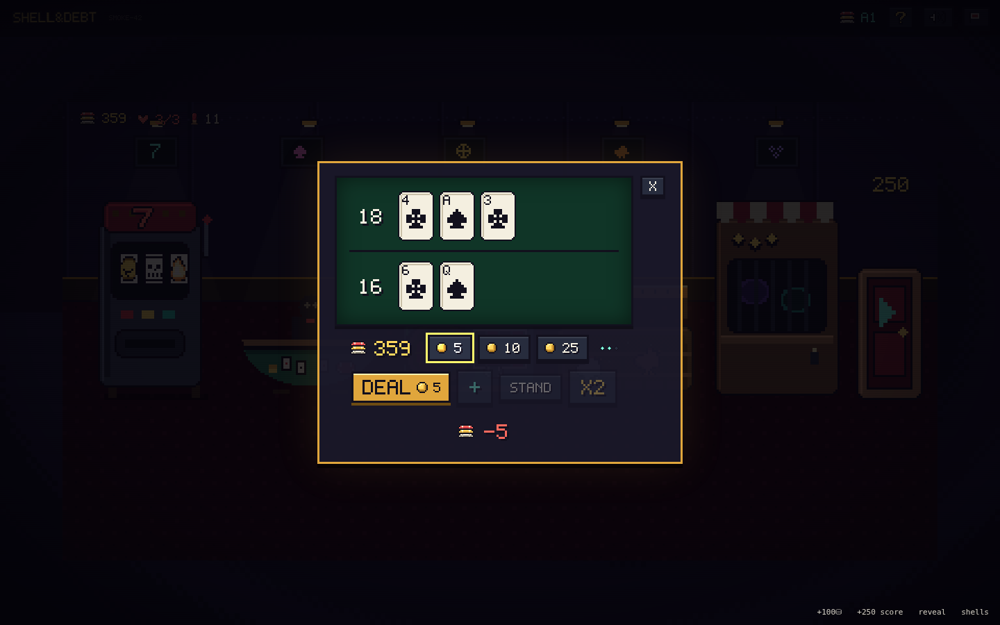
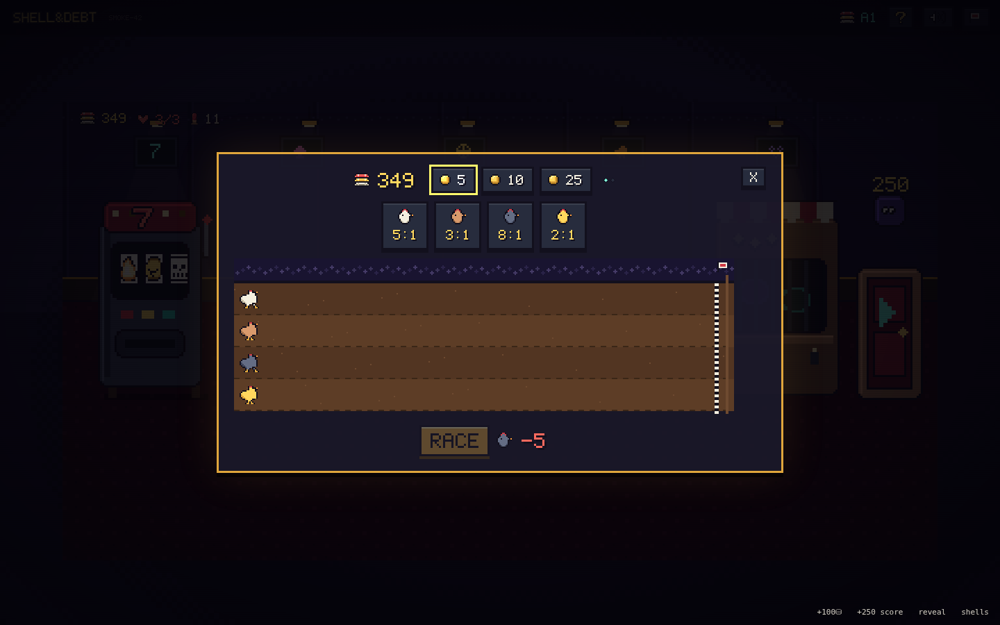

# SHELL & DEBT

**A 2D dark casino roguelike in hand-drawn pixel art.** The house found you, the chamber is
loaded, and the only way out is through eight antes of escalating debt. Manipulate the shells
in a cursed revolver cylinder, call the shot — **FIRE**, **DUD**, **JAM** or **BACKFIRE** —
and ride your pot down the razor's edge between banking the streak and burning it all.

Between rounds you walk a drawn pixel casino floor: a one-armed bandit that pays out in
ammunition, a blackjack table with a shadow for a dealer, a wheel that rewrites the next
round, a chicken derby of questionable integrity, and a pawn shop behind bars. Everything is
gambling. Everything combos. Every run gets more broken.

Inspired by Balatro's ante-and-shop skeleton — swirling paint background, breathing sprites,
CRT scanlines and all — with a push-your-luck gamble where the deck of cards would be. The
interface is almost wordless: icons, pixel numerals, and hover tooltips carry everything.


## Play it

No build, no dependencies, no assets, no network — plain HTML/CSS/JS:

```
# either just open index.html in a browser, or:
python3 -m http.server 8080   # then visit http://localhost:8080
```

Every sprite is drawn by the game at boot from pixel maps checked into `js/sprites.js`;
sounds are synthesized with WebAudio. Runs are seeded — enter a "cursed seed" on the title
screen to replay or share a run.


## The core gamble

Each ante, the house names a **DEBT** (the red number). You have ~10 trigger pulls to bank
that much score.

1. **The chamber** holds up to 6 shells drawn blind from your shell pouch. The shell under
   the hammer resolves as FIRE / DUD / JAM / BACKFIRE according to its own hidden weights.
2. **Call the outcome before you pull.** Posted odds set the payout multiplier — safe calls
   pay ×1.4, longshots pay up to ×25. Hidden shells (?) show the *average* odds of everything
   hidden in the chamber; revealed shells show exact odds.
3. **Correct call** → payout enters **the pot** and your **streak multiplier** grows (×1, ×2,
   ×3… compounding ×1.5 on deep rides). **Wrong call** → the whole pot burns.
4. **BANK** whenever you like to convert pot into score — and reset the streak. Push or cash.
5. An **uncalled BACKFIRE** costs **Nerve** (the hearts). At zero the run ends face-down on
   the felt. *Call* the backfire and you ride the blast for one of the best payouts in the game.
6. A **JAM** keeps the shell in the cylinder (now revealed) and comes around again.

**Sleight of Hand** (the ◆ diamonds) is where the manipulation lives: 👁 **peek** the top
shell · 🌀 **spin** to reshuffle and re-hide · ⏏ **eject** the top shell unseen · 🫳 **load**
a chosen shell from your pouch under the hammer.

The information game is the whole game: a peeked blank called DUD is a safe streak-builder; a
**Web Shell** forces the *next* shell to copy its outcome while the odds display still shows
the natural (wrong) percentages — which is how you call a 4% BACKFIRE at ×25 with total
certainty.

## The casino floor (your shop)

Walk up to a machine and click it:

| Station | What it does |
|---|---|
| 🎰 **One-Armed Bandit** | Pays out in *shells* — triples drop Shotgun/Web/Cursed shells, triple 7s drop a legendary. Three dry spins and the house slides you a blank in sympathy. |
| 🃏 **Blackjack** | Chips on a knife's edge; win with exactly 21 and a shell falls off the table. |
| 🎡 **Wheel of Fates** | One spin a night. Wherever it lands *rewrites the next round* — the fate's emblem hangs over the exit door until you face it. Side-bet on the color if you're feeling lucky. |
| 🐔 **Chicken Derby** | Four athletes of questionable provenance. Longshot winners you backed shed a Feather Shell. |
| 🏚️ **Pawn Shop** | Charms (passive artifacts, 5 slots), pouch surgery — melt a shell, mirror a shell, mystery jars, back-room stitches for your Nerve. |
| 🚪 **The door** | The next debt glows above it. Walk through when you're ready. |

15 shell types (blanks to Dead Man's Shells), 20 charms (Grave Dancer, Loaded Rabbit, Echo
Chamber, Second Wind…), 7 boss twists on antes 3/6/8 (The Blindfold, The Vig, THE OWNER), and
12 roulette fates. Beat ante 8 and the door to **Endless** opens.




## Controls

**1–4** select a call · **SPACE / ENTER** pull the trigger · **B** bank · mouse for
everything else. **Hover anything** — every icon, shell, charm, emblem and panel explains
itself in a tooltip. **?** in the top bar has the full house rules.

## Project layout

```
index.html        entry point
style.css         pixel skin: chunky panels, CRT overlay, wobble/breathe animations
js/util.js        seeded RNG (mulberry32), helpers, procedural WebAudio SFX
js/pixfont.js     hand-drawn 5×7 pixel typeface (every numeral in the game)
js/pix.js         pixel engine: palette, sprite compiler, procedural draw helpers
js/sprites.js     ALL the art: shells, icons, chickens, glyphs, cards, cylinder, wheel
js/bg.js          the swirling paint background (low-res canvas, scaled up)
js/data.js        content tables: shells, charms, bosses, fates, chickens
js/engine.js      pure game rules: chamber, odds, pulls, pot/streak, antes, economy
js/ui.js          round screen, HUD, stamps/toasts, tooltips, title & end screens
js/casino.js      the drawn casino floor scene + all five mini-games
js/main.js        boot (+ ?debug harness)
dev/sim.js        headless balance & fuzz harness (node dev/sim.js)
dev/smoke.js      full browser smoke test (playwright-core)
```

### How the art works

There are no image files. `js/sprites.js` holds every sprite as a text pixel map against the
32-color palette in `js/pix.js` (`K` = ink, `G` = gold, `r` = blood…), compiled to canvases at
boot and drawn with nearest-neighbor scaling. Big set pieces — the revolver cylinder, the slot
cabinet, the roulette wheel, the casino backdrop — are composed procedurally from the same
palette so everything stays on-model. Want to re-skin a shell? Edit its letters.

### Tuning knobs (for modders)

- `DEBTS` and the endless growth rate — `js/engine.js`
- Shell weights/base values and all content — `js/data.js`
- Call multiplier curve `callMult()` and streak curve `streakMult()` — `js/engine.js`
- Add a shell: one entry in `SHELLS` + a palette row in `SHELL_COLORS` (+ optional mark)
- Add a charm: one entry in `CHARMS` + an 8×8 glyph in `CHARM_GLYPHS` + an `E.has('id')` check

### Dev checks

```
node dev/sim.js      # 400 bot runs + 150 random-action fuzz runs against the real engine
node dev/smoke.js    # drives the full UI in headless Chromium, fails on any console error
```

Current curve (greedy bot, no real strategy): ~72% clear ante 1, ~35% ante 2, ~5% ante 3 —
humans exploiting webs, echoes, loaded chambers and charm stacks go much deeper. That's the
point.

---

*The wheel only turns once a night. The house always remembers.* 🎰
