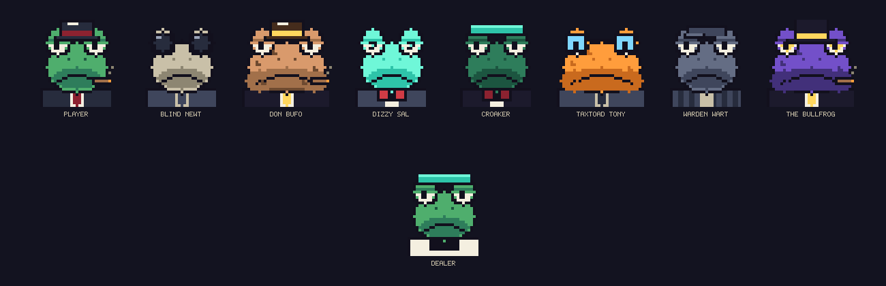
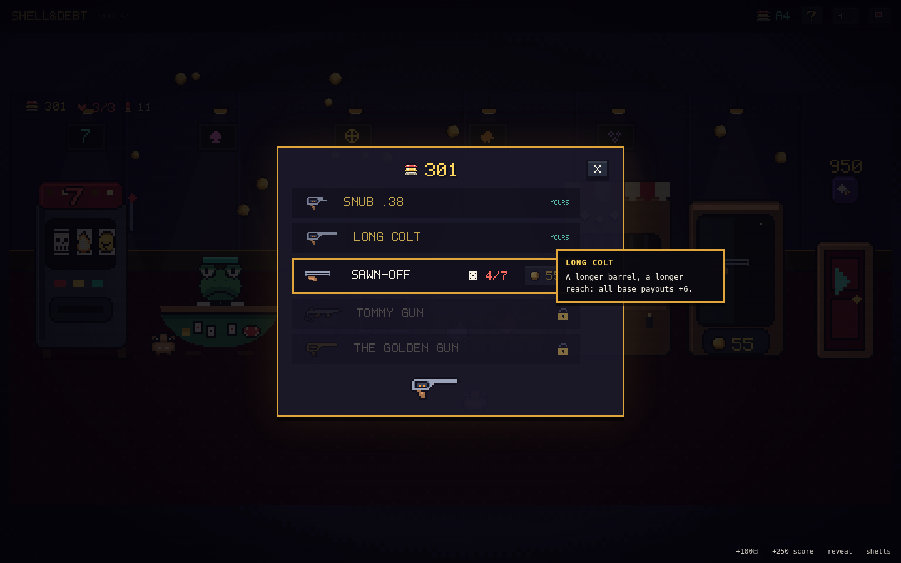

# SHELL & DEBT

**A dark casino roguelike about a mafia frog, in hand-drawn pixel art.** You are 'Lucky'
Verde. You owe the Bullfrog everything, the chamber is loaded, and the only way out is
through eight antes of escalating debt. Call the shot — **FIRE**, **DUD**, **JAM** or
**BACKFIRE** — ride your pot down the razor's edge between banking the streak and burning
it all, and climb from a snub .38 to the Golden Gun.



The mob collects on antes 3, 6 and 8: Blind Newt, fat Don Bufo, Dizzy Sal, Croaker,
TaxToad Tony, Warden Wart — and at the bottom of it all, THE BULLFROG. Each one twists a
rule when he sits down at your table.


## Play it

No build, no dependencies, no assets, no network — plain HTML/CSS/JS:

```
# either just open index.html in a browser, or:
python3 -m http.server 8080   # then visit http://localhost:8080
```

Every sprite is drawn by the game at boot from pixel maps in `js/sprites.js` (the frog
cast comes from one parameterized portrait rig, so the whole family stays on-model);
sounds are synthesized with WebAudio. Runs are seeded.

## How a round works

The house names a **DEBT** (the red number). You have ~10 trigger pulls to bank that much.

1. Shells load blind from your pouch into the cylinder. The one under the hammer resolves
   as FIRE / DUD / JAM / BACKFIRE by its own weights.
2. **Call it before you pull.** Posted odds set the multiplier — safe calls pay ×1.4,
   longshots up to ×25. Hidden shells (?) show the chamber average.
3. Correct → payout joins **the pot**, the **×streak** grows. Wrong → the pot burns.
   **BANK** anytime to turn pot into score (and reset the streak). Push or cash.
4. An uncalled **BACKFIRE** costs a heart. Zero hearts, and the swamp keeps your marker.
5. Three **tricks** a round: 👁 peek the top shell · 🌀 spin the chamber · 🫳 load a
   chosen shell under the hammer. That's the whole skill — know more than the odds say.

A **Web Shell** forces the next shell to copy its outcome while the odds still display the
natural percentages — that's how you call a 4% BACKFIRE at ×25 with total certainty.

## The casino floor


Between antes you walk the floor. It opens up as you go deeper — new tables unlock at
antes 2, 3 and 4:

| Station | Unlocks | Its reward |
|---|---|---|
| 🎰 **One-Armed Bandit** | ante 1 | pays in **shells** — triples drop good ammo, triple 7s drop a legendary |
| 🏚️ **Pawn Shop** | ante 1 | **charms** (5 slots) + pouch surgery: melt, mirror, mystery jar, stitches |
| 🔫 **The Gun Case** | ante 2 | **your iron** (see below) |
| 🃏 **Blackjack** | ante 2 | **chips** — and a shell if you win with exactly 21 |
| 🎡 **Wheel of Fates** | ante 3 | one spin a night **rewrites the next round** |
| 🐔 **Chicken Derby** | ante 4 | chips; longshot winners shed a Feather Shell |

### The guns



The house only arms regulars: every gun needs chips **and** total machine plays — slots,
blackjack, the wheel and the derby all punch the card. Perks stack as you climb:

SNUB .38 → LONG COLT (+6 base) → SAWN-OFF (FIRE streaks +1) → TOMMY GUN (+2 pulls) →
THE GOLDEN GUN (everything ×1.5).

11 shell types, 12 charms, 7 frog bosses, 8 fates, 8 antes, then Endless. The interface is
nearly wordless — icons and pixel numerals; hover anything for the details, `?` for the
full house rules.


## Project layout

```
index.html        entry point
style.css         pixel skin: chunky panels, CRT overlay, wobble/breathe animations
js/util.js        seeded RNG (mulberry32), helpers, procedural WebAudio SFX
js/pixfont.js     hand-drawn 5×7 typeface (every numeral in the game)
js/pix.js         pixel engine: palette, sprite compiler, procedural draw helpers
js/sprites.js     ALL the art: shells, icons, guns, the frog portrait rig, cards, wheel
js/bg.js          the swirling paint background
js/data.js        content: shells, guns, charms, the mob, fates, unlock schedule
js/engine.js      pure rules: chamber, odds, pot/streak, guns, antes, economy
js/ui.js          round screen, HUD, stamps/toasts, tooltips, title & end screens
js/casino.js      the drawn floor scene, unlock gating + all six stations
js/main.js        boot (+ ?debug harness)
dev/sim.js        headless balance & fuzz harness (node dev/sim.js)
dev/smoke.js      full browser smoke test (playwright-core)
```

### Tuning knobs (for modders)

- `DEBTS`, `callMult()`, `streakMult()` — `js/engine.js`
- Shells / guns / charms / bosses / fates / `UNLOCKS` — all tables in `js/data.js`
- New frog: add a `FROG_DEFS` entry in `js/sprites.js` (skin colors, fat flag, accessories)
- New gun: a `GUNS` row + a sprite + one perk hook in `doPull`/`startRound`

### Dev checks

```
node dev/sim.js      # 400 bot runs + 150 random-action fuzz runs against the real engine
node dev/smoke.js    # drives the full UI in headless Chromium, fails on any console error
```

Current curve (greedy bot): ~73% clear ante 1, ~48% ante 2, ~14% ante 3, thinning to ante 6.
Humans exploiting webs, loaded chambers, charm stacks and a Tommy Gun go deeper. That's
the point.

---

*The house only arms regulars. The Bullfrog is waiting.* 🐸🔫
